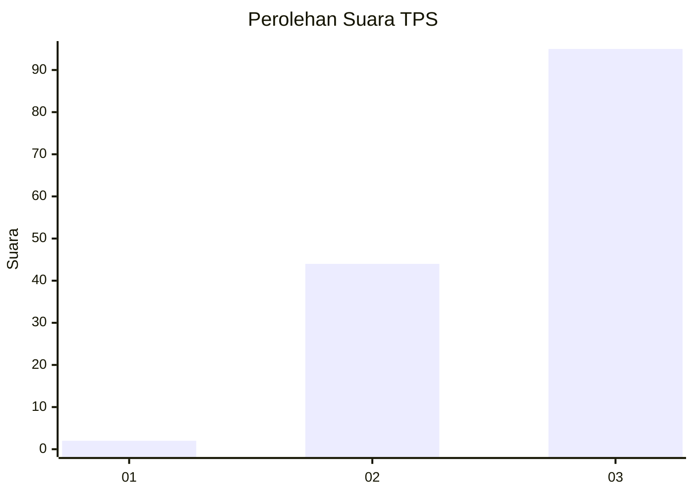
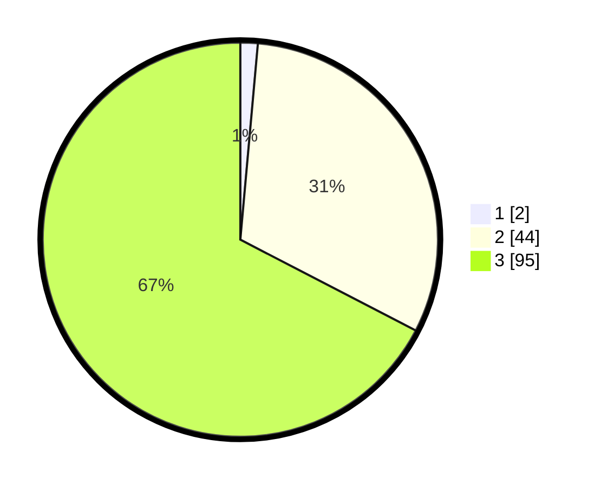

# Hasil

## Grafik

## Tabel

| No. | Nama Paslon    | Suara | Suara (raw) | Persentase |
|:--- |:-------------- | -----:| -----------:| ----------:|
| 1   | ANIES MUHAIMIN | 2     | [2][p-1]    | 1,42       |
| 2   | PRABOWO GIBRAN | 44    | [44][p-2]   | 31,21      |
| 3   | GANJAR MAHFUD  | 95    | [95][p-3]   | 67,38      |

[p-1]: https://github.com/gigit-pemilu/pemilu-2024-51-bali/blob/main/pilpres/hitung-suara/sub/51-bali/sub/06-bangli/sub/01-susut/sub/2006-penglumbaran/sub/004-tps/sub/paslon-1.txt
[p-2]: https://github.com/gigit-pemilu/pemilu-2024-51-bali/blob/main/pilpres/hitung-suara/sub/51-bali/sub/06-bangli/sub/01-susut/sub/2006-penglumbaran/sub/004-tps/sub/paslon-2.txt
[p-3]: https://github.com/gigit-pemilu/pemilu-2024-51-bali/blob/main/pilpres/hitung-suara/sub/51-bali/sub/06-bangli/sub/01-susut/sub/2006-penglumbaran/sub/004-tps/sub/paslon-3.txt

## Foto C Plano

https://sirekap-obj-formc.kpu.go.id/5ebc/pemilu/ppwp/51/06/01/20/06/5106012006004-20240214-133115--750f4ea5-f63b-494a-9a6e-c7c24a6f8c75.jpg

https://sirekap-obj-formc.kpu.go.id/5ebc/pemilu/ppwp/51/06/01/20/06/5106012006004-20240216-025300--06806f24-bae2-4972-97af-b7d48b12f576.jpg

https://sirekap-obj-formc.kpu.go.id/5ebc/pemilu/ppwp/51/06/01/20/06/5106012006004-20240216-025252--05e02e64-6572-48da-937b-241257d9bc52.jpg

## Metadata

| Key        | Value               |
| ---------- | ------------------- |
| Time Stamp | 2024-02-16 14:00:34 |

## DATA PEMILIH TETAP

Jumlah pemilih dalam DPT: **153**.
 * L: **86**.
 * P: **67**.

## DATA PENGGUNA HAK PILIH

Jumlah pengguna hak pilih dalam DPT: **141**.
 * L: **77**.
 * P: **64**.

Jumlah pengguna hak pilih dalam DPTb: **0**.
 * L: **0**.
 * P: **0**.

Jumlah pengguna hak pilih dalam DPK: **1**.
 * L: **0**.
 * P: **1**.

Jumlah pengguna hak pilih: **142**.
 * L: **77**.
 * P: **65**.

## JUMLAH SUARA SAH DAN TIDAK SAH

JUMLAH SELURUH SUARA SAH: **141**.

JUMLAH SUARA TIDAK SAH: **1**.

JUMLAH SELURUH SUARA SAH DAN SUARA TIDAK SAH: **142**.

