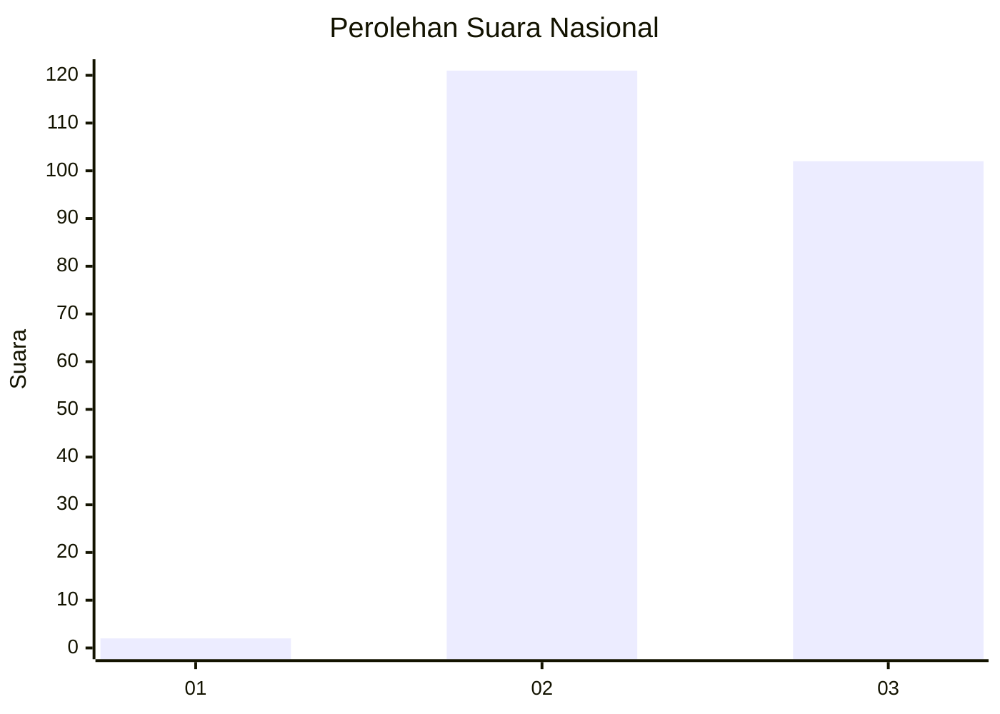
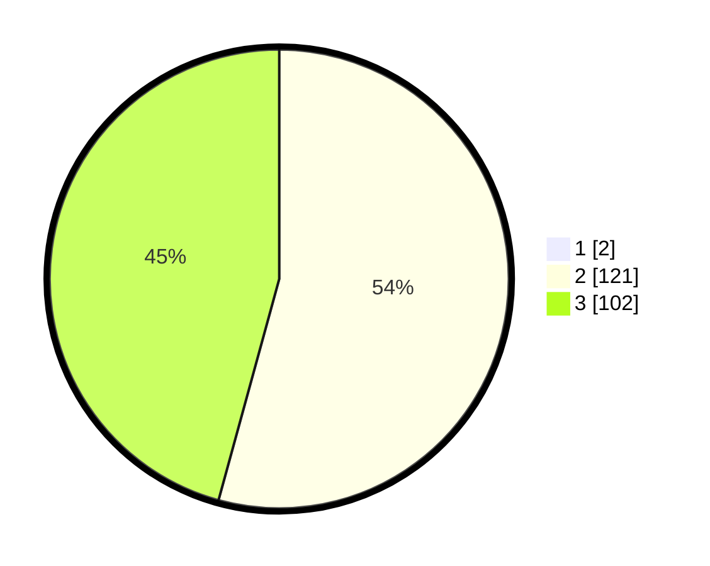

# Hasil

## Grafik

## Tabel

| No. | Nama Paslon    | Suara | Suara (raw) | Persentase |
|:--- |:-------------- | -----:| -----------:| ----------:|
| 1   | ANIES MUHAIMIN | 2     | [2][p-1]    | 0,89       |
| 2   | PRABOWO GIBRAN | 121   | [121][p-2]  | 53,78      |
| 3   | GANJAR MAHFUD  | 102   | [102][p-3]  | 45,33      |

[p-1]: https://github.com/gigit-pemilu/pemilu-2024/blob/main/pilpres/hitung-suara/sub/51-bali/sub/06-bangli/sub/01-susut/sub/2006-penglumbaran/sub/009-tps/sub/paslon-1.txt
[p-2]: https://github.com/gigit-pemilu/pemilu-2024/blob/main/pilpres/hitung-suara/sub/51-bali/sub/06-bangli/sub/01-susut/sub/2006-penglumbaran/sub/009-tps/sub/paslon-2.txt
[p-3]: https://github.com/gigit-pemilu/pemilu-2024/blob/main/pilpres/hitung-suara/sub/51-bali/sub/06-bangli/sub/01-susut/sub/2006-penglumbaran/sub/009-tps/sub/paslon-3.txt

## Foto C Plano

https://sirekap-obj-formc.kpu.go.id/c890/pemilu/ppwp/51/06/01/20/06/5106012006009-20240214-141654--6ba4504f-8165-43e8-bdf3-a0031c58fe1c.jpg

https://sirekap-obj-formc.kpu.go.id/c890/pemilu/ppwp/51/06/01/20/06/5106012006009-20240214-215654--f9a3b319-19c7-4702-a797-aea1169338cd.jpg

https://sirekap-obj-formc.kpu.go.id/c890/pemilu/ppwp/51/06/01/20/06/5106012006009-20240214-141943--5d3e40dd-225a-4e8a-a06a-e29d2ee418aa.jpg

## Metadata

| Key        | Value               |
| ---------- | ------------------- |
| Time Stamp | 2024-02-24 22:31:28 |

