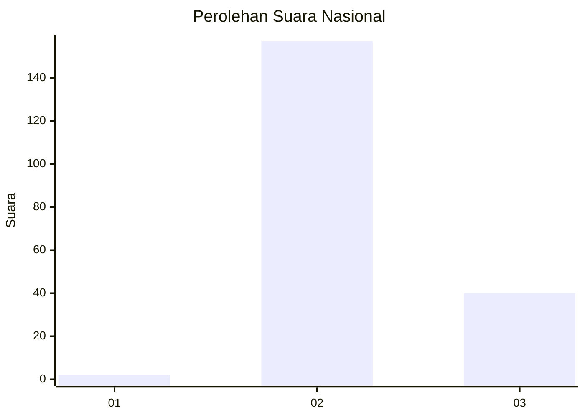

# Hasil

## Grafik

## Tabel

| No. | Nama Paslon    | Suara | Suara (raw) | Persentase |
|:--- |:-------------- | -----:| -----------:| ----------:|
| 1   | ANIES MUHAIMIN | 2     | [2][p-1]    | 1,01       |
| 2   | PRABOWO GIBRAN | 157   | [157][p-2]  | 78,89      |
| 3   | GANJAR MAHFUD  | 40    | [40][p-3]   | 20,10      |

[p-1]: https://github.com/gigit-pemilu/pemilu-2024/blob/main/pilpres/hitung-suara/sub/51-bali/sub/06-bangli/sub/01-susut/sub/2006-penglumbaran/sub/011-tps/sub/paslon-1.txt
[p-2]: https://github.com/gigit-pemilu/pemilu-2024/blob/main/pilpres/hitung-suara/sub/51-bali/sub/06-bangli/sub/01-susut/sub/2006-penglumbaran/sub/011-tps/sub/paslon-2.txt
[p-3]: https://github.com/gigit-pemilu/pemilu-2024/blob/main/pilpres/hitung-suara/sub/51-bali/sub/06-bangli/sub/01-susut/sub/2006-penglumbaran/sub/011-tps/sub/paslon-3.txt

## Foto C Plano

https://sirekap-obj-formc.kpu.go.id/e710/pemilu/ppwp/51/06/01/20/06/5106012006011-20240215-001232--f5f3bf3b-ce7a-4cb8-97cb-e79a07fdfaf3.jpg

https://sirekap-obj-formc.kpu.go.id/e710/pemilu/ppwp/51/06/01/20/06/5106012006011-20240215-001442--dcd1a08d-0113-4a61-a8f4-18b2fc19010d.jpg

https://sirekap-obj-formc.kpu.go.id/e710/pemilu/ppwp/51/06/01/20/06/5106012006011-20240215-001519--d8dc044e-bdd0-4a45-baed-78d042fec18a.jpg

## Metadata

| Key        | Value               |
| ---------- | ------------------- |
| Time Stamp | 2024-02-24 22:31:28 |

