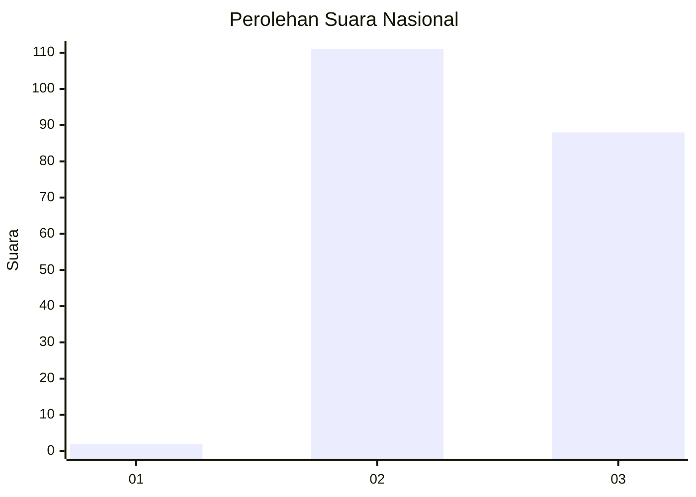
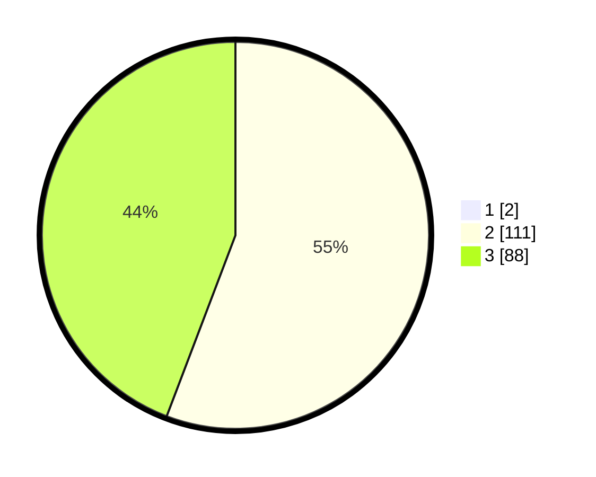

# Hasil

## Grafik

## Tabel

| No. | Nama Paslon    | Suara | Suara (raw) | Persentase |
|:--- |:-------------- | -----:| -----------:| ----------:|
| 1   | ANIES MUHAIMIN | 2     | [2][p-1]    | 1,00       |
| 2   | PRABOWO GIBRAN | 111   | [111][p-2]  | 55,22      |
| 3   | GANJAR MAHFUD  | 88    | [88][p-3]   | 43,78      |

[p-1]: https://github.com/gigit-pemilu/pemilu-2024/blob/main/pilpres/hitung-suara/sub/51-bali/sub/06-bangli/sub/01-susut/sub/2007-tiga/sub/001-tps/sub/paslon-1.txt
[p-2]: https://github.com/gigit-pemilu/pemilu-2024/blob/main/pilpres/hitung-suara/sub/51-bali/sub/06-bangli/sub/01-susut/sub/2007-tiga/sub/001-tps/sub/paslon-2.txt
[p-3]: https://github.com/gigit-pemilu/pemilu-2024/blob/main/pilpres/hitung-suara/sub/51-bali/sub/06-bangli/sub/01-susut/sub/2007-tiga/sub/001-tps/sub/paslon-3.txt

## Foto C Plano

https://sirekap-obj-formc.kpu.go.id/b1f6/pemilu/ppwp/51/06/01/20/07/5106012007001-20240217-082334--8780b3a2-cae9-4241-99cc-180decc61e08.jpg

https://sirekap-obj-formc.kpu.go.id/b1f6/pemilu/ppwp/51/06/01/20/07/5106012007001-20240217-082459--e8eb91ac-24e9-4f44-a1b4-80e3b967eac9.jpg

https://sirekap-obj-formc.kpu.go.id/b1f6/pemilu/ppwp/51/06/01/20/07/5106012007001-20240217-082601--7e608aec-5163-4d06-a7ce-33cc0736dcfa.jpg

## Metadata

| Key        | Value               |
| ---------- | ------------------- |
| Time Stamp | 2024-02-17 10:00:02 |

## DATA PEMILIH TETAP

Jumlah pemilih dalam DPT: **247**.
 * L: **120**.
 * P: **127**.

## DATA PENGGUNA HAK PILIH

Jumlah pengguna hak pilih dalam DPT: **204**.
 * L: **95**.
 * P: **109**.

Jumlah pengguna hak pilih dalam DPTb: **0**.
 * L: **0**.
 * P: **0**.

Jumlah pengguna hak pilih dalam DPK: **1**.
 * L: **1**.
 * P: **0**.

Jumlah pengguna hak pilih: **205**.
 * L: **96**.
 * P: **109**.

## JUMLAH SUARA SAH DAN TIDAK SAH

JUMLAH SELURUH SUARA SAH: **201**.

JUMLAH SUARA TIDAK SAH: **4**.

JUMLAH SELURUH SUARA SAH DAN SUARA TIDAK SAH: **205**.

