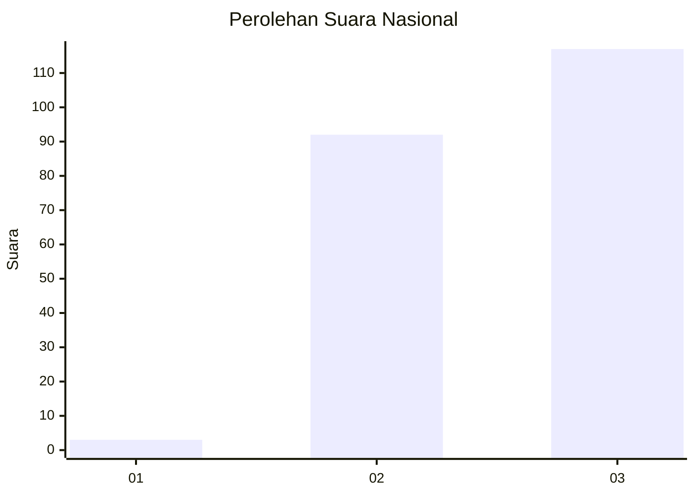
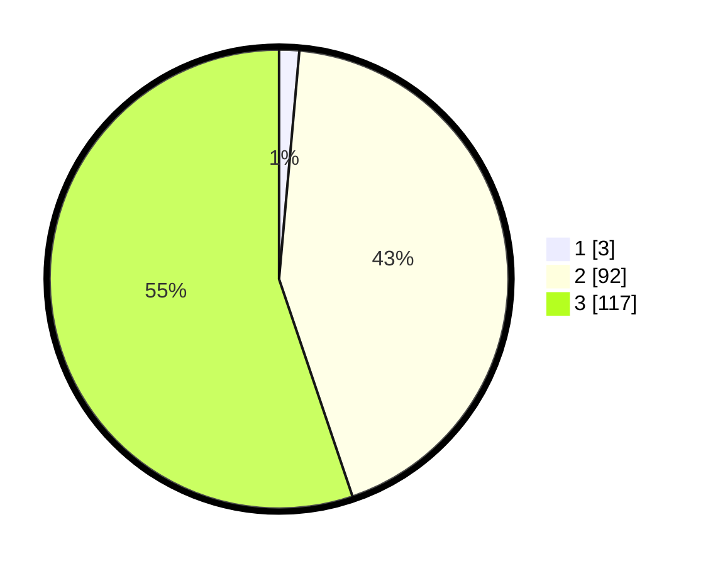

# Hasil

## Grafik

## Tabel

| No. | Nama Paslon    | Suara | Suara (raw) | Persentase |
|:--- |:-------------- | -----:| -----------:| ----------:|
| 1   | ANIES MUHAIMIN | 3     | [3][p-1]    | 1,42       |
| 2   | PRABOWO GIBRAN | 92    | [92][p-2]   | 43,40      |
| 3   | GANJAR MAHFUD  | 117   | [117][p-3]  | 55,19      |

[p-1]: https://github.com/gigit-pemilu/pemilu-2024/blob/main/pilpres/hitung-suara/sub/51-bali/sub/06-bangli/sub/01-susut/sub/2007-tiga/sub/002-tps/sub/paslon-1.txt
[p-2]: https://github.com/gigit-pemilu/pemilu-2024/blob/main/pilpres/hitung-suara/sub/51-bali/sub/06-bangli/sub/01-susut/sub/2007-tiga/sub/002-tps/sub/paslon-2.txt
[p-3]: https://github.com/gigit-pemilu/pemilu-2024/blob/main/pilpres/hitung-suara/sub/51-bali/sub/06-bangli/sub/01-susut/sub/2007-tiga/sub/002-tps/sub/paslon-3.txt

## Foto C Plano

https://sirekap-obj-formc.kpu.go.id/dc54/pemilu/ppwp/51/06/01/20/07/5106012007002-20240214-213317--f410bd49-5936-406b-b204-21f5c78785f2.jpg

https://sirekap-obj-formc.kpu.go.id/dc54/pemilu/ppwp/51/06/01/20/07/5106012007002-20240215-004901--225d2251-5238-4aac-9d21-ed3c3be075ef.jpg

https://sirekap-obj-formc.kpu.go.id/dc54/pemilu/ppwp/51/06/01/20/07/5106012007002-20240214-213644--50bb423c-5f92-40a5-bcb9-341ee206a870.jpg

## Metadata

| Key        | Value               |
| ---------- | ------------------- |
| Time Stamp | 2024-02-15 06:00:23 |

## DATA PEMILIH TETAP

Jumlah pemilih dalam DPT: **253**.
 * L: **125**.
 * P: **128**.

## DATA PENGGUNA HAK PILIH

Jumlah pengguna hak pilih dalam DPT: **215**.
 * L: **107**.
 * P: **108**.

Jumlah pengguna hak pilih dalam DPTb: **0**.
 * L: **0**.
 * P: **0**.

Jumlah pengguna hak pilih dalam DPK: **0**.
 * L: **0**.
 * P: **0**.

Jumlah pengguna hak pilih: **215**.
 * L: **107**.
 * P: **108**.

## JUMLAH SUARA SAH DAN TIDAK SAH

JUMLAH SELURUH SUARA SAH: **212**.

JUMLAH SUARA TIDAK SAH: **3**.

JUMLAH SELURUH SUARA SAH DAN SUARA TIDAK SAH: **215**.

