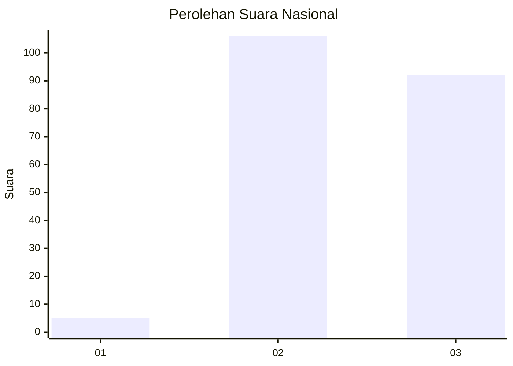
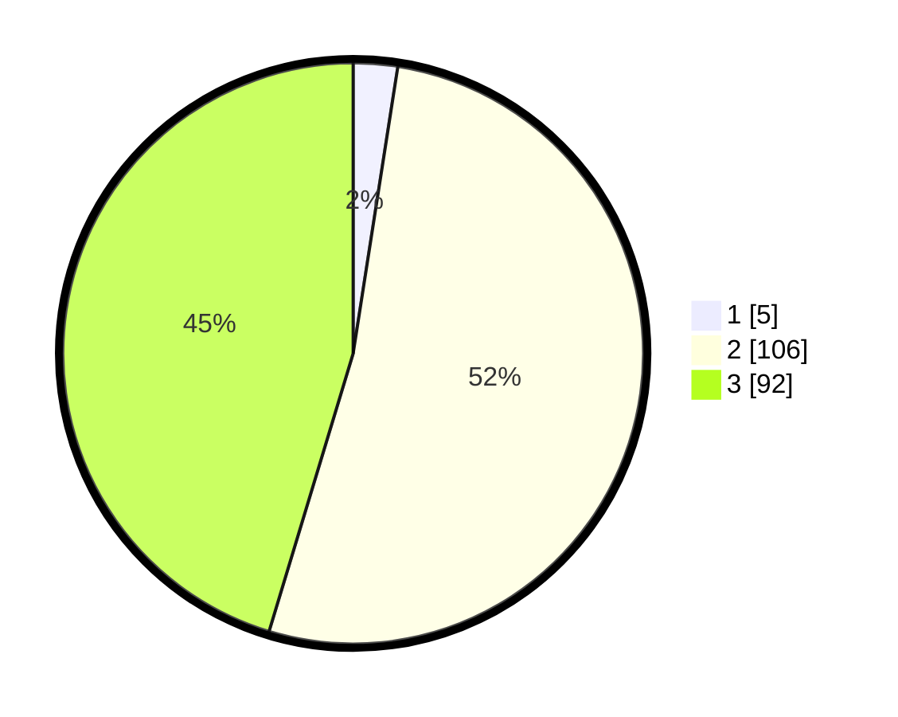

# Hasil

## Grafik

## Tabel

| No. | Nama Paslon    | Suara | Suara (raw) | Persentase |
|:--- |:-------------- | -----:| -----------:| ----------:|
| 1   | ANIES MUHAIMIN | 5     | [5][p-1]    | 2,46       |
| 2   | PRABOWO GIBRAN | 106   | [106][p-2]  | 52,22      |
| 3   | GANJAR MAHFUD  | 92    | [92][p-3]   | 45,32      |

[p-1]: https://github.com/gigit-pemilu/pemilu-2024/blob/main/pilpres/hitung-suara/sub/51-bali/sub/06-bangli/sub/01-susut/sub/2007-tiga/sub/003-tps/sub/paslon-1.txt
[p-2]: https://github.com/gigit-pemilu/pemilu-2024/blob/main/pilpres/hitung-suara/sub/51-bali/sub/06-bangli/sub/01-susut/sub/2007-tiga/sub/003-tps/sub/paslon-2.txt
[p-3]: https://github.com/gigit-pemilu/pemilu-2024/blob/main/pilpres/hitung-suara/sub/51-bali/sub/06-bangli/sub/01-susut/sub/2007-tiga/sub/003-tps/sub/paslon-3.txt

## Foto C Plano

https://sirekap-obj-formc.kpu.go.id/2b7b/pemilu/ppwp/51/06/01/20/07/5106012007003-20240214-224605--06c7e952-cbf1-44be-bb67-28450dfe34a5.jpg

https://sirekap-obj-formc.kpu.go.id/2b7b/pemilu/ppwp/51/06/01/20/07/5106012007003-20240214-224756--43ea533c-b558-4165-ba90-5a8bbd11b036.jpg

https://sirekap-obj-formc.kpu.go.id/2b7b/pemilu/ppwp/51/06/01/20/07/5106012007003-20240214-224851--ed71c4cc-6304-4499-95fe-1d6e4ead71f4.jpg

## Metadata

| Key        | Value               |
| ---------- | ------------------- |
| Time Stamp | 2024-02-24 22:31:28 |

