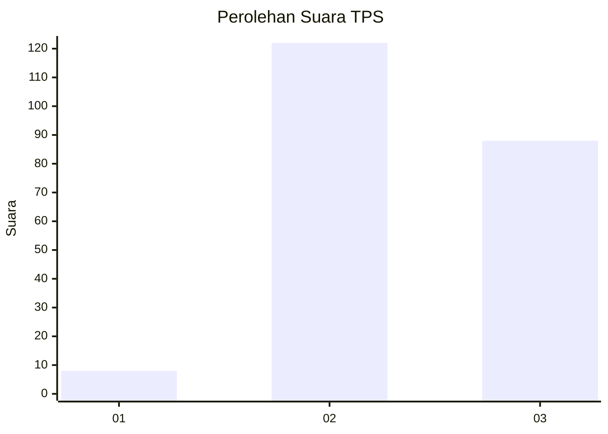
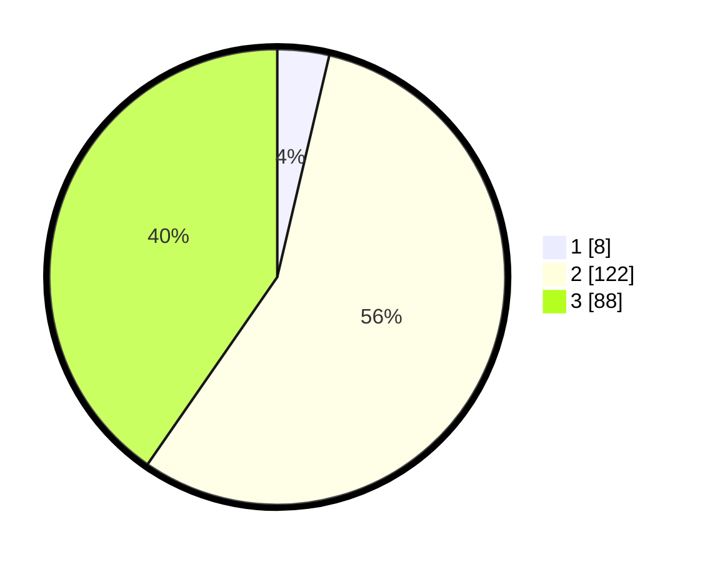

# Hasil

## Grafik

## Tabel

| No. | Nama Paslon    | Suara | Suara (raw) | Persentase |
|:--- |:-------------- | -----:| -----------:| ----------:|
| 1   | ANIES MUHAIMIN | 8     | [8][p-1]    | 3,67       |
| 2   | PRABOWO GIBRAN | 122   | [122][p-2]  | 55,96      |
| 3   | GANJAR MAHFUD  | 88    | [88][p-3]   | 40,37      |

[p-1]: https://github.com/gigit-pemilu/pemilu-2024-51-bali/blob/main/pilpres/hitung-suara/sub/51-bali/sub/06-bangli/sub/01-susut/sub/2007-tiga/sub/004-tps/sub/paslon-1.txt
[p-2]: https://github.com/gigit-pemilu/pemilu-2024-51-bali/blob/main/pilpres/hitung-suara/sub/51-bali/sub/06-bangli/sub/01-susut/sub/2007-tiga/sub/004-tps/sub/paslon-2.txt
[p-3]: https://github.com/gigit-pemilu/pemilu-2024-51-bali/blob/main/pilpres/hitung-suara/sub/51-bali/sub/06-bangli/sub/01-susut/sub/2007-tiga/sub/004-tps/sub/paslon-3.txt

## Foto C Plano

https://sirekap-obj-formc.kpu.go.id/e0ef/pemilu/ppwp/51/06/01/20/07/5106012007004-20240214-234451--2b94e87e-97ea-4d20-ab38-24ed90479e94.jpg

https://sirekap-obj-formc.kpu.go.id/e0ef/pemilu/ppwp/51/06/01/20/07/5106012007004-20240214-234112--1ceed6e8-3f8a-4b88-bd50-d771120d8342.jpg

https://sirekap-obj-formc.kpu.go.id/e0ef/pemilu/ppwp/51/06/01/20/07/5106012007004-20240214-234427--5af0e464-4f12-4776-b1de-06bd440f6779.jpg

## Metadata

| Key        | Value               |
| ---------- | ------------------- |
| Time Stamp | 2024-02-24 22:31:28 |

