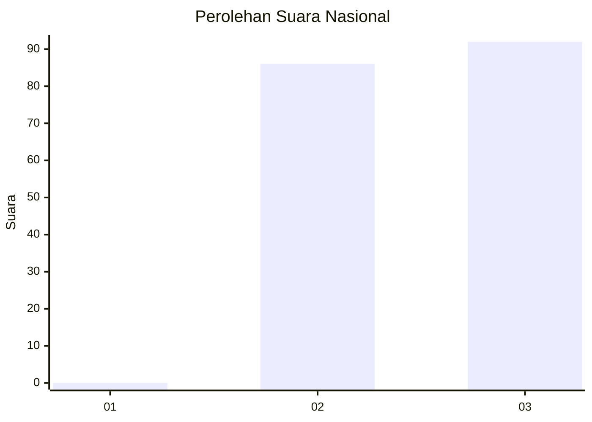
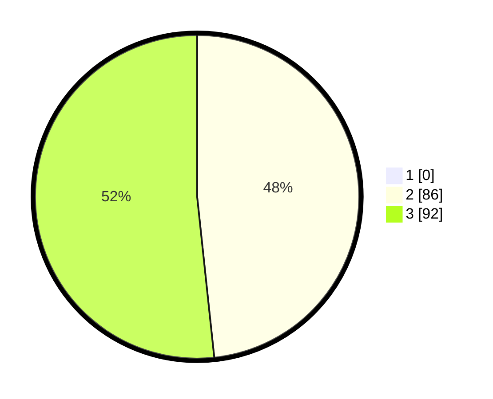

# Hasil

## Grafik

## Tabel

| No. | Nama Paslon    | Suara | Suara (raw) | Persentase |
|:--- |:-------------- | -----:| -----------:| ----------:|
| 1   | ANIES MUHAIMIN | 0     | [0][p-1]    | 0,00       |
| 2   | PRABOWO GIBRAN | 86    | [86][p-2]   | 48,31      |
| 3   | GANJAR MAHFUD  | 92    | [92][p-3]   | 51,69      |

[p-1]: https://github.com/gigit-pemilu/pemilu-2024/blob/main/pilpres/hitung-suara/sub/51-bali/sub/06-bangli/sub/01-susut/sub/2007-tiga/sub/006-tps/sub/paslon-1.txt
[p-2]: https://github.com/gigit-pemilu/pemilu-2024/blob/main/pilpres/hitung-suara/sub/51-bali/sub/06-bangli/sub/01-susut/sub/2007-tiga/sub/006-tps/sub/paslon-2.txt
[p-3]: https://github.com/gigit-pemilu/pemilu-2024/blob/main/pilpres/hitung-suara/sub/51-bali/sub/06-bangli/sub/01-susut/sub/2007-tiga/sub/006-tps/sub/paslon-3.txt

## Foto C Plano

https://sirekap-obj-formc.kpu.go.id/7ac0/pemilu/ppwp/51/06/01/20/07/5106012007006-20240214-155652--6394e548-2ea5-4d7d-ab80-9fa704997ba2.jpg

https://sirekap-obj-formc.kpu.go.id/7ac0/pemilu/ppwp/51/06/01/20/07/5106012007006-20240214-190454--ba4355f6-f579-47b8-92ca-e3bd5f5329ea.jpg

https://sirekap-obj-formc.kpu.go.id/7ac0/pemilu/ppwp/51/06/01/20/07/5106012007006-20240214-235600--6ff0ede7-b10c-4fd1-9aa4-6dcce92b4d98.jpg

## Metadata

| Key        | Value               |
| ---------- | ------------------- |
| Time Stamp | 2024-02-15 15:00:29 |

