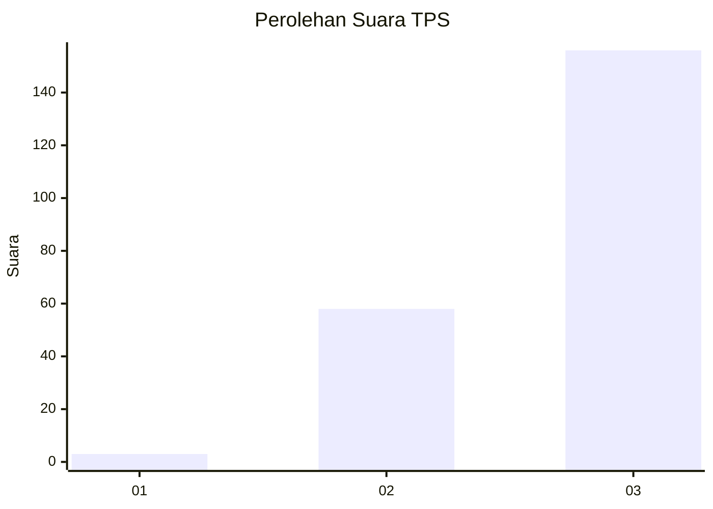
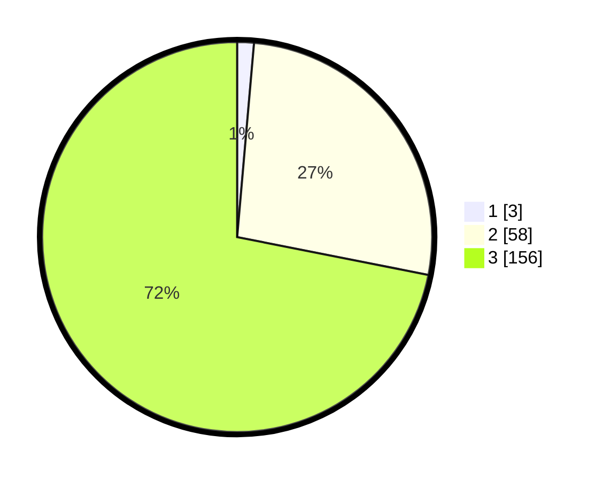

# Hasil

## Grafik

## Tabel

| No. | Nama Paslon    | Suara | Suara (raw) | Persentase |
|:--- |:-------------- | -----:| -----------:| ----------:|
| 1   | ANIES MUHAIMIN | 3     | [3][p-1]    | 1,38       |
| 2   | PRABOWO GIBRAN | 58    | [58][p-2]   | 26,73      |
| 3   | GANJAR MAHFUD  | 156   | [156][p-3]  | 71,89      |

[p-1]: https://github.com/gigit-pemilu/pemilu-2024-51-bali/blob/main/pilpres/hitung-suara/sub/51-bali/sub/06-bangli/sub/01-susut/sub/2007-tiga/sub/009-tps/sub/paslon-1.txt
[p-2]: https://github.com/gigit-pemilu/pemilu-2024-51-bali/blob/main/pilpres/hitung-suara/sub/51-bali/sub/06-bangli/sub/01-susut/sub/2007-tiga/sub/009-tps/sub/paslon-2.txt
[p-3]: https://github.com/gigit-pemilu/pemilu-2024-51-bali/blob/main/pilpres/hitung-suara/sub/51-bali/sub/06-bangli/sub/01-susut/sub/2007-tiga/sub/009-tps/sub/paslon-3.txt

## Foto C Plano

https://sirekap-obj-formc.kpu.go.id/2d81/pemilu/ppwp/51/06/01/20/07/5106012007009-20240318-092914--160d7acb-4a00-43c1-9f92-b8327021c6a1.jpg

https://sirekap-obj-formc.kpu.go.id/2d81/pemilu/ppwp/51/06/01/20/07/5106012007009-20240214-214651--14ddf450-4dab-4004-a975-3d06fab7a4f2.jpg

https://sirekap-obj-formc.kpu.go.id/2d81/pemilu/ppwp/51/06/01/20/07/5106012007009-20240214-214557--0e8f8159-af16-49f4-a886-876667d1c3f1.jpg

## Metadata

| Key        | Value               |
| ---------- | ------------------- |
| Time Stamp | 2024-03-18 09:30:00 |

