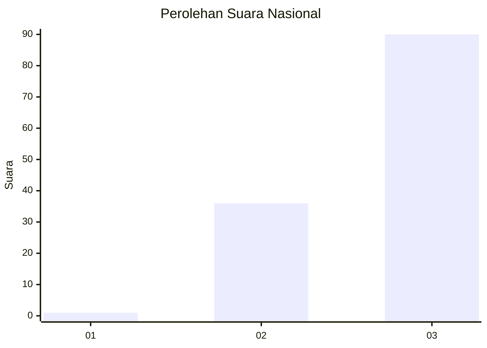
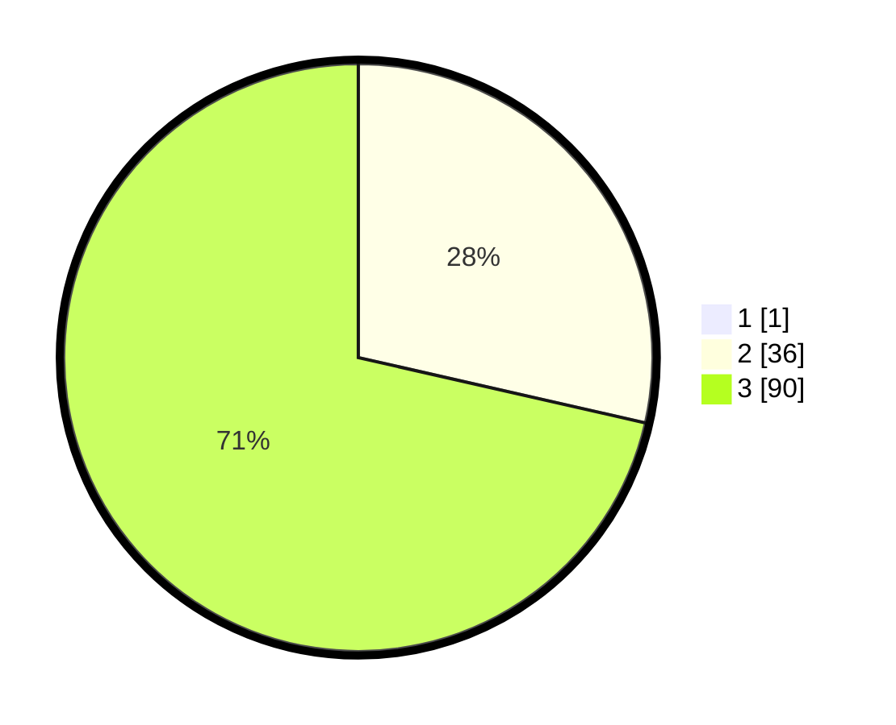

# Hasil

## Grafik

## Tabel

| No. | Nama Paslon    | Suara | Suara (raw) | Persentase |
|:--- |:-------------- | -----:| -----------:| ----------:|
| 1   | ANIES MUHAIMIN | 1     | [1][p-1]    | 0,79       |
| 2   | PRABOWO GIBRAN | 36    | [36][p-2]   | 28,35      |
| 3   | GANJAR MAHFUD  | 90    | [90][p-3]   | 70,87      |

[p-1]: https://github.com/gigit-pemilu/pemilu-2024/blob/main/pilpres/hitung-suara/sub/51-bali/sub/06-bangli/sub/01-susut/sub/2007-tiga/sub/010-tps/sub/paslon-1.txt
[p-2]: https://github.com/gigit-pemilu/pemilu-2024/blob/main/pilpres/hitung-suara/sub/51-bali/sub/06-bangli/sub/01-susut/sub/2007-tiga/sub/010-tps/sub/paslon-2.txt
[p-3]: https://github.com/gigit-pemilu/pemilu-2024/blob/main/pilpres/hitung-suara/sub/51-bali/sub/06-bangli/sub/01-susut/sub/2007-tiga/sub/010-tps/sub/paslon-3.txt

## Foto C Plano

https://sirekap-obj-formc.kpu.go.id/9db0/pemilu/ppwp/51/06/01/20/07/5106012007010-20240216-021903--89568410-93df-4ec0-94e3-4f1750c56390.jpg

https://sirekap-obj-formc.kpu.go.id/9db0/pemilu/ppwp/51/06/01/20/07/5106012007010-20240216-021904--bb0945c2-2c3a-40f7-8ea2-bf056c90eb95.jpg

https://sirekap-obj-formc.kpu.go.id/9db0/pemilu/ppwp/51/06/01/20/07/5106012007010-20240216-021904--90375f05-a2d2-4213-8f31-92bb1da2ce8c.jpg

## Metadata

| Key        | Value               |
| ---------- | ------------------- |
| Time Stamp | 2024-02-16 14:30:33 |

## DATA PEMILIH TETAP

Jumlah pemilih dalam DPT: **146**.
 * L: **72**.
 * P: **74**.

## DATA PENGGUNA HAK PILIH

Jumlah pengguna hak pilih dalam DPT: **126**.
 * L: **57**.
 * P: **69**.

Jumlah pengguna hak pilih dalam DPTb: **0**.
 * L: **0**.
 * P: **0**.

Jumlah pengguna hak pilih dalam DPK: **3**.
 * L: **0**.
 * P: **3**.

Jumlah pengguna hak pilih: **129**.
 * L: **57**.
 * P: **72**.

## JUMLAH SUARA SAH DAN TIDAK SAH

JUMLAH SELURUH SUARA SAH: **127**.

JUMLAH SUARA TIDAK SAH: **2**.

JUMLAH SELURUH SUARA SAH DAN SUARA TIDAK SAH: **129**.

