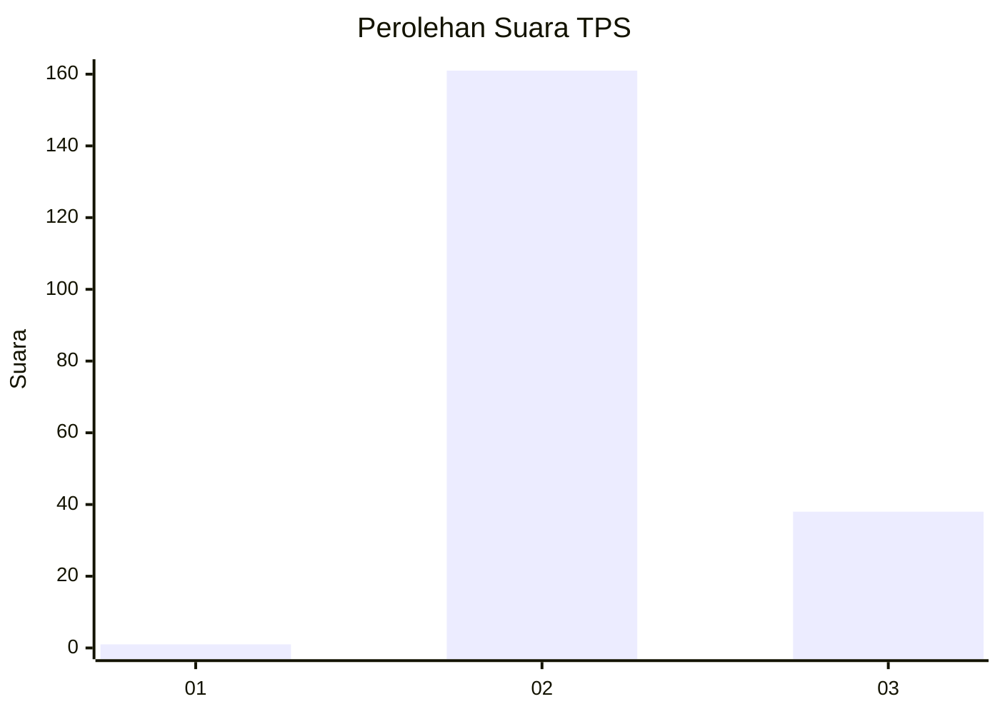
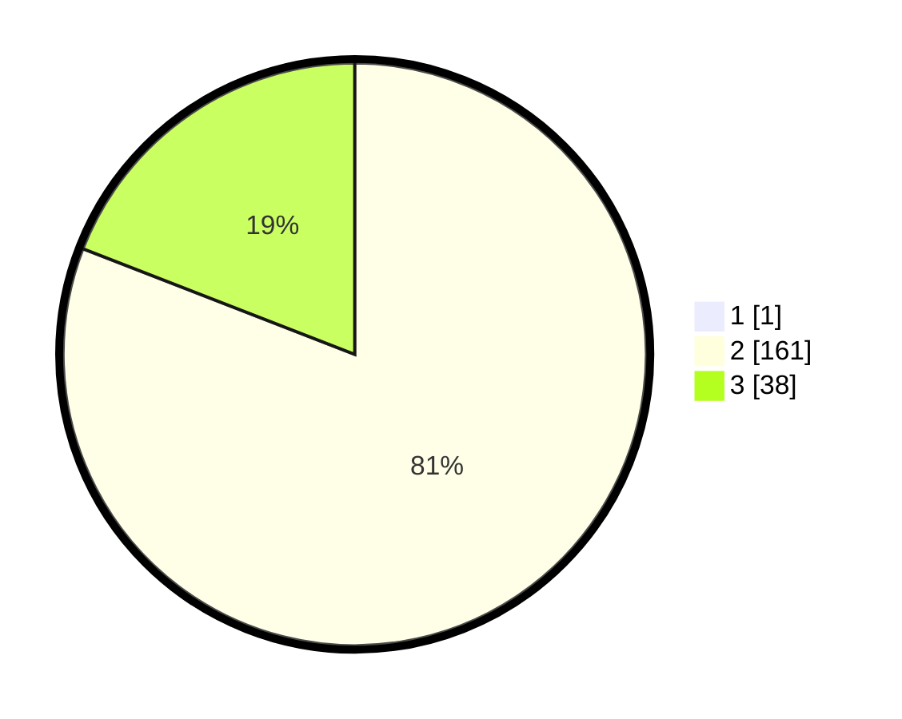

# Hasil

## Grafik

## Tabel

| No. | Nama Paslon    | Suara | Suara (raw) | Persentase |
|:--- |:-------------- | -----:| -----------:| ----------:|
| 1   | ANIES MUHAIMIN | 1     | [1][p-1]    | 0,50       |
| 2   | PRABOWO GIBRAN | 161   | [161][p-2]  | 80,50      |
| 3   | GANJAR MAHFUD  | 38    | [38][p-3]   | 19,00      |

[p-1]: https://github.com/gigit-pemilu/pemilu-2024-51-bali/blob/main/pilpres/hitung-suara/sub/51-bali/sub/06-bangli/sub/01-susut/sub/2007-tiga/sub/013-tps/sub/paslon-1.txt
[p-2]: https://github.com/gigit-pemilu/pemilu-2024-51-bali/blob/main/pilpres/hitung-suara/sub/51-bali/sub/06-bangli/sub/01-susut/sub/2007-tiga/sub/013-tps/sub/paslon-2.txt
[p-3]: https://github.com/gigit-pemilu/pemilu-2024-51-bali/blob/main/pilpres/hitung-suara/sub/51-bali/sub/06-bangli/sub/01-susut/sub/2007-tiga/sub/013-tps/sub/paslon-3.txt

## Foto C Plano

https://sirekap-obj-formc.kpu.go.id/6dc3/pemilu/ppwp/51/06/01/20/07/5106012007013-20240214-230325--9dab1786-1a13-4bad-93c0-738fb003b008.jpg

https://sirekap-obj-formc.kpu.go.id/6dc3/pemilu/ppwp/51/06/01/20/07/5106012007013-20240215-201037--2fc66e92-538f-4580-9625-b24fd043507f.jpg

https://sirekap-obj-formc.kpu.go.id/6dc3/pemilu/ppwp/51/06/01/20/07/5106012007013-20240214-231229--cbfaf09b-1ca3-4a5c-a258-f96a1e915035.jpg

## Metadata

| Key        | Value               |
| ---------- | ------------------- |
| Time Stamp | 2024-02-24 22:31:28 |

