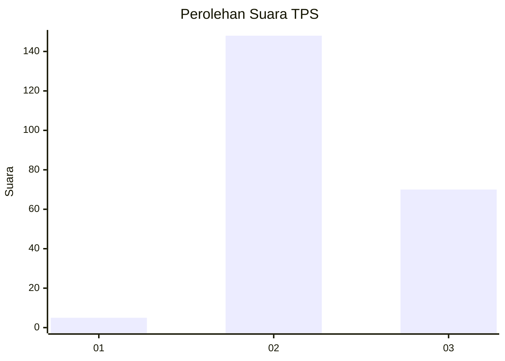
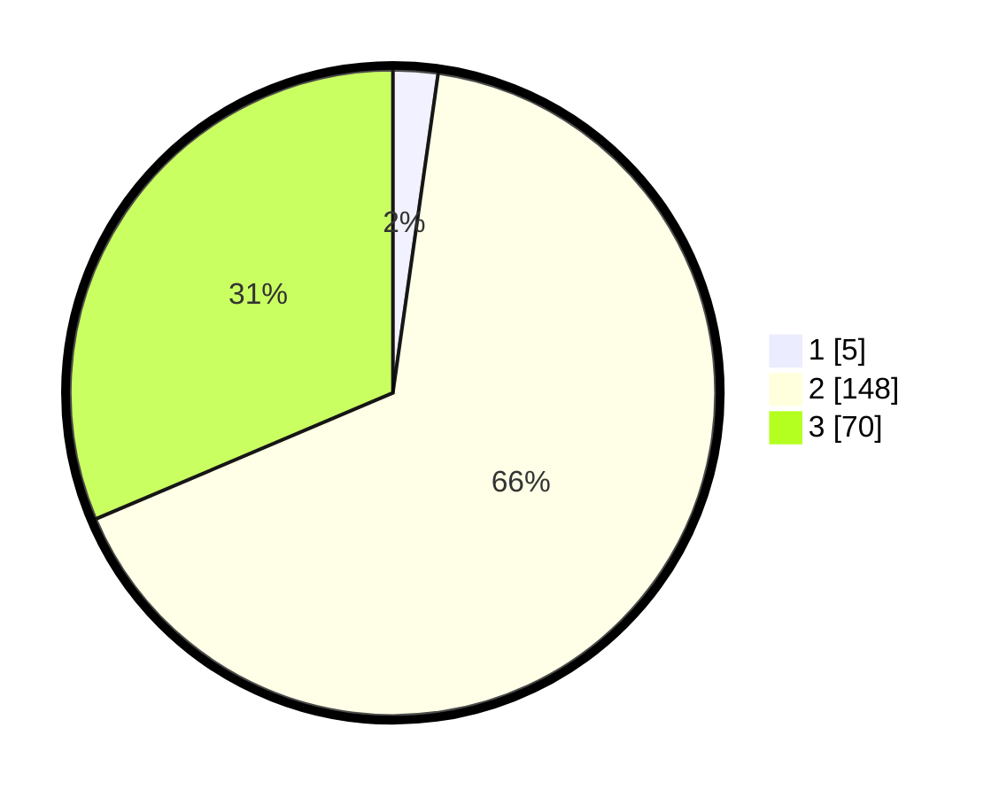

# Hasil

## Grafik

## Tabel

| No. | Nama Paslon    | Suara | Suara (raw) | Persentase |
|:--- |:-------------- | -----:| -----------:| ----------:|
| 1   | ANIES MUHAIMIN | 5     | [5][p-1]    | 2,24       |
| 2   | PRABOWO GIBRAN | 148   | [148][p-2]  | 66,37      |
| 3   | GANJAR MAHFUD  | 70    | [70][p-3]   | 31,39      |

[p-1]: https://github.com/gigit-pemilu/pemilu-2024-51-bali/blob/main/pilpres/hitung-suara/sub/51-bali/sub/06-bangli/sub/01-susut/sub/2007-tiga/sub/018-tps/sub/paslon-1.txt
[p-2]: https://github.com/gigit-pemilu/pemilu-2024-51-bali/blob/main/pilpres/hitung-suara/sub/51-bali/sub/06-bangli/sub/01-susut/sub/2007-tiga/sub/018-tps/sub/paslon-2.txt
[p-3]: https://github.com/gigit-pemilu/pemilu-2024-51-bali/blob/main/pilpres/hitung-suara/sub/51-bali/sub/06-bangli/sub/01-susut/sub/2007-tiga/sub/018-tps/sub/paslon-3.txt

## Foto C Plano

https://sirekap-obj-formc.kpu.go.id/11f7/pemilu/ppwp/51/06/01/20/07/5106012007018-20240214-224206--e1c353c5-2492-412e-90e0-777fb22bb62a.jpg

https://sirekap-obj-formc.kpu.go.id/11f7/pemilu/ppwp/51/06/01/20/07/5106012007018-20240214-224313--660fb0d9-1d22-44b0-a7ef-8760fec512ba.jpg

https://sirekap-obj-formc.kpu.go.id/11f7/pemilu/ppwp/51/06/01/20/07/5106012007018-20240214-224428--ecf62c75-0904-4f96-9f18-7d60fa72082e.jpg

## Metadata

| Key        | Value               |
| ---------- | ------------------- |
| Time Stamp | 2024-02-25 12:00:00 |

