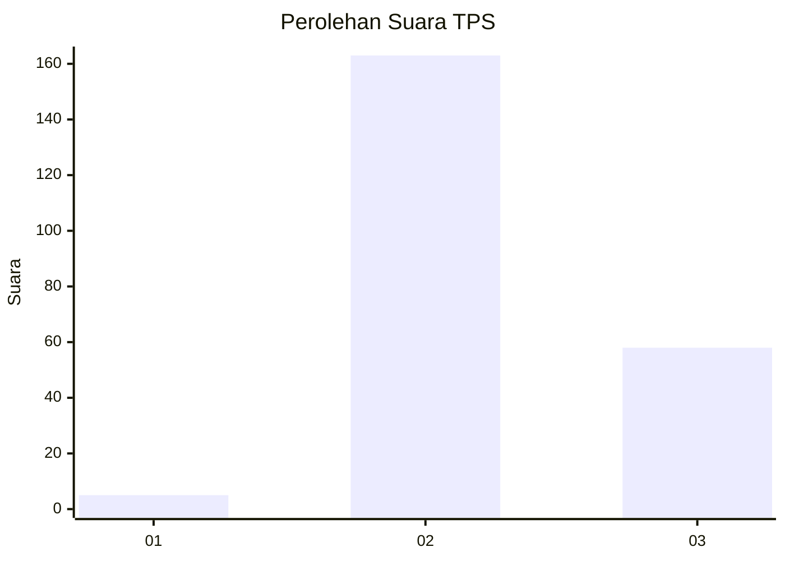
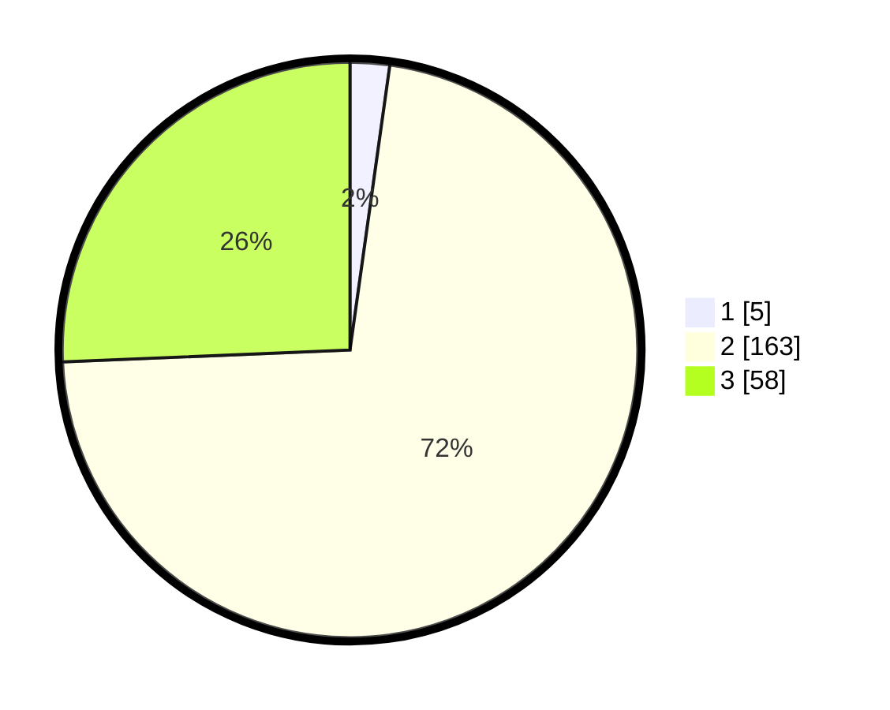

# Hasil

## Grafik

## Tabel

| No. | Nama Paslon    | Suara | Suara (raw) | Persentase |
|:--- |:-------------- | -----:| -----------:| ----------:|
| 1   | ANIES MUHAIMIN | 5     | [5][p-1]    | 2,21       |
| 2   | PRABOWO GIBRAN | 163   | [163][p-2]  | 72,12      |
| 3   | GANJAR MAHFUD  | 58    | [58][p-3]   | 25,66      |

[p-1]: https://github.com/gigit-pemilu/pemilu-2024-51-bali/blob/main/pilpres/hitung-suara/sub/51-bali/sub/06-bangli/sub/01-susut/sub/2007-tiga/sub/020-tps/sub/paslon-1.txt
[p-2]: https://github.com/gigit-pemilu/pemilu-2024-51-bali/blob/main/pilpres/hitung-suara/sub/51-bali/sub/06-bangli/sub/01-susut/sub/2007-tiga/sub/020-tps/sub/paslon-2.txt
[p-3]: https://github.com/gigit-pemilu/pemilu-2024-51-bali/blob/main/pilpres/hitung-suara/sub/51-bali/sub/06-bangli/sub/01-susut/sub/2007-tiga/sub/020-tps/sub/paslon-3.txt

## Foto C Plano

https://sirekap-obj-formc.kpu.go.id/fd4a/pemilu/ppwp/51/06/01/20/07/5106012007020-20240214-230814--a0a59d34-969f-4701-ad0a-59e346a21998.jpg

https://sirekap-obj-formc.kpu.go.id/fd4a/pemilu/ppwp/51/06/01/20/07/5106012007020-20240214-230951--d6474376-f691-43a7-9c8a-70fe61d838ce.jpg

https://sirekap-obj-formc.kpu.go.id/fd4a/pemilu/ppwp/51/06/01/20/07/5106012007020-20240214-231027--5d981467-aa90-43c9-b108-4db0b3122eed.jpg

## Metadata

| Key        | Value               |
| ---------- | ------------------- |
| Time Stamp | 2024-02-25 12:00:00 |

