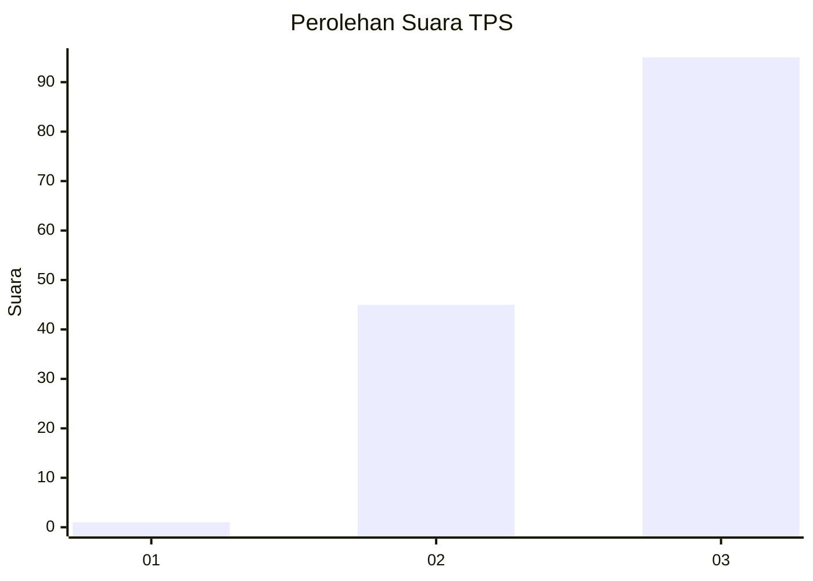
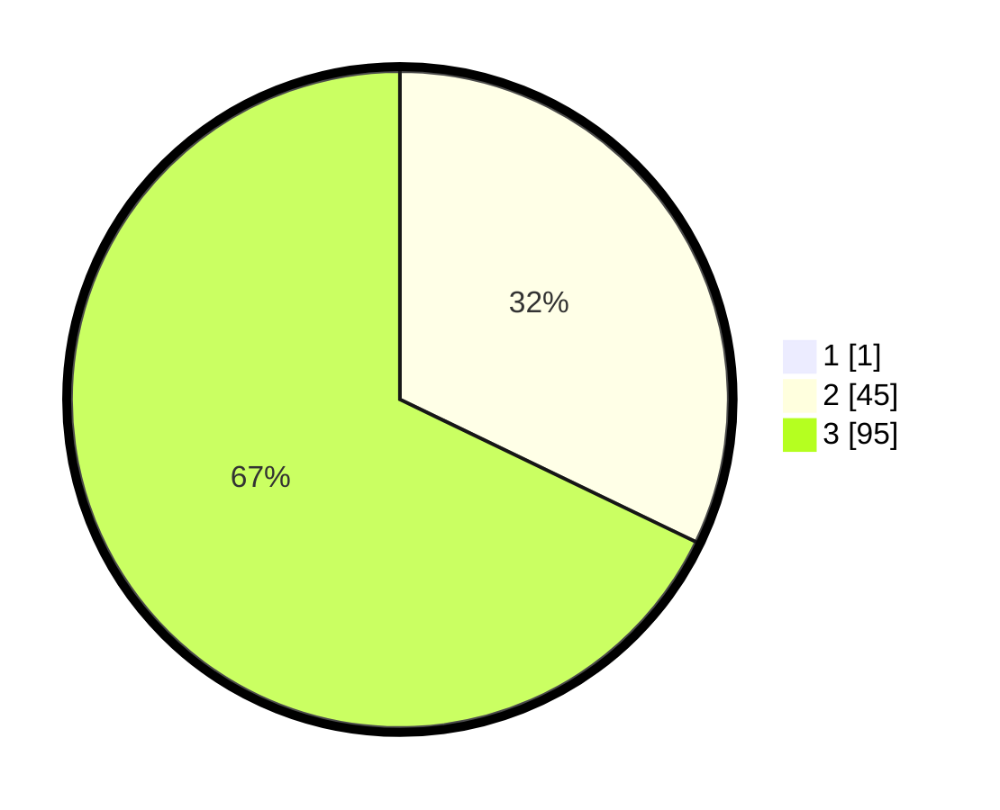

# Hasil

## Grafik

## Tabel

| No. | Nama Paslon    | Suara | Suara (raw) | Persentase |
|:--- |:-------------- | -----:| -----------:| ----------:|
| 1   | ANIES MUHAIMIN | 1     | [1][p-1]    | 0,71       |
| 2   | PRABOWO GIBRAN | 45    | [45][p-2]   | 31,91      |
| 3   | GANJAR MAHFUD  | 95    | [95][p-3]   | 67,38      |

[p-1]: https://github.com/gigit-pemilu/pemilu-2024-51-bali/blob/main/pilpres/hitung-suara/sub/51-bali/sub/06-bangli/sub/01-susut/sub/2007-tiga/sub/022-tps/sub/paslon-1.txt
[p-2]: https://github.com/gigit-pemilu/pemilu-2024-51-bali/blob/main/pilpres/hitung-suara/sub/51-bali/sub/06-bangli/sub/01-susut/sub/2007-tiga/sub/022-tps/sub/paslon-2.txt
[p-3]: https://github.com/gigit-pemilu/pemilu-2024-51-bali/blob/main/pilpres/hitung-suara/sub/51-bali/sub/06-bangli/sub/01-susut/sub/2007-tiga/sub/022-tps/sub/paslon-3.txt

## Foto C Plano

https://sirekap-obj-formc.kpu.go.id/374b/pemilu/ppwp/51/06/01/20/07/5106012007022-20240214-213352--d7504d0b-d8b5-4325-88e3-23b5ef382695.jpg

https://sirekap-obj-formc.kpu.go.id/374b/pemilu/ppwp/51/06/01/20/07/5106012007022-20240214-213636--276b0f56-2aeb-4b14-9213-0c169fb803b4.jpg

https://sirekap-obj-formc.kpu.go.id/374b/pemilu/ppwp/51/06/01/20/07/5106012007022-20240214-213938--1298e539-b5e8-4f9c-bc17-776482b94284.jpg

## Metadata

| Key        | Value               |
| ---------- | ------------------- |
| Time Stamp | 2024-02-24 22:31:28 |

