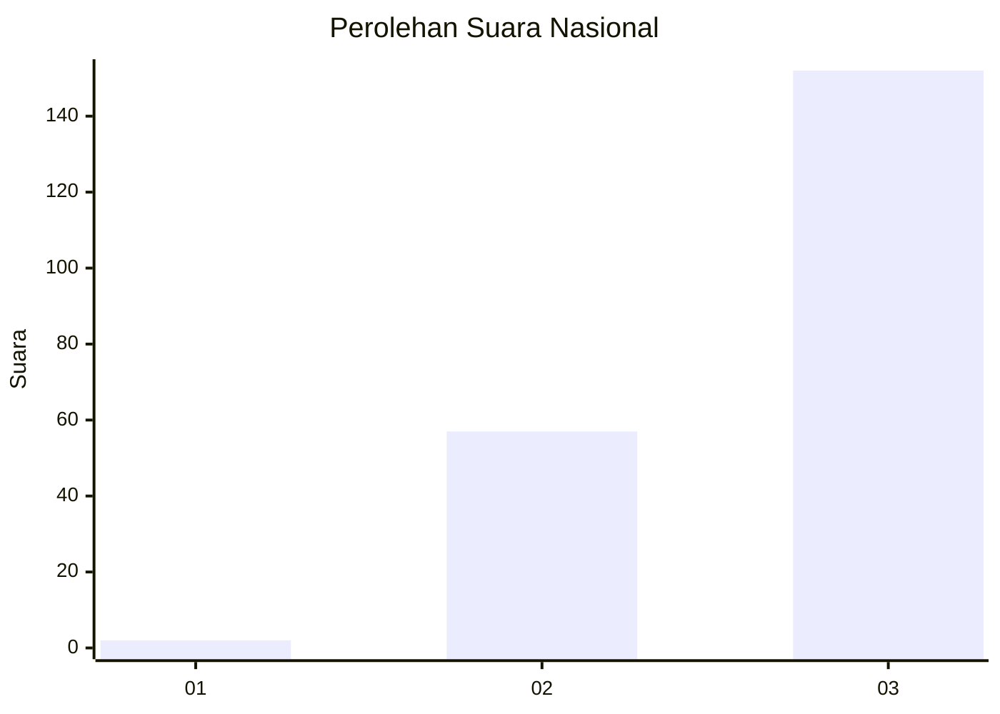
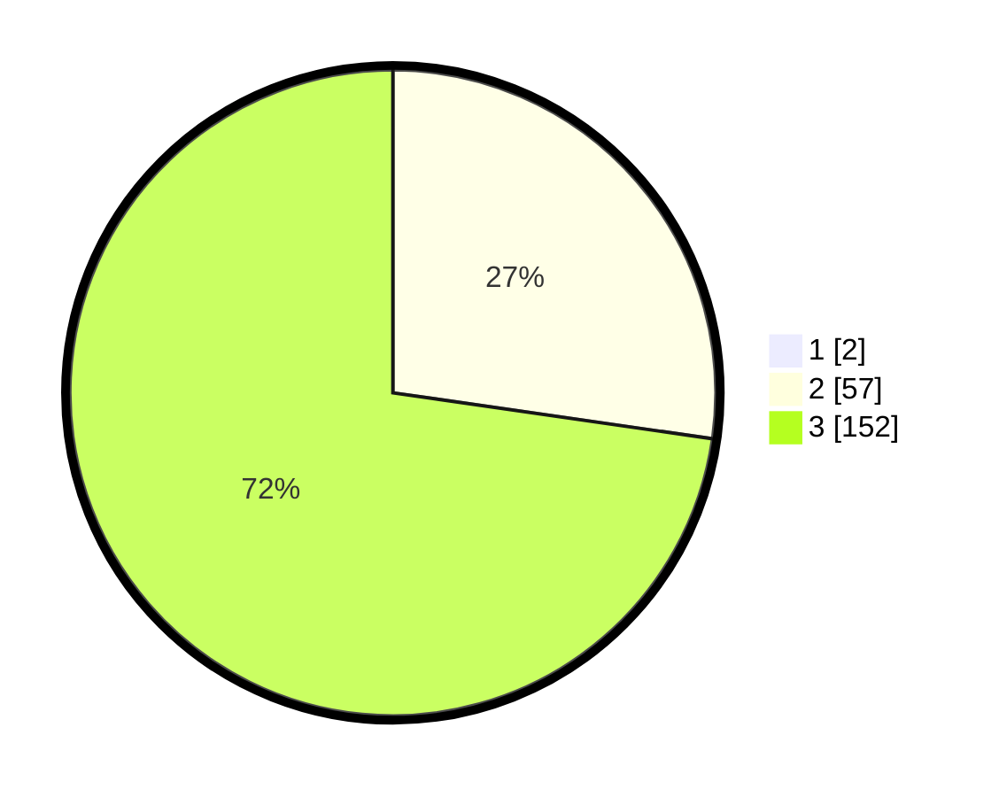

# Hasil

## Grafik

## Tabel

| No. | Nama Paslon    | Suara | Suara (raw) | Persentase |
|:--- |:-------------- | -----:| -----------:| ----------:|
| 1   | ANIES MUHAIMIN | 2     | [2][p-1]    | 0,95       |
| 2   | PRABOWO GIBRAN | 57    | [57][p-2]   | 27,01      |
| 3   | GANJAR MAHFUD  | 152   | [152][p-3]  | 72,04      |

[p-1]: https://github.com/gigit-pemilu/pemilu-2024/blob/main/pilpres/hitung-suara/sub/51-bali/sub/06-bangli/sub/01-susut/sub/2008-selat/sub/008-tps/sub/paslon-1.txt
[p-2]: https://github.com/gigit-pemilu/pemilu-2024/blob/main/pilpres/hitung-suara/sub/51-bali/sub/06-bangli/sub/01-susut/sub/2008-selat/sub/008-tps/sub/paslon-2.txt
[p-3]: https://github.com/gigit-pemilu/pemilu-2024/blob/main/pilpres/hitung-suara/sub/51-bali/sub/06-bangli/sub/01-susut/sub/2008-selat/sub/008-tps/sub/paslon-3.txt

## Foto C Plano

https://sirekap-obj-formc.kpu.go.id/3d96/pemilu/ppwp/51/06/01/20/08/5106012008008-20240214-210513--31dabc7b-d9a6-45e1-b147-4d52736e1665.jpg

https://sirekap-obj-formc.kpu.go.id/3d96/pemilu/ppwp/51/06/01/20/08/5106012008008-20240214-210601--b8b7eed6-89b7-4869-b480-847c32b6ed04.jpg

https://sirekap-obj-formc.kpu.go.id/3d96/pemilu/ppwp/51/06/01/20/08/5106012008008-20240214-210643--da0797d3-c3cd-464c-b7ef-f40575de798b.jpg

## Metadata

| Key        | Value               |
| ---------- | ------------------- |
| Time Stamp | 2024-02-15 06:00:23 |

## DATA PEMILIH TETAP

Jumlah pemilih dalam DPT: **258**.
 * L: **134**.
 * P: **124**.

## DATA PENGGUNA HAK PILIH

Jumlah pengguna hak pilih dalam DPT: **220**.
 * L: **115**.
 * P: **105**.

Jumlah pengguna hak pilih dalam DPTb: **0**.
 * L: **0**.
 * P: **0**.

Jumlah pengguna hak pilih dalam DPK: **0**.
 * L: **0**.
 * P: **0**.

Jumlah pengguna hak pilih: **220**.
 * L: **115**.
 * P: **105**.

## JUMLAH SUARA SAH DAN TIDAK SAH

JUMLAH SELURUH SUARA SAH: **211**.

JUMLAH SUARA TIDAK SAH: **9**.

JUMLAH SELURUH SUARA SAH DAN SUARA TIDAK SAH: **220**.

