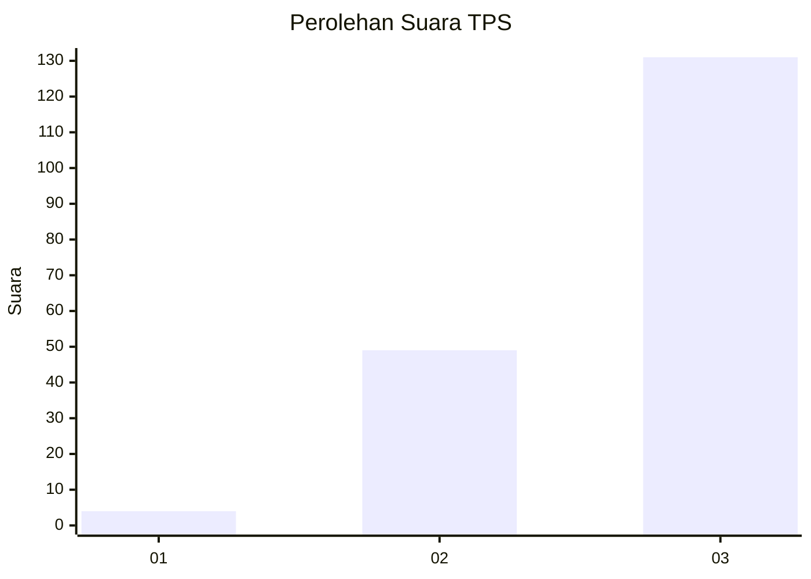
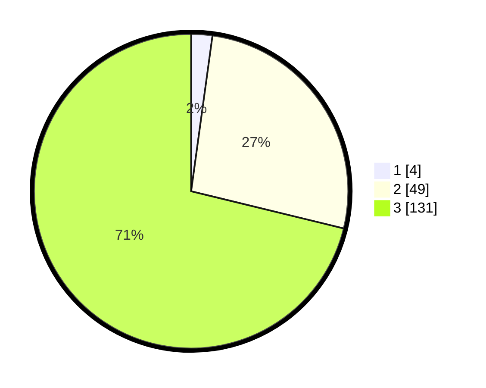

# Hasil

## Grafik

## Tabel

| No. | Nama Paslon    | Suara | Suara (raw) | Persentase |
|:--- |:-------------- | -----:| -----------:| ----------:|
| 1   | ANIES MUHAIMIN | 4     | [4][p-1]    | 2,17       |
| 2   | PRABOWO GIBRAN | 49    | [49][p-2]   | 26,63      |
| 3   | GANJAR MAHFUD  | 131   | [131][p-3]  | 71,20      |

[p-1]: https://github.com/gigit-pemilu/pemilu-2024-51-bali/blob/main/pilpres/hitung-suara/sub/51-bali/sub/06-bangli/sub/01-susut/sub/2008-selat/sub/009-tps/sub/paslon-1.txt
[p-2]: https://github.com/gigit-pemilu/pemilu-2024-51-bali/blob/main/pilpres/hitung-suara/sub/51-bali/sub/06-bangli/sub/01-susut/sub/2008-selat/sub/009-tps/sub/paslon-2.txt
[p-3]: https://github.com/gigit-pemilu/pemilu-2024-51-bali/blob/main/pilpres/hitung-suara/sub/51-bali/sub/06-bangli/sub/01-susut/sub/2008-selat/sub/009-tps/sub/paslon-3.txt

## Foto C Plano

https://sirekap-obj-formc.kpu.go.id/2a14/pemilu/ppwp/51/06/01/20/08/5106012008009-20240216-144952--f9e0f622-de06-442e-8dcf-a144c6049501.jpg

https://sirekap-obj-formc.kpu.go.id/2a14/pemilu/ppwp/51/06/01/20/08/5106012008009-20240216-144954--be01557d-c2c6-47f0-8959-21fa8a1c2271.jpg

https://sirekap-obj-formc.kpu.go.id/2a14/pemilu/ppwp/51/06/01/20/08/5106012008009-20240216-144953--e2bd878a-e097-410c-a01b-a81459a88967.jpg

## Metadata

| Key        | Value               |
| ---------- | ------------------- |
| Time Stamp | 2024-02-17 10:00:02 |

## DATA PEMILIH TETAP

Jumlah pemilih dalam DPT: **248**.
 * L: **128**.
 * P: **120**.

## DATA PENGGUNA HAK PILIH

Jumlah pengguna hak pilih dalam DPT: **189**.
 * L: **101**.
 * P: **88**.

Jumlah pengguna hak pilih dalam DPTb: **0**.
 * L: **0**.
 * P: **0**.

Jumlah pengguna hak pilih dalam DPK: **0**.
 * L: **0**.
 * P: **0**.

Jumlah pengguna hak pilih: **189**.
 * L: **101**.
 * P: **88**.

## JUMLAH SUARA SAH DAN TIDAK SAH

JUMLAH SELURUH SUARA SAH: **184**.

JUMLAH SUARA TIDAK SAH: **5**.

JUMLAH SELURUH SUARA SAH DAN SUARA TIDAK SAH: **189**.

