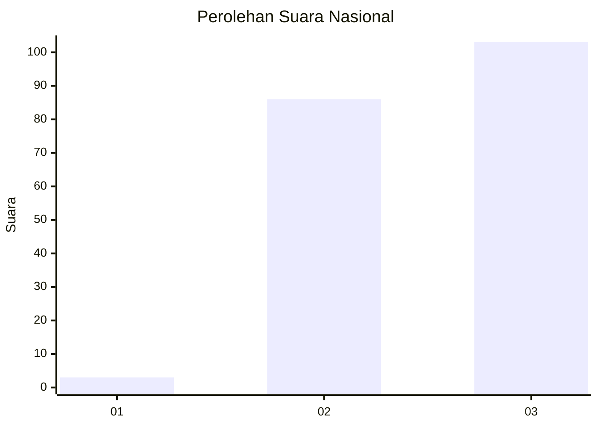
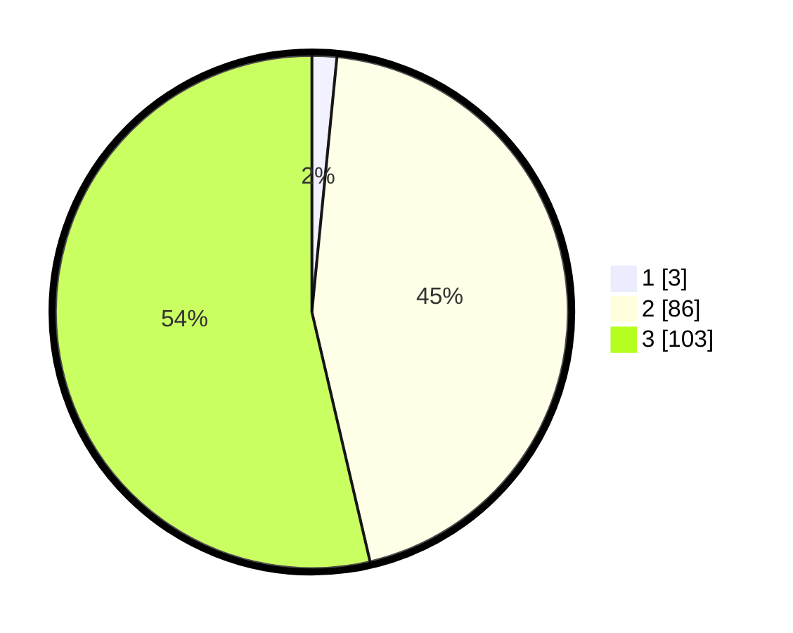

# Hasil

## Grafik

## Tabel

| No. | Nama Paslon    | Suara | Suara (raw) | Persentase |
|:--- |:-------------- | -----:| -----------:| ----------:|
| 1   | ANIES MUHAIMIN | 3     | [3][p-1]    | 1,56       |
| 2   | PRABOWO GIBRAN | 86    | [86][p-2]   | 44,79      |
| 3   | GANJAR MAHFUD  | 103   | [103][p-3]  | 53,65      |

[p-1]: https://github.com/gigit-pemilu/pemilu-2024/blob/main/pilpres/hitung-suara/sub/51-bali/sub/06-bangli/sub/01-susut/sub/2009-pengiangan/sub/005-tps/sub/paslon-1.txt
[p-2]: https://github.com/gigit-pemilu/pemilu-2024/blob/main/pilpres/hitung-suara/sub/51-bali/sub/06-bangli/sub/01-susut/sub/2009-pengiangan/sub/005-tps/sub/paslon-2.txt
[p-3]: https://github.com/gigit-pemilu/pemilu-2024/blob/main/pilpres/hitung-suara/sub/51-bali/sub/06-bangli/sub/01-susut/sub/2009-pengiangan/sub/005-tps/sub/paslon-3.txt

## Foto C Plano

https://sirekap-obj-formc.kpu.go.id/edda/pemilu/ppwp/51/06/01/20/09/5106012009005-20240214-141528--92973474-fe25-4d0f-afd1-14f2f72a5a47.jpg

https://sirekap-obj-formc.kpu.go.id/edda/pemilu/ppwp/51/06/01/20/09/5106012009005-20240214-141912--dfde8b43-0ee4-4908-bcd5-484c88137109.jpg

## Metadata

| Key        | Value               |
| ---------- | ------------------- |
| Time Stamp | 2024-02-24 22:31:28 |

