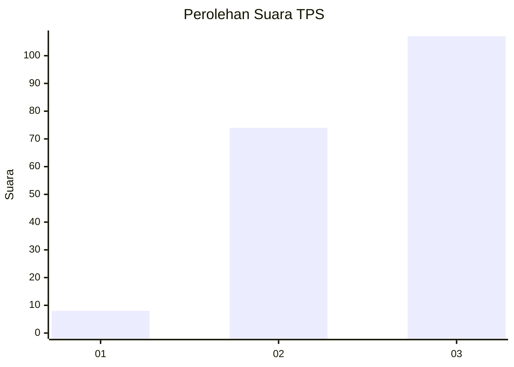
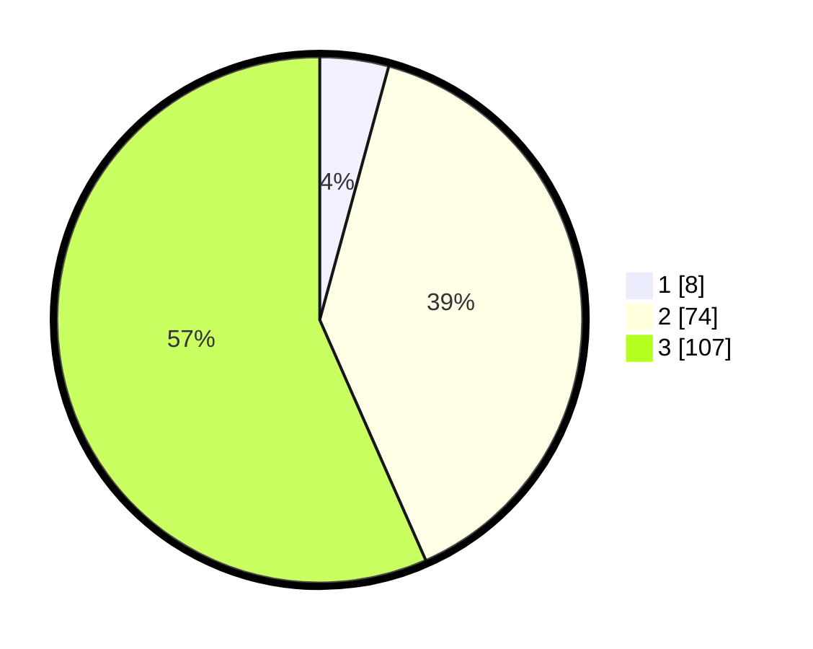

# Hasil

## Grafik

## Tabel

| No. | Nama Paslon    | Suara | Suara (raw) | Persentase |
|:--- |:-------------- | -----:| -----------:| ----------:|
| 1   | ANIES MUHAIMIN | 8     | [8][p-1]    | 4,23       |
| 2   | PRABOWO GIBRAN | 74    | [74][p-2]   | 39,15      |
| 3   | GANJAR MAHFUD  | 107   | [107][p-3]  | 56,61      |

[p-1]: https://github.com/gigit-pemilu/pemilu-2024-51-bali/blob/main/pilpres/hitung-suara/sub/51-bali/sub/06-bangli/sub/01-susut/sub/2009-pengiangan/sub/006-tps/sub/paslon-1.txt
[p-2]: https://github.com/gigit-pemilu/pemilu-2024-51-bali/blob/main/pilpres/hitung-suara/sub/51-bali/sub/06-bangli/sub/01-susut/sub/2009-pengiangan/sub/006-tps/sub/paslon-2.txt
[p-3]: https://github.com/gigit-pemilu/pemilu-2024-51-bali/blob/main/pilpres/hitung-suara/sub/51-bali/sub/06-bangli/sub/01-susut/sub/2009-pengiangan/sub/006-tps/sub/paslon-3.txt

## Foto C Plano

https://sirekap-obj-formc.kpu.go.id/07b9/pemilu/ppwp/51/06/01/20/09/5106012009006-20240214-215900--7cb374e7-545e-4492-8413-fcfa84c1d3bf.jpg

https://sirekap-obj-formc.kpu.go.id/07b9/pemilu/ppwp/51/06/01/20/09/5106012009006-20240214-220020--d0808b08-fd9b-431b-85d1-b440a3e49f9c.jpg

https://sirekap-obj-formc.kpu.go.id/07b9/pemilu/ppwp/51/06/01/20/09/5106012009006-20240214-220929--9644d51e-ab25-42ad-a1a0-59df076a9cb9.jpg

## Metadata

| Key        | Value               |
| ---------- | ------------------- |
| Time Stamp | 2024-02-24 22:31:28 |

