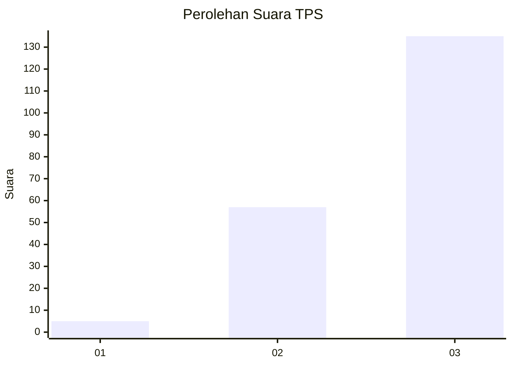
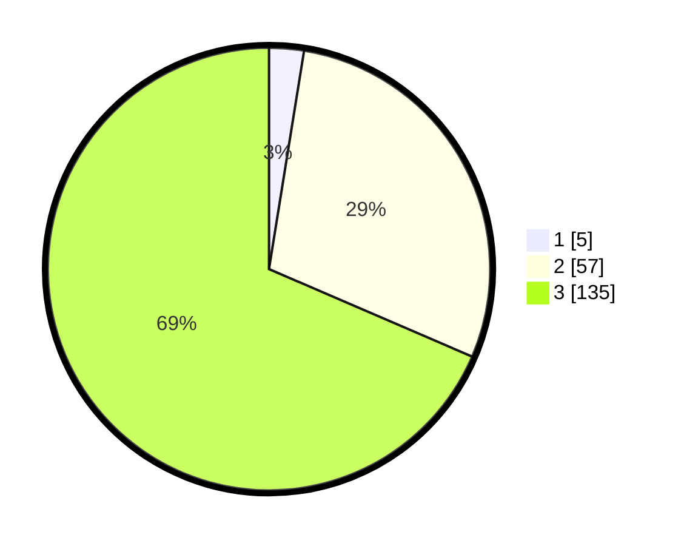

# Hasil

## Grafik

## Tabel

| No. | Nama Paslon    | Suara | Suara (raw) | Persentase |
|:--- |:-------------- | -----:| -----------:| ----------:|
| 1   | ANIES MUHAIMIN | 5     | [5][p-1]    | 2,54       |
| 2   | PRABOWO GIBRAN | 57    | [57][p-2]   | 28,93      |
| 3   | GANJAR MAHFUD  | 135   | [135][p-3]  | 68,53      |

[p-1]: https://github.com/gigit-pemilu/pemilu-2024-51-bali/blob/main/pilpres/hitung-suara/sub/51-bali/sub/06-bangli/sub/01-susut/sub/2009-pengiangan/sub/009-tps/sub/paslon-1.txt
[p-2]: https://github.com/gigit-pemilu/pemilu-2024-51-bali/blob/main/pilpres/hitung-suara/sub/51-bali/sub/06-bangli/sub/01-susut/sub/2009-pengiangan/sub/009-tps/sub/paslon-2.txt
[p-3]: https://github.com/gigit-pemilu/pemilu-2024-51-bali/blob/main/pilpres/hitung-suara/sub/51-bali/sub/06-bangli/sub/01-susut/sub/2009-pengiangan/sub/009-tps/sub/paslon-3.txt

## Foto C Plano

https://sirekap-obj-formc.kpu.go.id/f281/pemilu/ppwp/51/06/01/20/09/5106012009009-20240214-141738--b1466b2a-27d2-45d3-9253-b434836c4d09.jpg

https://sirekap-obj-formc.kpu.go.id/f281/pemilu/ppwp/51/06/01/20/09/5106012009009-20240214-141631--b5cd36e6-35cd-4ab1-acb1-6a72fb737e09.jpg

https://sirekap-obj-formc.kpu.go.id/f281/pemilu/ppwp/51/06/01/20/09/5106012009009-20240214-141758--bc9bfa45-164c-430d-a074-86787a77dcdc.jpg

## Metadata

| Key        | Value               |
| ---------- | ------------------- |
| Time Stamp | 2024-02-15 16:00:26 |

