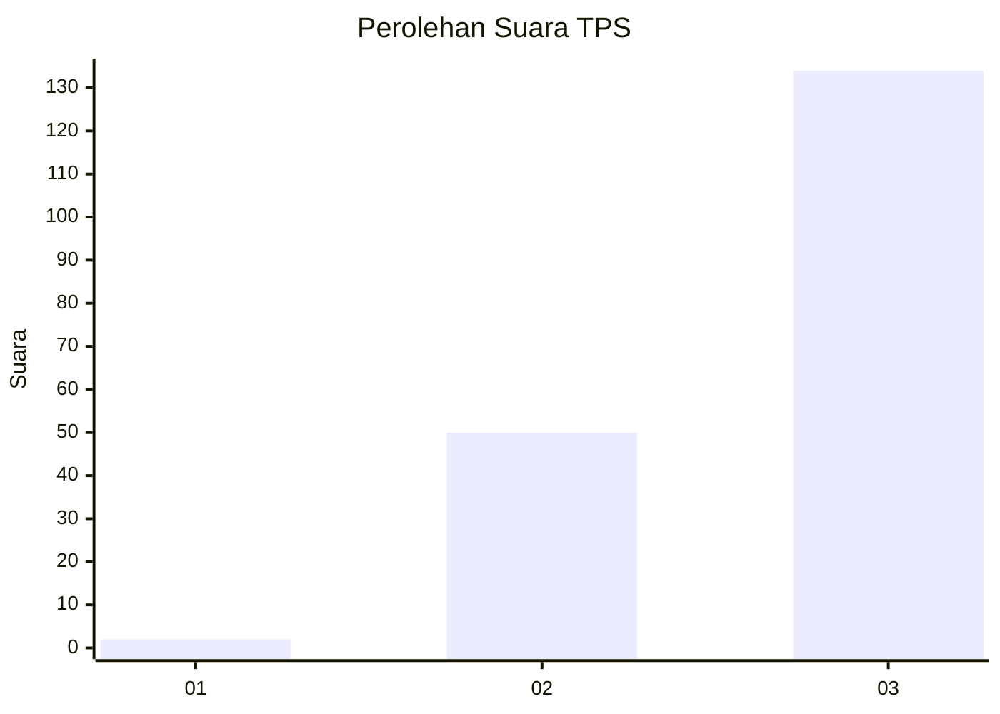
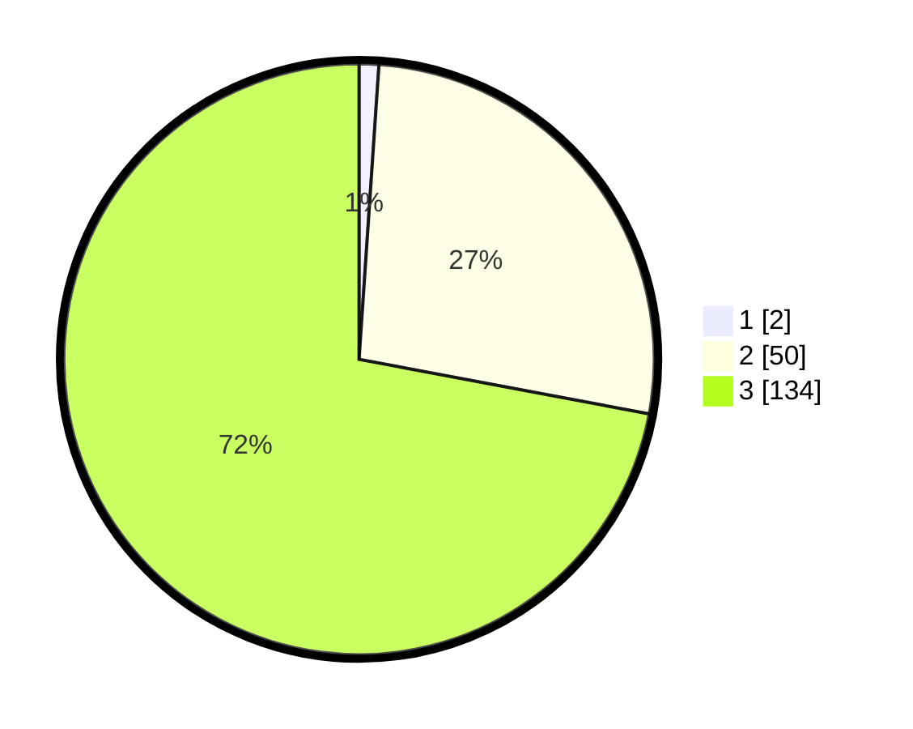

# Hasil

## Grafik

## Tabel

| No. | Nama Paslon    | Suara | Suara (raw) | Persentase |
|:--- |:-------------- | -----:| -----------:| ----------:|
| 1   | ANIES MUHAIMIN | 2     | [2][p-1]    | 1,08       |
| 2   | PRABOWO GIBRAN | 50    | [50][p-2]   | 26,88      |
| 3   | GANJAR MAHFUD  | 134   | [134][p-3]  | 72,04      |

[p-1]: https://github.com/gigit-pemilu/pemilu-2024-51-bali/blob/main/pilpres/hitung-suara/sub/51-bali/sub/06-bangli/sub/01-susut/sub/2009-pengiangan/sub/010-tps/sub/paslon-1.txt
[p-2]: https://github.com/gigit-pemilu/pemilu-2024-51-bali/blob/main/pilpres/hitung-suara/sub/51-bali/sub/06-bangli/sub/01-susut/sub/2009-pengiangan/sub/010-tps/sub/paslon-2.txt
[p-3]: https://github.com/gigit-pemilu/pemilu-2024-51-bali/blob/main/pilpres/hitung-suara/sub/51-bali/sub/06-bangli/sub/01-susut/sub/2009-pengiangan/sub/010-tps/sub/paslon-3.txt

## Foto C Plano

https://sirekap-obj-formc.kpu.go.id/549a/pemilu/ppwp/51/06/01/20/09/5106012009010-20240214-224933--1db61471-6b1a-4f62-9ec4-34931721aeed.jpg

https://sirekap-obj-formc.kpu.go.id/549a/pemilu/ppwp/51/06/01/20/09/5106012009010-20240214-225839--5c82277b-8f3e-416f-9b98-a7811242485b.jpg

https://sirekap-obj-formc.kpu.go.id/549a/pemilu/ppwp/51/06/01/20/09/5106012009010-20240214-225248--80e4d2ee-f54a-4974-bf7c-76975249e4ad.jpg

## Metadata

| Key        | Value               |
| ---------- | ------------------- |
| Time Stamp | 2024-02-24 22:31:28 |

