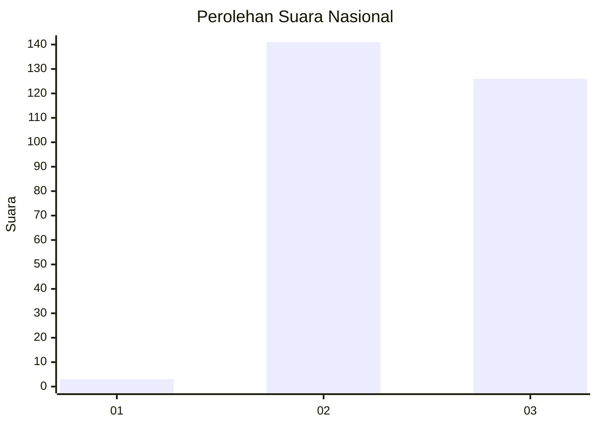
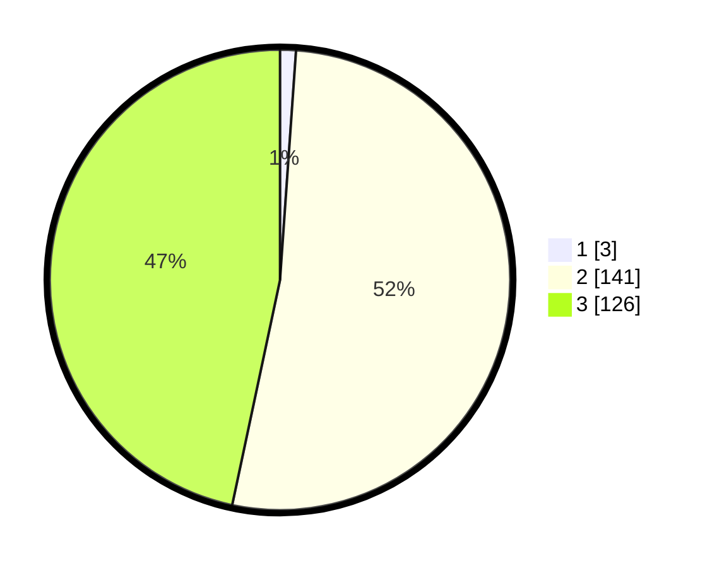

# Hasil

## Grafik

## Tabel

| No. | Nama Paslon    | Suara | Suara (raw) | Persentase |
|:--- |:-------------- | -----:| -----------:| ----------:|
| 1   | ANIES MUHAIMIN | 3     | [3][p-1]    | 1,11       |
| 2   | PRABOWO GIBRAN | 141   | [141][p-2]  | 52,22      |
| 3   | GANJAR MAHFUD  | 126   | [126][p-3]  | 46,67      |

[p-1]: https://github.com/gigit-pemilu/pemilu-2024/blob/main/pilpres/hitung-suara/sub/51-bali/sub/06-bangli/sub/02-bangli/sub/1003-bebalang/sub/004-tps/sub/paslon-1.txt
[p-2]: https://github.com/gigit-pemilu/pemilu-2024/blob/main/pilpres/hitung-suara/sub/51-bali/sub/06-bangli/sub/02-bangli/sub/1003-bebalang/sub/004-tps/sub/paslon-2.txt
[p-3]: https://github.com/gigit-pemilu/pemilu-2024/blob/main/pilpres/hitung-suara/sub/51-bali/sub/06-bangli/sub/02-bangli/sub/1003-bebalang/sub/004-tps/sub/paslon-3.txt

## Foto C Plano

https://sirekap-obj-formc.kpu.go.id/9811/pemilu/ppwp/51/06/02/10/03/5106021003004-20240216-015046--44a6cc1e-ce2b-4241-9f3f-22a8f91e2849.jpg

https://sirekap-obj-formc.kpu.go.id/9811/pemilu/ppwp/51/06/02/10/03/5106021003004-20240216-015103--fb425d0f-1b34-4fe4-aa99-83a92fd10198.jpg

https://sirekap-obj-formc.kpu.go.id/9811/pemilu/ppwp/51/06/02/10/03/5106021003004-20240216-040527--7b1ae0d9-6c91-48d4-954b-f9f73a6b593a.jpg

## Metadata

| Key        | Value               |
| ---------- | ------------------- |
| Time Stamp | 2024-02-16 12:51:22 |

## DATA PEMILIH TETAP

Jumlah pemilih dalam DPT: **292**.
 * L: **140**.
 * P: **152**.

## DATA PENGGUNA HAK PILIH

Jumlah pengguna hak pilih dalam DPT: **278**.
 * L: **134**.
 * P: **144**.

Jumlah pengguna hak pilih dalam DPTb: **0**.
 * L: **0**.
 * P: **0**.

Jumlah pengguna hak pilih dalam DPK: **1**.
 * L: **1**.
 * P: **0**.

Jumlah pengguna hak pilih: **279**.
 * L: **135**.
 * P: **144**.

## JUMLAH SUARA SAH DAN TIDAK SAH

JUMLAH SELURUH SUARA SAH: **270**.

JUMLAH SUARA TIDAK SAH: **9**.

JUMLAH SELURUH SUARA SAH DAN SUARA TIDAK SAH: **279**.

