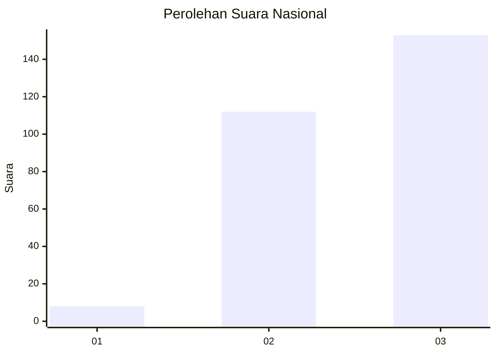
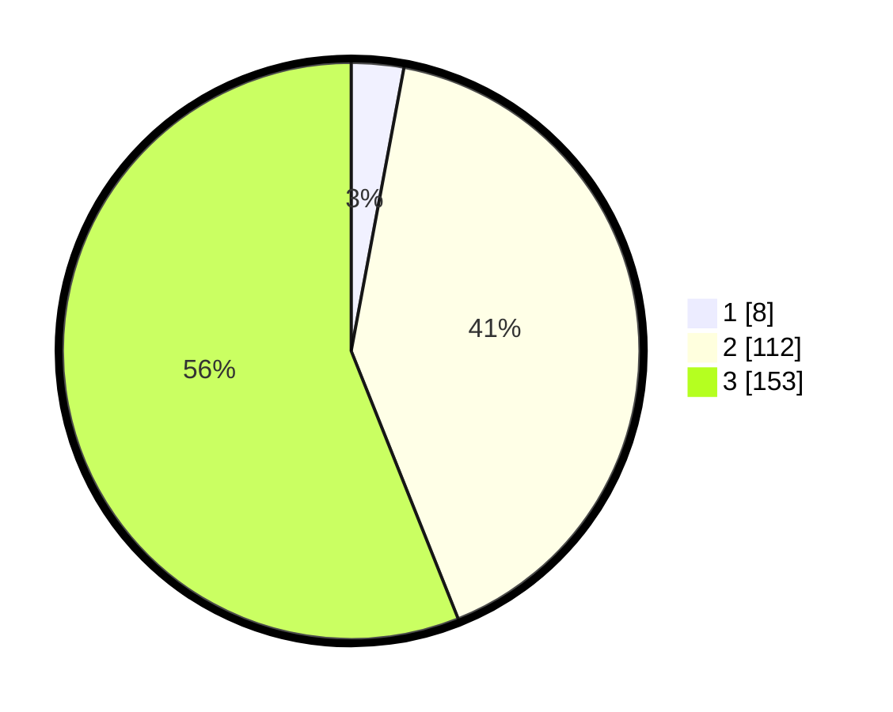

# Hasil

## Grafik

## Tabel

| No. | Nama Paslon    | Suara | Suara (raw) | Persentase |
|:--- |:-------------- | -----:| -----------:| ----------:|
| 1   | ANIES MUHAIMIN | 8     | [8][p-1]    | 2,93       |
| 2   | PRABOWO GIBRAN | 112   | [112][p-2]  | 41,03      |
| 3   | GANJAR MAHFUD  | 153   | [153][p-3]  | 56,04      |

[p-1]: https://github.com/gigit-pemilu/pemilu-2024/blob/main/pilpres/hitung-suara/sub/51-bali/sub/06-bangli/sub/02-bangli/sub/1003-bebalang/sub/006-tps/sub/paslon-1.txt
[p-2]: https://github.com/gigit-pemilu/pemilu-2024/blob/main/pilpres/hitung-suara/sub/51-bali/sub/06-bangli/sub/02-bangli/sub/1003-bebalang/sub/006-tps/sub/paslon-2.txt
[p-3]: https://github.com/gigit-pemilu/pemilu-2024/blob/main/pilpres/hitung-suara/sub/51-bali/sub/06-bangli/sub/02-bangli/sub/1003-bebalang/sub/006-tps/sub/paslon-3.txt

## Foto C Plano

https://sirekap-obj-formc.kpu.go.id/8365/pemilu/ppwp/51/06/02/10/03/5106021003006-20240214-192905--ad1fc318-b68f-44d6-ba7f-76173ee68c9f.jpg

https://sirekap-obj-formc.kpu.go.id/8365/pemilu/ppwp/51/06/02/10/03/5106021003006-20240216-040028--280bdbd0-6a35-478e-894a-52e92deb39b6.jpg

https://sirekap-obj-formc.kpu.go.id/8365/pemilu/ppwp/51/06/02/10/03/5106021003006-20240216-040023--7d240132-3524-40e4-bf87-058ea6067e2b.jpg

## Metadata

| Key        | Value               |
| ---------- | ------------------- |
| Time Stamp | 2024-02-16 12:51:22 |

## DATA PEMILIH TETAP

Jumlah pemilih dalam DPT: **296**.
 * L: **139**.
 * P: **157**.

## DATA PENGGUNA HAK PILIH

Jumlah pengguna hak pilih dalam DPT: **270**.
 * L: **127**.
 * P: **143**.

Jumlah pengguna hak pilih dalam DPTb: **0**.
 * L: **0**.
 * P: **0**.

Jumlah pengguna hak pilih dalam DPK: **6**.
 * L: **2**.
 * P: **4**.

Jumlah pengguna hak pilih: **276**.
 * L: **129**.
 * P: **147**.

## JUMLAH SUARA SAH DAN TIDAK SAH

JUMLAH SELURUH SUARA SAH: **273**.

JUMLAH SUARA TIDAK SAH: **3**.

JUMLAH SELURUH SUARA SAH DAN SUARA TIDAK SAH: **276**.

