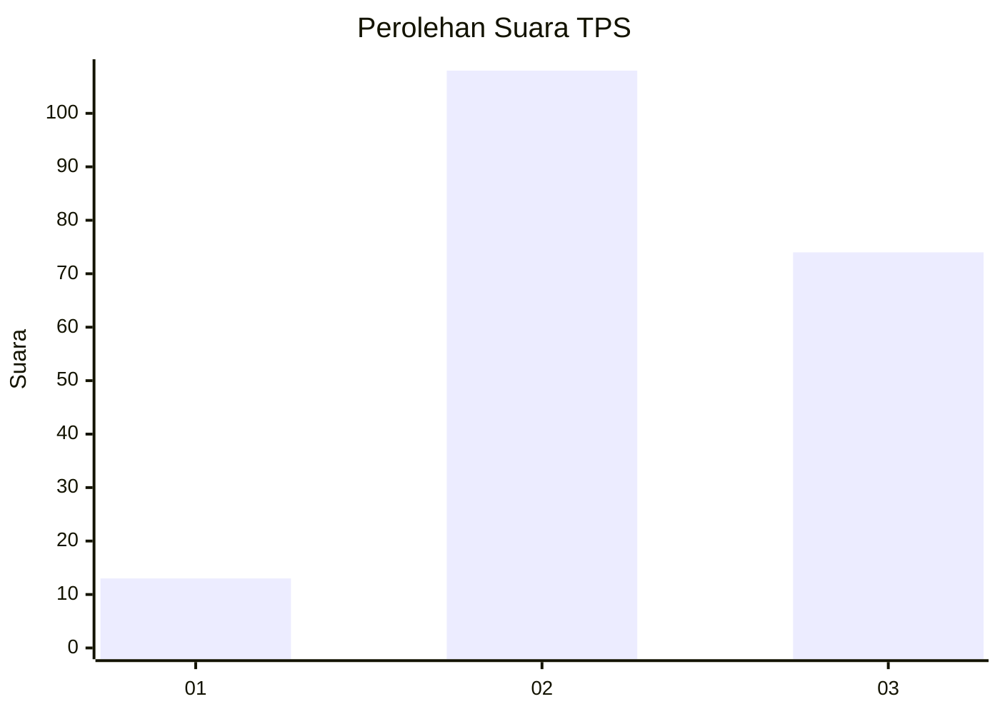
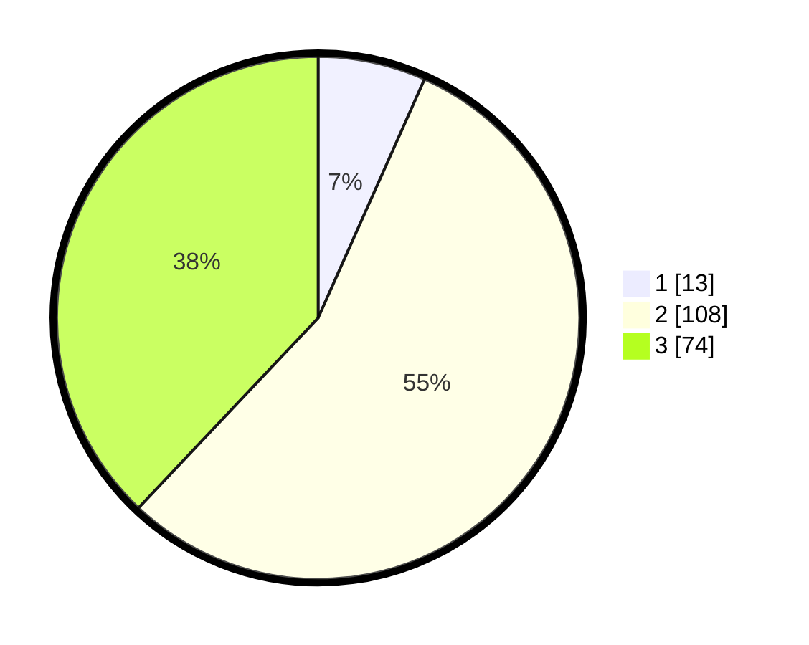

# Hasil

## Grafik

## Tabel

| No. | Nama Paslon    | Suara | Suara (raw) | Persentase |
|:--- |:-------------- | -----:| -----------:| ----------:|
| 1   | ANIES MUHAIMIN | 13    | [13][p-1]   | 6,67       |
| 2   | PRABOWO GIBRAN | 108   | [108][p-2]  | 55,38      |
| 3   | GANJAR MAHFUD  | 74    | [74][p-3]   | 37,95      |

[p-1]: https://github.com/gigit-pemilu/pemilu-2024-51-bali/blob/main/pilpres/hitung-suara/sub/51-bali/sub/06-bangli/sub/02-bangli/sub/1003-bebalang/sub/007-tps/sub/paslon-1.txt
[p-2]: https://github.com/gigit-pemilu/pemilu-2024-51-bali/blob/main/pilpres/hitung-suara/sub/51-bali/sub/06-bangli/sub/02-bangli/sub/1003-bebalang/sub/007-tps/sub/paslon-2.txt
[p-3]: https://github.com/gigit-pemilu/pemilu-2024-51-bali/blob/main/pilpres/hitung-suara/sub/51-bali/sub/06-bangli/sub/02-bangli/sub/1003-bebalang/sub/007-tps/sub/paslon-3.txt

## Foto C Plano

https://sirekap-obj-formc.kpu.go.id/0ffe/pemilu/ppwp/51/06/02/10/03/5106021003007-20240215-111604--e90f2fed-5f80-4af7-9738-7824e9003e9b.jpg

https://sirekap-obj-formc.kpu.go.id/0ffe/pemilu/ppwp/51/06/02/10/03/5106021003007-20240215-111633--1525c346-6bdd-4e17-b9e3-f1de540868f7.jpg

https://sirekap-obj-formc.kpu.go.id/0ffe/pemilu/ppwp/51/06/02/10/03/5106021003007-20240215-111615--544106d6-62a7-48cb-a5f5-8e9a0ab1b077.jpg

## Metadata

| Key        | Value               |
| ---------- | ------------------- |
| Time Stamp | 2024-02-15 15:00:29 |

## DATA PEMILIH TETAP

Jumlah pemilih dalam DPT: **230**.
 * L: **106**.
 * P: **124**.

## DATA PENGGUNA HAK PILIH

Jumlah pengguna hak pilih dalam DPT: **194**.
 * L: **88**.
 * P: **106**.

Jumlah pengguna hak pilih dalam DPTb: **4**.
 * L: **2**.
 * P: **2**.

Jumlah pengguna hak pilih dalam DPK: **0**.
 * L: **0**.
 * P: **0**.

Jumlah pengguna hak pilih: **198**.
 * L: **90**.
 * P: **108**.

## JUMLAH SUARA SAH DAN TIDAK SAH

JUMLAH SELURUH SUARA SAH: **195**.

JUMLAH SUARA TIDAK SAH: **3**.

JUMLAH SELURUH SUARA SAH DAN SUARA TIDAK SAH: **198**.

