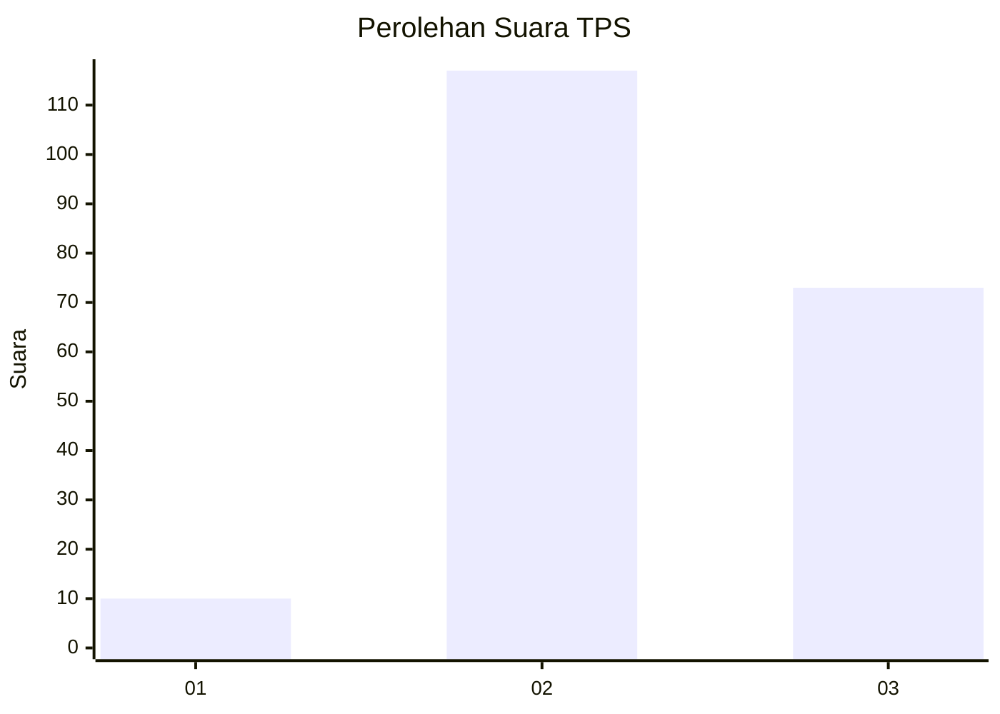
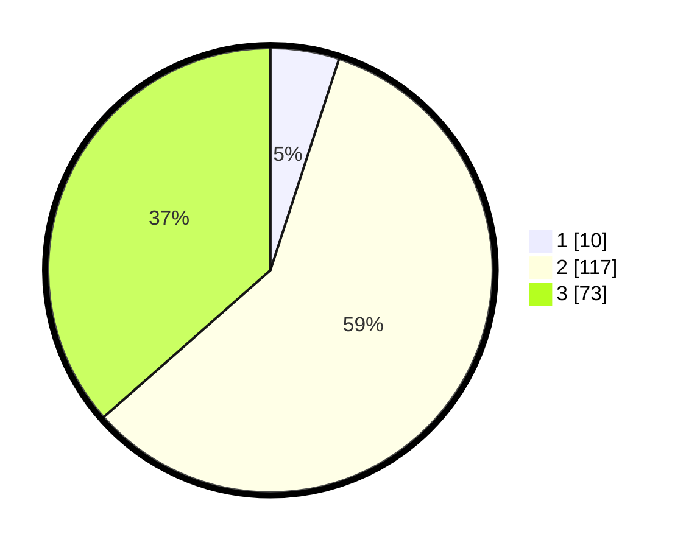

# Hasil

## Grafik

## Tabel

| No. | Nama Paslon    | Suara | Suara (raw) | Persentase |
|:--- |:-------------- | -----:| -----------:| ----------:|
| 1   | ANIES MUHAIMIN | 10    | [10][p-1]   | 5,00       |
| 2   | PRABOWO GIBRAN | 117   | [117][p-2]  | 58,50      |
| 3   | GANJAR MAHFUD  | 73    | [73][p-3]   | 36,50      |

[p-1]: https://github.com/gigit-pemilu/pemilu-2024-51-bali/blob/main/pilpres/hitung-suara/sub/51-bali/sub/06-bangli/sub/02-bangli/sub/1003-bebalang/sub/008-tps/sub/paslon-1.txt
[p-2]: https://github.com/gigit-pemilu/pemilu-2024-51-bali/blob/main/pilpres/hitung-suara/sub/51-bali/sub/06-bangli/sub/02-bangli/sub/1003-bebalang/sub/008-tps/sub/paslon-2.txt
[p-3]: https://github.com/gigit-pemilu/pemilu-2024-51-bali/blob/main/pilpres/hitung-suara/sub/51-bali/sub/06-bangli/sub/02-bangli/sub/1003-bebalang/sub/008-tps/sub/paslon-3.txt

## Foto C Plano

https://sirekap-obj-formc.kpu.go.id/959b/pemilu/ppwp/51/06/02/10/03/5106021003008-20240215-204637--1fd1507a-f8b9-4d2d-8072-1851d1ab6c86.jpg

https://sirekap-obj-formc.kpu.go.id/959b/pemilu/ppwp/51/06/02/10/03/5106021003008-20240215-204639--67c3b49d-b8da-4efd-bb0d-98317f6fea35.jpg

https://sirekap-obj-formc.kpu.go.id/959b/pemilu/ppwp/51/06/02/10/03/5106021003008-20240215-204638--bb252783-cc51-4b27-9792-eb00d5d3e289.jpg

## Metadata

| Key        | Value               |
| ---------- | ------------------- |
| Time Stamp | 2024-02-15 21:01:18 |

## DATA PEMILIH TETAP

Jumlah pemilih dalam DPT: **228**.
 * L: **115**.
 * P: **113**.

## DATA PENGGUNA HAK PILIH

Jumlah pengguna hak pilih dalam DPT: **189**.
 * L: **96**.
 * P: **93**.

Jumlah pengguna hak pilih dalam DPTb: **8**.
 * L: **4**.
 * P: **4**.

Jumlah pengguna hak pilih dalam DPK: **7**.
 * L: **5**.
 * P: **2**.

Jumlah pengguna hak pilih: **204**.
 * L: **105**.
 * P: **99**.

## JUMLAH SUARA SAH DAN TIDAK SAH

JUMLAH SELURUH SUARA SAH: **200**.

JUMLAH SUARA TIDAK SAH: **4**.

JUMLAH SELURUH SUARA SAH DAN SUARA TIDAK SAH: **204**.

