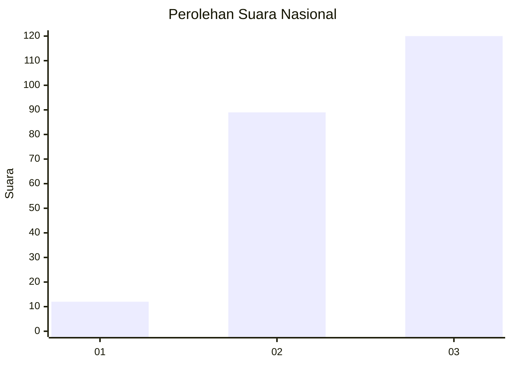
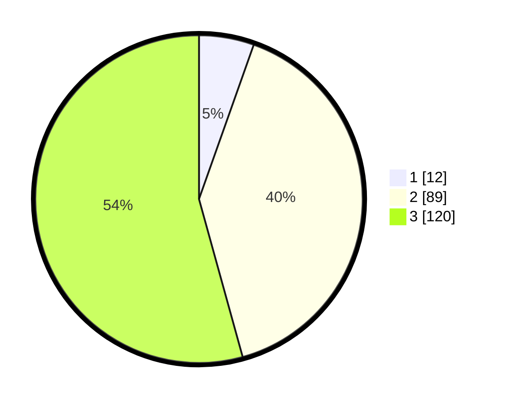

# Hasil

## Grafik

## Tabel

| No. | Nama Paslon    | Suara | Suara (raw) | Persentase |
|:--- |:-------------- | -----:| -----------:| ----------:|
| 1   | ANIES MUHAIMIN | 12    | [12][p-1]   | 5,43       |
| 2   | PRABOWO GIBRAN | 89    | [89][p-2]   | 40,27      |
| 3   | GANJAR MAHFUD  | 120   | [120][p-3]  | 54,30      |

[p-1]: https://github.com/gigit-pemilu/pemilu-2024/blob/main/pilpres/hitung-suara/sub/51-bali/sub/06-bangli/sub/02-bangli/sub/1003-bebalang/sub/015-tps/sub/paslon-1.txt
[p-2]: https://github.com/gigit-pemilu/pemilu-2024/blob/main/pilpres/hitung-suara/sub/51-bali/sub/06-bangli/sub/02-bangli/sub/1003-bebalang/sub/015-tps/sub/paslon-2.txt
[p-3]: https://github.com/gigit-pemilu/pemilu-2024/blob/main/pilpres/hitung-suara/sub/51-bali/sub/06-bangli/sub/02-bangli/sub/1003-bebalang/sub/015-tps/sub/paslon-3.txt

## Foto C Plano

https://sirekap-obj-formc.kpu.go.id/27ac/pemilu/ppwp/51/06/02/10/03/5106021003015-20240214-193810--1f8e653f-59f0-44ed-8056-34166cb10ae8.jpg

https://sirekap-obj-formc.kpu.go.id/27ac/pemilu/ppwp/51/06/02/10/03/5106021003015-20240214-202406--4242ec0f-79ca-4051-a865-f4d8bda3c98a.jpg

https://sirekap-obj-formc.kpu.go.id/27ac/pemilu/ppwp/51/06/02/10/03/5106021003015-20240214-213523--db92fcf7-3b9f-4e40-9162-d69c5b8b2c6d.jpg

## Metadata

| Key        | Value               |
| ---------- | ------------------- |
| Time Stamp | 2024-02-16 22:01:00 |

