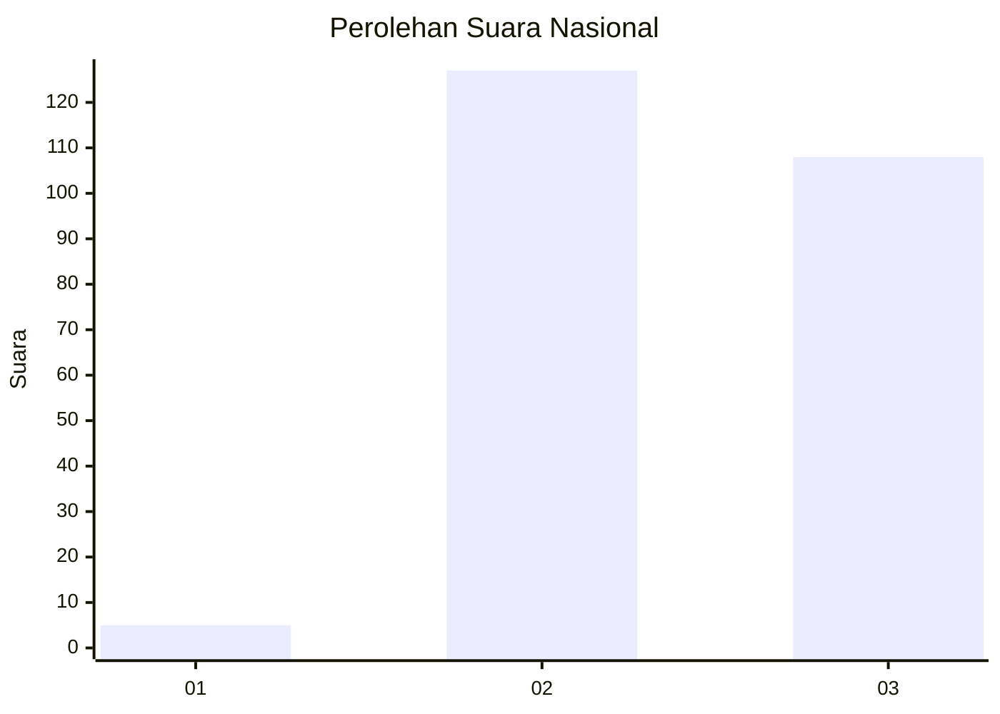
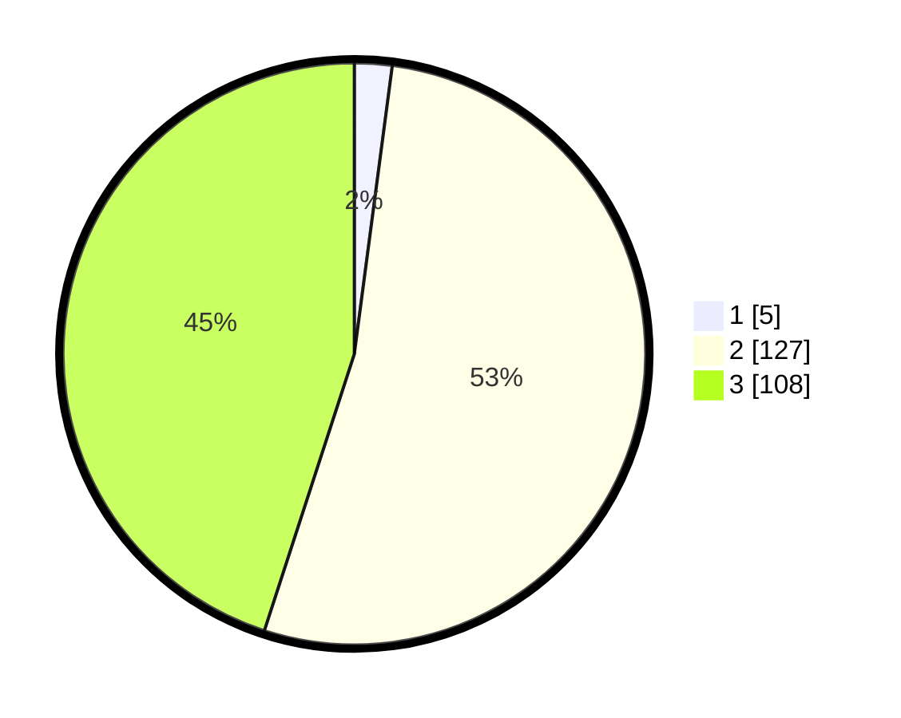

# Hasil

## Grafik

## Tabel

| No. | Nama Paslon    | Suara | Suara (raw) | Persentase |
|:--- |:-------------- | -----:| -----------:| ----------:|
| 1   | ANIES MUHAIMIN | 5     | [5][p-1]    | 2,08       |
| 2   | PRABOWO GIBRAN | 127   | [127][p-2]  | 52,92      |
| 3   | GANJAR MAHFUD  | 108   | [108][p-3]  | 45,00      |

[p-1]: https://github.com/gigit-pemilu/pemilu-2024/blob/main/pilpres/hitung-suara/sub/51-bali/sub/06-bangli/sub/02-bangli/sub/1004-kawan/sub/005-tps/sub/paslon-1.txt
[p-2]: https://github.com/gigit-pemilu/pemilu-2024/blob/main/pilpres/hitung-suara/sub/51-bali/sub/06-bangli/sub/02-bangli/sub/1004-kawan/sub/005-tps/sub/paslon-2.txt
[p-3]: https://github.com/gigit-pemilu/pemilu-2024/blob/main/pilpres/hitung-suara/sub/51-bali/sub/06-bangli/sub/02-bangli/sub/1004-kawan/sub/005-tps/sub/paslon-3.txt

## Foto C Plano

https://sirekap-obj-formc.kpu.go.id/84d9/pemilu/ppwp/51/06/02/10/04/5106021004005-20240216-192147--634221d3-cfc7-48c0-8b10-830ec2f8a8fd.jpg

https://sirekap-obj-formc.kpu.go.id/84d9/pemilu/ppwp/51/06/02/10/04/5106021004005-20240216-192149--a5dab3a7-722c-4855-830a-9b7d52f8d607.jpg

https://sirekap-obj-formc.kpu.go.id/84d9/pemilu/ppwp/51/06/02/10/04/5106021004005-20240216-192148--3791f83e-ef57-4dc9-bc66-57d4781d7a43.jpg

## Metadata

| Key        | Value               |
| ---------- | ------------------- |
| Time Stamp | 2024-02-16 21:01:00 |

## DATA PEMILIH TETAP

Jumlah pemilih dalam DPT: **266**.
 * L: **123**.
 * P: **143**.

## DATA PENGGUNA HAK PILIH

Jumlah pengguna hak pilih dalam DPT: **232**.
 * L: **111**.
 * P: **121**.

Jumlah pengguna hak pilih dalam DPTb: **9**.
 * L: **8**.
 * P: **1**.

Jumlah pengguna hak pilih dalam DPK: **2**.
 * L: **1**.
 * P: **1**.

Jumlah pengguna hak pilih: **243**.
 * L: **120**.
 * P: **123**.

## JUMLAH SUARA SAH DAN TIDAK SAH

JUMLAH SELURUH SUARA SAH: **240**.

JUMLAH SUARA TIDAK SAH: **3**.

JUMLAH SELURUH SUARA SAH DAN SUARA TIDAK SAH: **243**.

