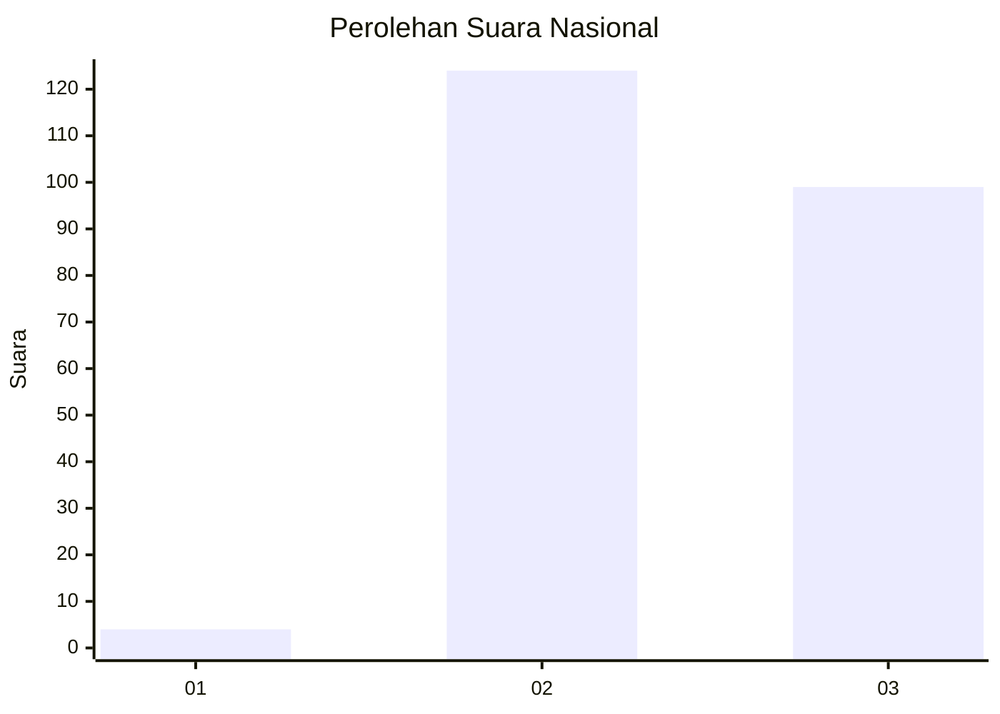
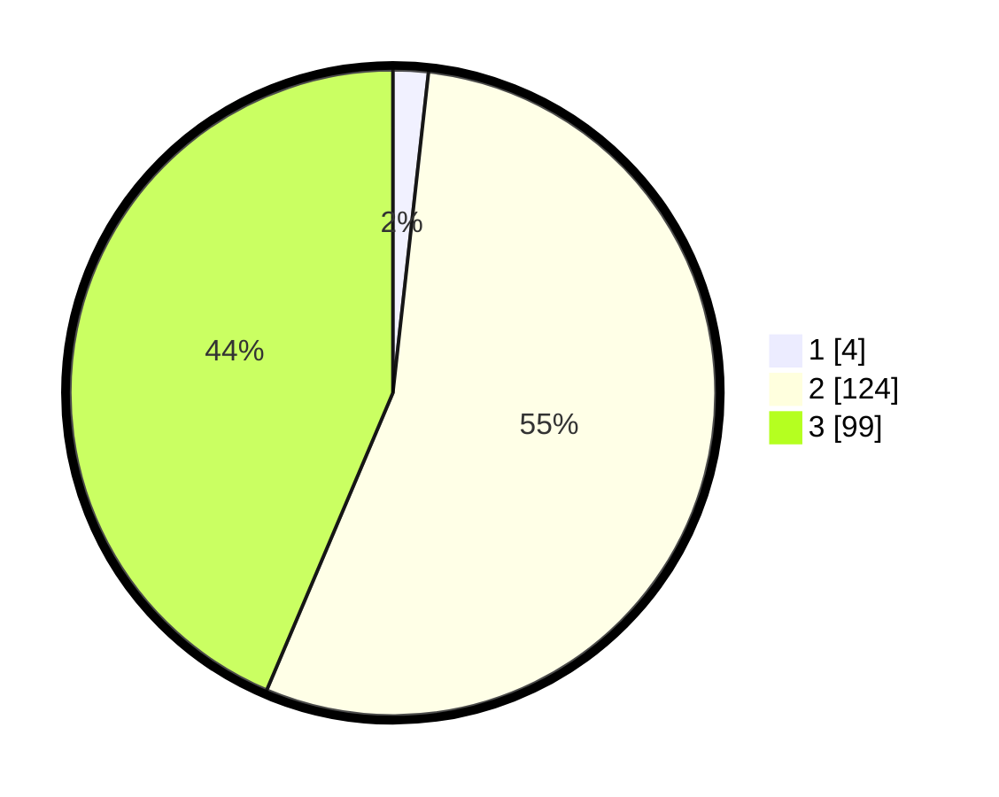

# Hasil

## Grafik

## Tabel

| No. | Nama Paslon    | Suara | Suara (raw) | Persentase |
|:--- |:-------------- | -----:| -----------:| ----------:|
| 1   | ANIES MUHAIMIN | 4     | [4][p-1]    | 1,76       |
| 2   | PRABOWO GIBRAN | 124   | [124][p-2]  | 54,63      |
| 3   | GANJAR MAHFUD  | 99    | [99][p-3]   | 43,61      |

[p-1]: https://github.com/gigit-pemilu/pemilu-2024/blob/main/pilpres/hitung-suara/sub/51-bali/sub/06-bangli/sub/02-bangli/sub/1004-kawan/sub/007-tps/sub/paslon-1.txt
[p-2]: https://github.com/gigit-pemilu/pemilu-2024/blob/main/pilpres/hitung-suara/sub/51-bali/sub/06-bangli/sub/02-bangli/sub/1004-kawan/sub/007-tps/sub/paslon-2.txt
[p-3]: https://github.com/gigit-pemilu/pemilu-2024/blob/main/pilpres/hitung-suara/sub/51-bali/sub/06-bangli/sub/02-bangli/sub/1004-kawan/sub/007-tps/sub/paslon-3.txt

## Foto C Plano

https://sirekap-obj-formc.kpu.go.id/b1c7/pemilu/ppwp/51/06/02/10/04/5106021004007-20240216-092805--7f91def3-b63b-4337-890f-2bd2b4e501de.jpg

https://sirekap-obj-formc.kpu.go.id/b1c7/pemilu/ppwp/51/06/02/10/04/5106021004007-20240216-092809--55fb33cc-c9c0-428b-94d6-4006088e0ba6.jpg

https://sirekap-obj-formc.kpu.go.id/b1c7/pemilu/ppwp/51/06/02/10/04/5106021004007-20240216-092806--7e95b7de-755b-49f6-9b49-fafec859c1ca.jpg

## Metadata

| Key        | Value               |
| ---------- | ------------------- |
| Time Stamp | 2024-02-16 12:51:22 |

## DATA PEMILIH TETAP

Jumlah pemilih dalam DPT: **270**.
 * L: **137**.
 * P: **133**.

## DATA PENGGUNA HAK PILIH

Jumlah pengguna hak pilih dalam DPT: **217**.
 * L: **115**.
 * P: **102**.

Jumlah pengguna hak pilih dalam DPTb: **11**.
 * L: **0**.
 * P: **11**.

Jumlah pengguna hak pilih dalam DPK: **4**.
 * L: **2**.
 * P: **2**.

Jumlah pengguna hak pilih: **232**.
 * L: **117**.
 * P: **115**.

## JUMLAH SUARA SAH DAN TIDAK SAH

JUMLAH SELURUH SUARA SAH: **227**.

JUMLAH SUARA TIDAK SAH: **5**.

JUMLAH SELURUH SUARA SAH DAN SUARA TIDAK SAH: **232**.

