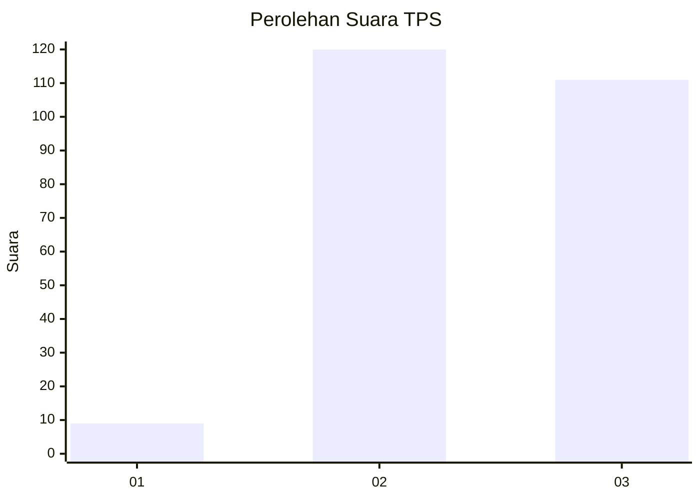
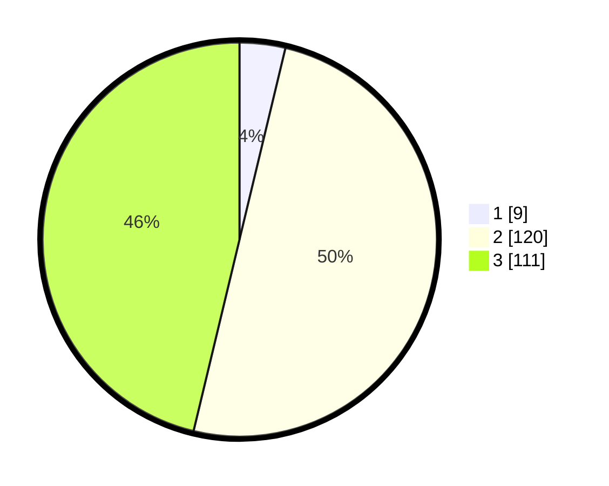

# Hasil

## Grafik

## Tabel

| No. | Nama Paslon    | Suara | Suara (raw) | Persentase |
|:--- |:-------------- | -----:| -----------:| ----------:|
| 1   | ANIES MUHAIMIN | 9     | [9][p-1]    | 3,75       |
| 2   | PRABOWO GIBRAN | 120   | [120][p-2]  | 50,00      |
| 3   | GANJAR MAHFUD  | 111   | [111][p-3]  | 46,25      |

[p-1]: https://github.com/gigit-pemilu/pemilu-2024-51-bali/blob/main/pilpres/hitung-suara/sub/51-bali/sub/06-bangli/sub/02-bangli/sub/1004-kawan/sub/011-tps/sub/paslon-1.txt
[p-2]: https://github.com/gigit-pemilu/pemilu-2024-51-bali/blob/main/pilpres/hitung-suara/sub/51-bali/sub/06-bangli/sub/02-bangli/sub/1004-kawan/sub/011-tps/sub/paslon-2.txt
[p-3]: https://github.com/gigit-pemilu/pemilu-2024-51-bali/blob/main/pilpres/hitung-suara/sub/51-bali/sub/06-bangli/sub/02-bangli/sub/1004-kawan/sub/011-tps/sub/paslon-3.txt

## Foto C Plano

https://sirekap-obj-formc.kpu.go.id/4073/pemilu/ppwp/51/06/02/10/04/5106021004011-20240214-230456--9a46e60a-6031-4a2f-944d-5eea7cefb60a.jpg

https://sirekap-obj-formc.kpu.go.id/4073/pemilu/ppwp/51/06/02/10/04/5106021004011-20240214-230710--3d9d4c01-c8a5-46f7-9f0f-1ab532638b94.jpg

https://sirekap-obj-formc.kpu.go.id/4073/pemilu/ppwp/51/06/02/10/04/5106021004011-20240214-230820--778c9547-2fff-4ceb-a914-862ebe9e4e7a.jpg

## Metadata

| Key        | Value               |
| ---------- | ------------------- |
| Time Stamp | 2024-02-24 22:31:28 |

