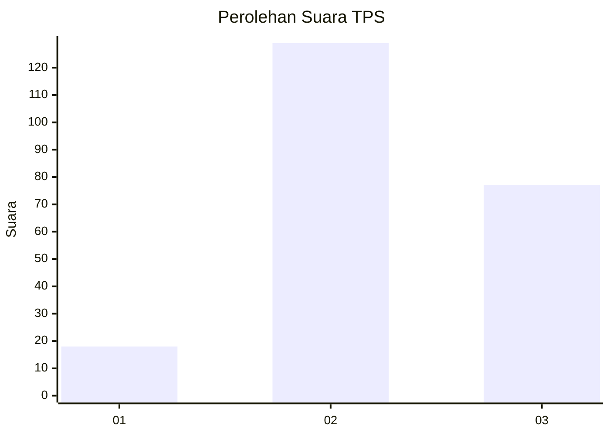
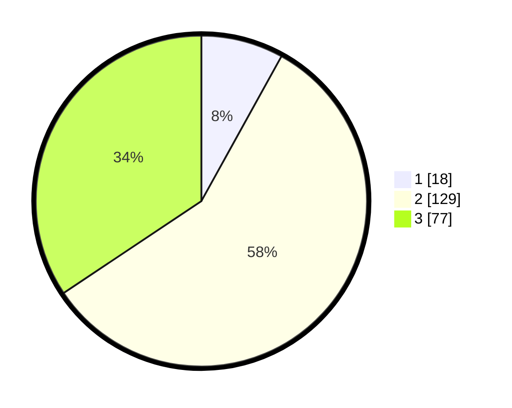

# Hasil

## Grafik

## Tabel

| No. | Nama Paslon    | Suara | Suara (raw) | Persentase |
|:--- |:-------------- | -----:| -----------:| ----------:|
| 1   | ANIES MUHAIMIN | 18    | [18][p-1]   | 8,04       |
| 2   | PRABOWO GIBRAN | 129   | [129][p-2]  | 57,59      |
| 3   | GANJAR MAHFUD  | 77    | [77][p-3]   | 34,38      |

[p-1]: https://github.com/gigit-pemilu/pemilu-2024-51-bali/blob/main/pilpres/hitung-suara/sub/51-bali/sub/06-bangli/sub/02-bangli/sub/1004-kawan/sub/013-tps/sub/paslon-1.txt
[p-2]: https://github.com/gigit-pemilu/pemilu-2024-51-bali/blob/main/pilpres/hitung-suara/sub/51-bali/sub/06-bangli/sub/02-bangli/sub/1004-kawan/sub/013-tps/sub/paslon-2.txt
[p-3]: https://github.com/gigit-pemilu/pemilu-2024-51-bali/blob/main/pilpres/hitung-suara/sub/51-bali/sub/06-bangli/sub/02-bangli/sub/1004-kawan/sub/013-tps/sub/paslon-3.txt

## Foto C Plano

https://sirekap-obj-formc.kpu.go.id/ba73/pemilu/ppwp/51/06/02/10/04/5106021004013-20240216-151011--e8b4dd9b-04e3-4c58-941b-9d15a0bd4bf2.jpg

https://sirekap-obj-formc.kpu.go.id/ba73/pemilu/ppwp/51/06/02/10/04/5106021004013-20240216-151013--34ccbed2-591d-4010-a534-af8b1a725281.jpg

https://sirekap-obj-formc.kpu.go.id/ba73/pemilu/ppwp/51/06/02/10/04/5106021004013-20240216-151012--87ccf9f8-daf9-4dab-9d13-c5082d12a7d6.jpg

## Metadata

| Key        | Value               |
| ---------- | ------------------- |
| Time Stamp | 2024-02-16 17:30:00 |

## DATA PEMILIH TETAP

Jumlah pemilih dalam DPT: **231**.
 * L: **108**.
 * P: **123**.

## DATA PENGGUNA HAK PILIH

Jumlah pengguna hak pilih dalam DPT: **218**.
 * L: **104**.
 * P: **114**.

Jumlah pengguna hak pilih dalam DPTb: **0**.
 * L: **0**.
 * P: **0**.

Jumlah pengguna hak pilih dalam DPK: **13**.
 * L: **4**.
 * P: **9**.

Jumlah pengguna hak pilih: **231**.
 * L: **108**.
 * P: **123**.

## JUMLAH SUARA SAH DAN TIDAK SAH

JUMLAH SELURUH SUARA SAH: **224**.

JUMLAH SUARA TIDAK SAH: **7**.

JUMLAH SELURUH SUARA SAH DAN SUARA TIDAK SAH: **231**.

