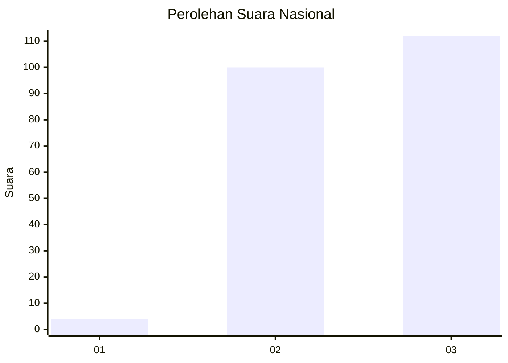
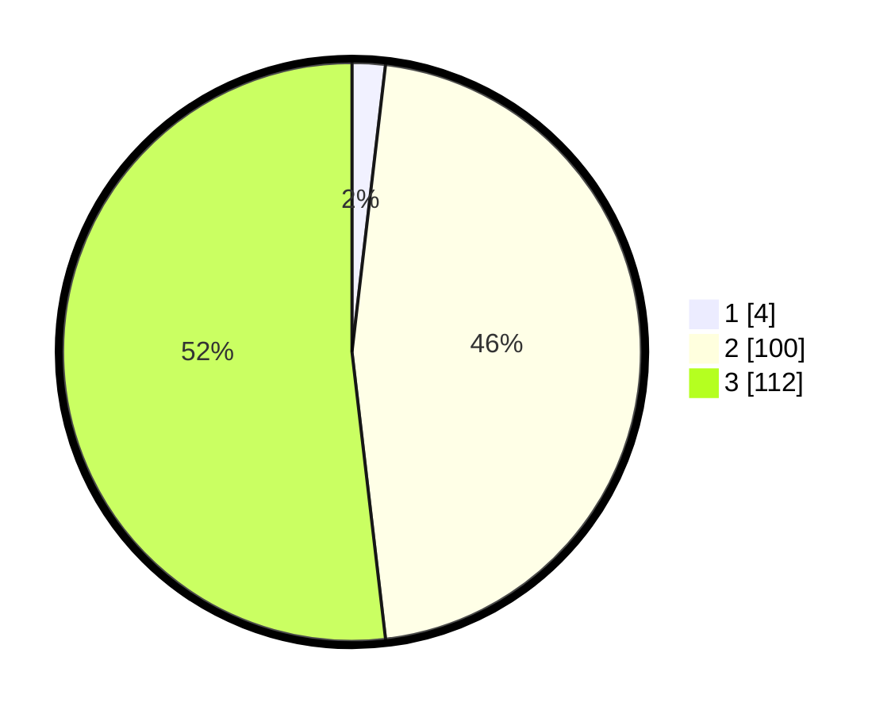

# Hasil

## Grafik

## Tabel

| No. | Nama Paslon    | Suara | Suara (raw) | Persentase |
|:--- |:-------------- | -----:| -----------:| ----------:|
| 1   | ANIES MUHAIMIN | 4     | [4][p-1]    | 1,85       |
| 2   | PRABOWO GIBRAN | 100   | [100][p-2]  | 46,30      |
| 3   | GANJAR MAHFUD  | 112   | [112][p-3]  | 51,85      |

[p-1]: https://github.com/gigit-pemilu/pemilu-2024/blob/main/pilpres/hitung-suara/sub/51-bali/sub/06-bangli/sub/02-bangli/sub/1004-kawan/sub/014-tps/sub/paslon-1.txt
[p-2]: https://github.com/gigit-pemilu/pemilu-2024/blob/main/pilpres/hitung-suara/sub/51-bali/sub/06-bangli/sub/02-bangli/sub/1004-kawan/sub/014-tps/sub/paslon-2.txt
[p-3]: https://github.com/gigit-pemilu/pemilu-2024/blob/main/pilpres/hitung-suara/sub/51-bali/sub/06-bangli/sub/02-bangli/sub/1004-kawan/sub/014-tps/sub/paslon-3.txt

## Foto C Plano

https://sirekap-obj-formc.kpu.go.id/25f9/pemilu/ppwp/51/06/02/10/04/5106021004014-20240214-230724--d7df1ff5-a489-4124-bdb4-88d03380addc.jpg

https://sirekap-obj-formc.kpu.go.id/25f9/pemilu/ppwp/51/06/02/10/04/5106021004014-20240214-230851--db815ae8-f41c-42b5-8f2f-2c13ca27f72b.jpg

https://sirekap-obj-formc.kpu.go.id/25f9/pemilu/ppwp/51/06/02/10/04/5106021004014-20240214-231006--0dc87116-39b7-4baf-8f0d-3d1696b439c9.jpg

## Metadata

| Key        | Value               |
| ---------- | ------------------- |
| Time Stamp | 2024-02-25 15:00:00 |

