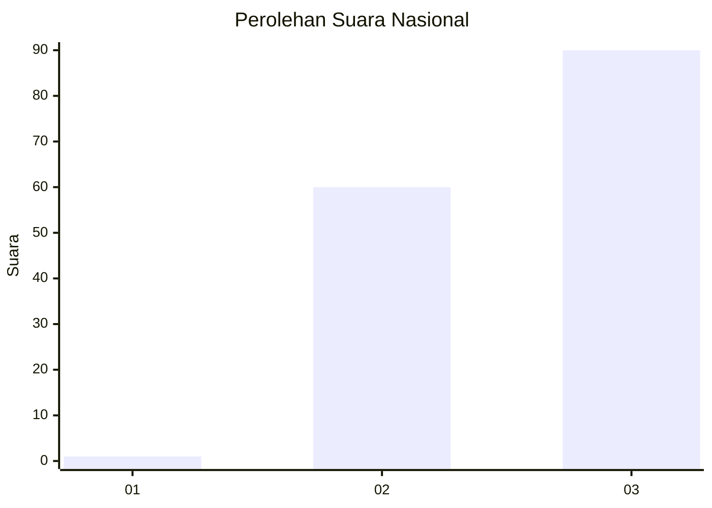
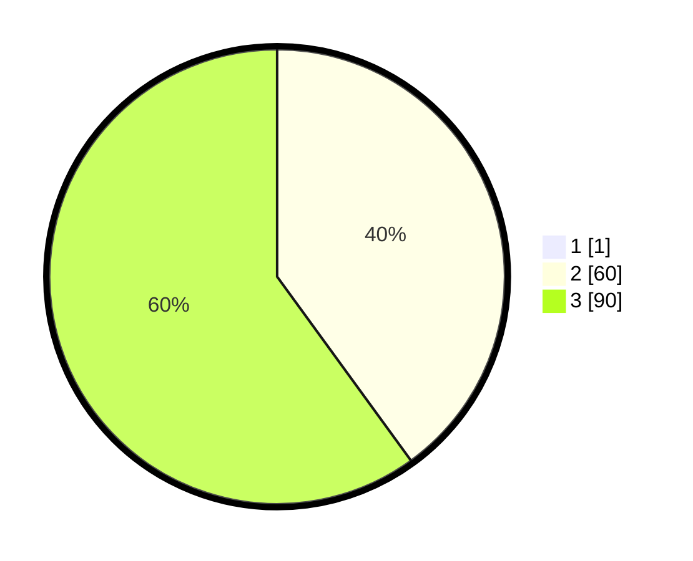

# Hasil

## Grafik

## Tabel

| No. | Nama Paslon    | Suara | Suara (raw) | Persentase |
|:--- |:-------------- | -----:| -----------:| ----------:|
| 1   | ANIES MUHAIMIN | 1     | [1][p-1]    | 0,66       |
| 2   | PRABOWO GIBRAN | 60    | [60][p-2]   | 39,74      |
| 3   | GANJAR MAHFUD  | 90    | [90][p-3]   | 59,60      |

[p-1]: https://github.com/gigit-pemilu/pemilu-2024/blob/main/pilpres/hitung-suara/sub/51-bali/sub/06-bangli/sub/02-bangli/sub/1004-kawan/sub/021-tps/sub/paslon-1.txt
[p-2]: https://github.com/gigit-pemilu/pemilu-2024/blob/main/pilpres/hitung-suara/sub/51-bali/sub/06-bangli/sub/02-bangli/sub/1004-kawan/sub/021-tps/sub/paslon-2.txt
[p-3]: https://github.com/gigit-pemilu/pemilu-2024/blob/main/pilpres/hitung-suara/sub/51-bali/sub/06-bangli/sub/02-bangli/sub/1004-kawan/sub/021-tps/sub/paslon-3.txt

## Foto C Plano

https://sirekap-obj-formc.kpu.go.id/6caf/pemilu/ppwp/51/06/02/10/04/5106021004021-20240214-123434--2ff7e0b2-e15e-417b-be22-d237f07475fa.jpg

https://sirekap-obj-formc.kpu.go.id/6caf/pemilu/ppwp/51/06/02/10/04/5106021004021-20240214-123710--d37b779e-7c79-4847-b949-1342b112b888.jpg

https://sirekap-obj-formc.kpu.go.id/6caf/pemilu/ppwp/51/06/02/10/04/5106021004021-20240214-123804--2f5a88a1-fee3-4d3b-9edb-a879ac53f2de.jpg

## Metadata

| Key        | Value               |
| ---------- | ------------------- |
| Time Stamp | 2024-02-14 21:46:01 |

## DATA PEMILIH TETAP

Jumlah pemilih dalam DPT: **154**.
 * L: **71**.
 * P: **83**.

## DATA PENGGUNA HAK PILIH

Jumlah pengguna hak pilih dalam DPT: **151**.
 * L: **71**.
 * P: **80**.

Jumlah pengguna hak pilih dalam DPTb: **1**.
 * L: **1**.
 * P: **0**.

Jumlah pengguna hak pilih dalam DPK: **0**.
 * L: **0**.
 * P: **0**.

Jumlah pengguna hak pilih: **152**.
 * L: **72**.
 * P: **80**.

## JUMLAH SUARA SAH DAN TIDAK SAH

JUMLAH SELURUH SUARA SAH: **151**.

JUMLAH SUARA TIDAK SAH: **1**.

JUMLAH SELURUH SUARA SAH DAN SUARA TIDAK SAH: **152**.

