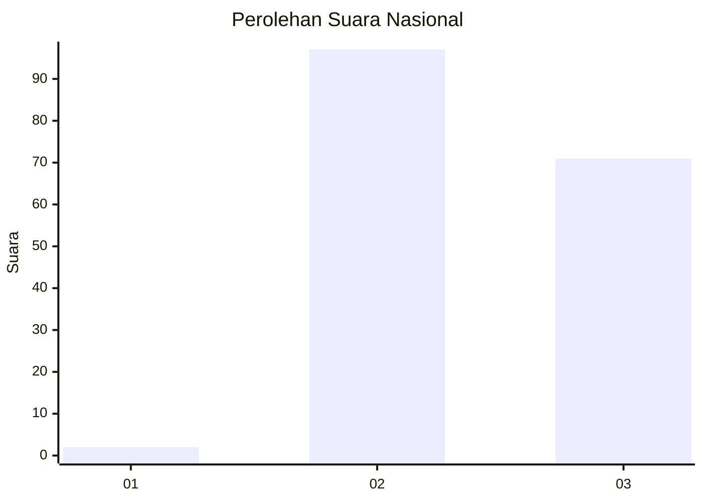
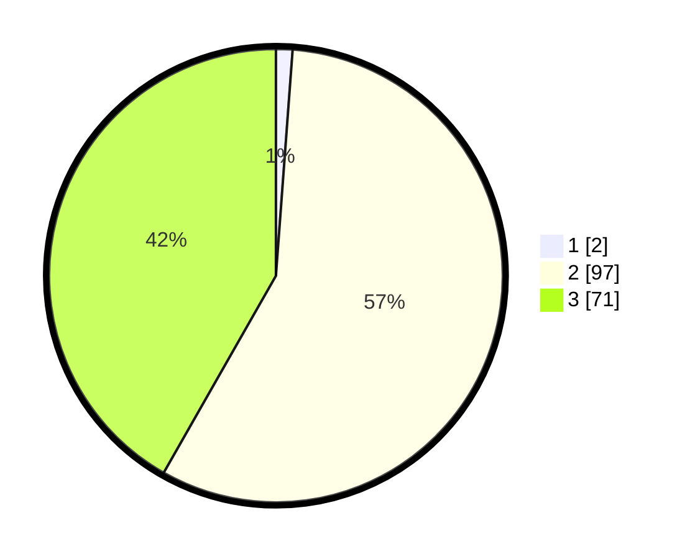

# Hasil

## Grafik

## Tabel

| No. | Nama Paslon    | Suara | Suara (raw) | Persentase |
|:--- |:-------------- | -----:| -----------:| ----------:|
| 1   | ANIES MUHAIMIN | 2     | [2][p-1]    | 1,18       |
| 2   | PRABOWO GIBRAN | 97    | [97][p-2]   | 57,06      |
| 3   | GANJAR MAHFUD  | 71    | [71][p-3]   | 41,76      |

[p-1]: https://github.com/gigit-pemilu/pemilu-2024/blob/main/pilpres/hitung-suara/sub/51-bali/sub/06-bangli/sub/02-bangli/sub/1004-kawan/sub/027-tps/sub/paslon-1.txt
[p-2]: https://github.com/gigit-pemilu/pemilu-2024/blob/main/pilpres/hitung-suara/sub/51-bali/sub/06-bangli/sub/02-bangli/sub/1004-kawan/sub/027-tps/sub/paslon-2.txt
[p-3]: https://github.com/gigit-pemilu/pemilu-2024/blob/main/pilpres/hitung-suara/sub/51-bali/sub/06-bangli/sub/02-bangli/sub/1004-kawan/sub/027-tps/sub/paslon-3.txt

## Foto C Plano

https://sirekap-obj-formc.kpu.go.id/f500/pemilu/ppwp/51/06/02/10/04/5106021004027-20240214-141915--1936d764-72ae-4921-a0b9-45f78e73404e.jpg

https://sirekap-obj-formc.kpu.go.id/f500/pemilu/ppwp/51/06/02/10/04/5106021004027-20240214-132816--950b4653-2f99-47a3-8f3a-d85884abd292.jpg

https://sirekap-obj-formc.kpu.go.id/f500/pemilu/ppwp/51/06/02/10/04/5106021004027-20240214-133016--ac94e47f-1784-421d-9f18-fdeeca5e1c13.jpg

## Metadata

| Key        | Value               |
| ---------- | ------------------- |
| Time Stamp | 2024-02-24 22:31:28 |

