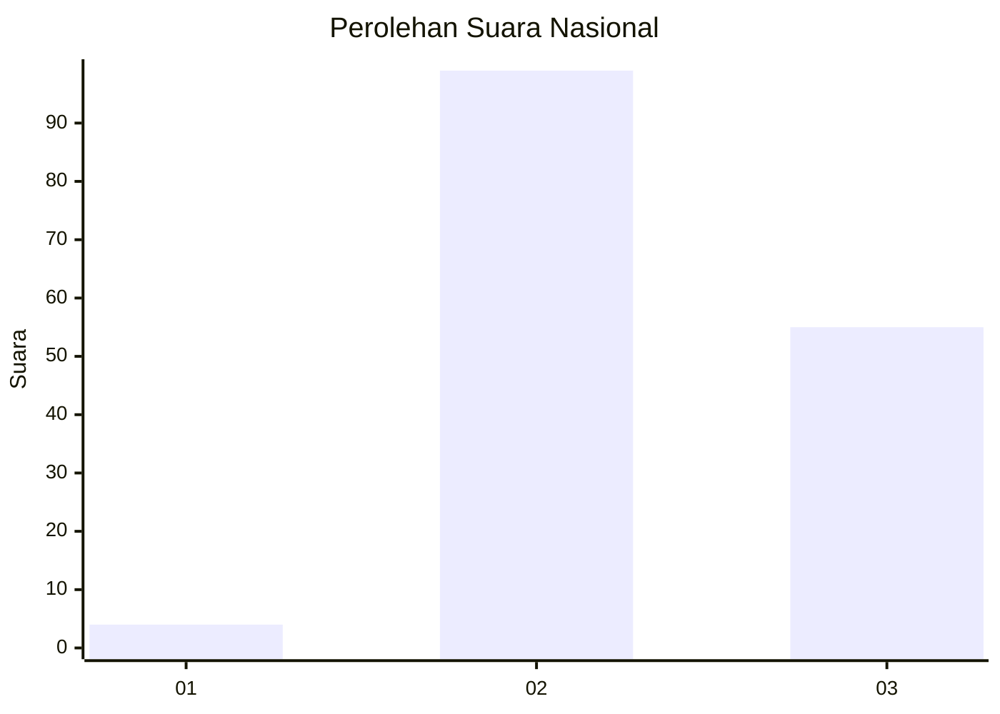
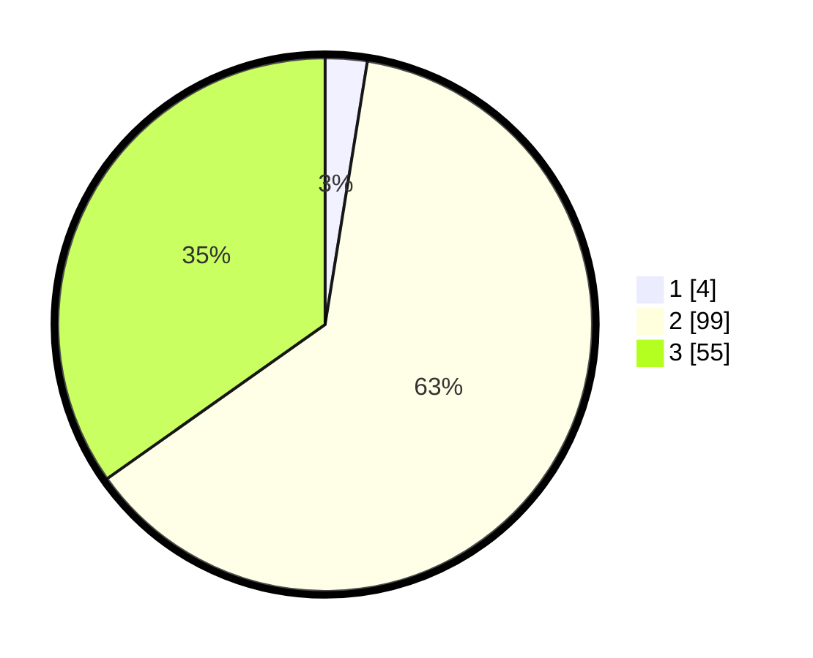

# Hasil

## Grafik

## Tabel

| No. | Nama Paslon    | Suara | Suara (raw) | Persentase |
|:--- |:-------------- | -----:| -----------:| ----------:|
| 1   | ANIES MUHAIMIN | 4     | [4][p-1]    | 2,53       |
| 2   | PRABOWO GIBRAN | 99    | [99][p-2]   | 62,66      |
| 3   | GANJAR MAHFUD  | 55    | [55][p-3]   | 34,81      |

[p-1]: https://github.com/gigit-pemilu/pemilu-2024/blob/main/pilpres/hitung-suara/sub/51-bali/sub/06-bangli/sub/02-bangli/sub/1004-kawan/sub/901-tps/sub/paslon-1.txt
[p-2]: https://github.com/gigit-pemilu/pemilu-2024/blob/main/pilpres/hitung-suara/sub/51-bali/sub/06-bangli/sub/02-bangli/sub/1004-kawan/sub/901-tps/sub/paslon-2.txt
[p-3]: https://github.com/gigit-pemilu/pemilu-2024/blob/main/pilpres/hitung-suara/sub/51-bali/sub/06-bangli/sub/02-bangli/sub/1004-kawan/sub/901-tps/sub/paslon-3.txt

## Foto C Plano

https://sirekap-obj-formc.kpu.go.id/4c2c/pemilu/ppwp/51/06/02/10/04/5106021004901-20240216-003434--dfca72f7-ea90-4ee8-8293-b3d3cb8c2f38.jpg

https://sirekap-obj-formc.kpu.go.id/4c2c/pemilu/ppwp/51/06/02/10/04/5106021004901-20240216-003436--0c6d7aae-948d-4d4b-aab8-5fe042df70dd.jpg

https://sirekap-obj-formc.kpu.go.id/4c2c/pemilu/ppwp/51/06/02/10/04/5106021004901-20240216-003435--fd98fae2-865d-4670-9f55-af76bbaeb752.jpg

## Metadata

| Key        | Value               |
| ---------- | ------------------- |
| Time Stamp | 2024-02-16 12:51:22 |

## DATA PEMILIH TETAP

Jumlah pemilih dalam DPT: **188**.
 * L: **179**.
 * P: **9**.

## DATA PENGGUNA HAK PILIH

Jumlah pengguna hak pilih dalam DPT: **0**.
 * L: **0**.
 * P: **0**.

Jumlah pengguna hak pilih dalam DPTb: **160**.
 * L: **152**.
 * P: **8**.

Jumlah pengguna hak pilih dalam DPK: **0**.
 * L: **0**.
 * P: **0**.

Jumlah pengguna hak pilih: **160**.
 * L: **152**.
 * P: **8**.

## JUMLAH SUARA SAH DAN TIDAK SAH

JUMLAH SELURUH SUARA SAH: **158**.

JUMLAH SUARA TIDAK SAH: **2**.

JUMLAH SELURUH SUARA SAH DAN SUARA TIDAK SAH: **160**.

