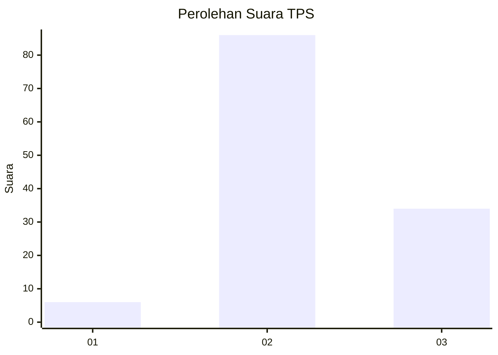
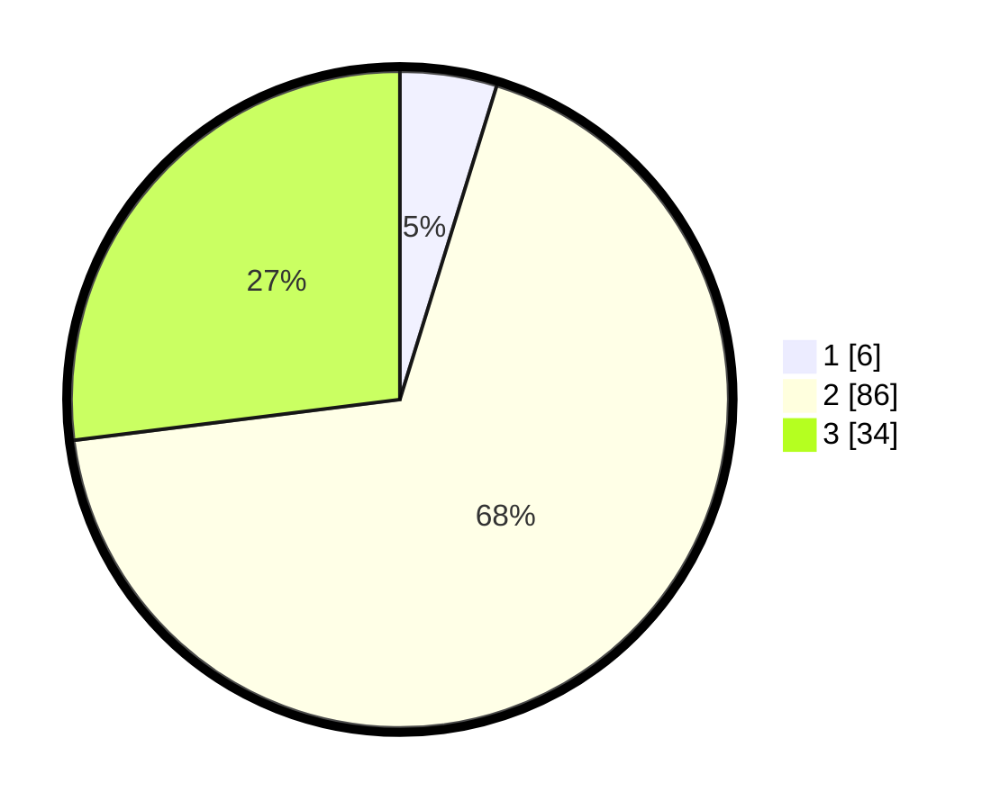

# Hasil

## Grafik

## Tabel

| No. | Nama Paslon    | Suara | Suara (raw) | Persentase |
|:--- |:-------------- | -----:| -----------:| ----------:|
| 1   | ANIES MUHAIMIN | 6     | [6][p-1]    | 4,76       |
| 2   | PRABOWO GIBRAN | 86    | [86][p-2]   | 68,25      |
| 3   | GANJAR MAHFUD  | 34    | [34][p-3]   | 26,98      |

[p-1]: https://github.com/gigit-pemilu/pemilu-2024-51-bali/blob/main/pilpres/hitung-suara/sub/51-bali/sub/06-bangli/sub/02-bangli/sub/1004-kawan/sub/902-tps/sub/paslon-1.txt
[p-2]: https://github.com/gigit-pemilu/pemilu-2024-51-bali/blob/main/pilpres/hitung-suara/sub/51-bali/sub/06-bangli/sub/02-bangli/sub/1004-kawan/sub/902-tps/sub/paslon-2.txt
[p-3]: https://github.com/gigit-pemilu/pemilu-2024-51-bali/blob/main/pilpres/hitung-suara/sub/51-bali/sub/06-bangli/sub/02-bangli/sub/1004-kawan/sub/902-tps/sub/paslon-3.txt

## Foto C Plano

https://sirekap-obj-formc.kpu.go.id/7569/pemilu/ppwp/51/06/02/10/04/5106021004902-20240215-030159--86a55a81-bd44-4efc-9c98-0c07e4c6af3c.jpg

https://sirekap-obj-formc.kpu.go.id/7569/pemilu/ppwp/51/06/02/10/04/5106021004902-20240215-030220--9ada7e1b-a5d9-4222-8497-697d87584f9e.jpg

https://sirekap-obj-formc.kpu.go.id/7569/pemilu/ppwp/51/06/02/10/04/5106021004902-20240215-030210--309c4d10-31f8-4424-a8ad-15ccf8362abd.jpg

## Metadata

| Key        | Value               |
| ---------- | ------------------- |
| Time Stamp | 2024-02-15 15:00:29 |

## DATA PEMILIH TETAP

Jumlah pemilih dalam DPT: **126**.
 * L: **121**.
 * P: **5**.

## DATA PENGGUNA HAK PILIH

Jumlah pengguna hak pilih dalam DPT: **100**.
 * L: **95**.
 * P: **5**.

Jumlah pengguna hak pilih dalam DPTb: **26**.
 * L: **22**.
 * P: **4**.

Jumlah pengguna hak pilih dalam DPK: **0**.
 * L: **0**.
 * P: **0**.

Jumlah pengguna hak pilih: **126**.
 * L: **117**.
 * P: **9**.

## JUMLAH SUARA SAH DAN TIDAK SAH

JUMLAH SELURUH SUARA SAH: **126**.

JUMLAH SUARA TIDAK SAH: **0**.

JUMLAH SELURUH SUARA SAH DAN SUARA TIDAK SAH: **126**.

