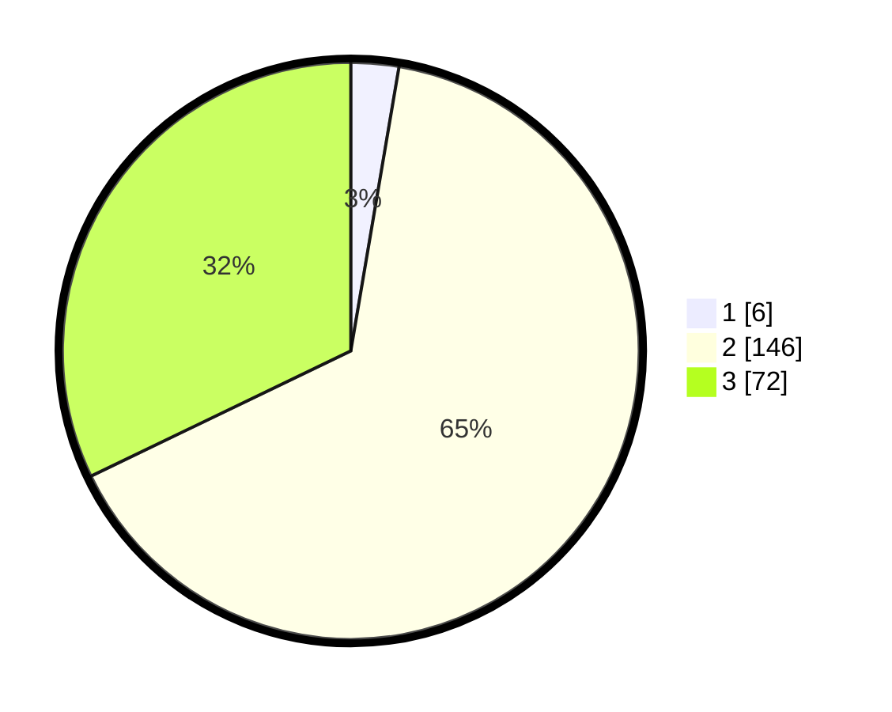

# Hasil

## Grafik

## Tabel

| No. | Nama Paslon    | Suara | Suara (raw) | Persentase |
|:--- |:-------------- | -----:| -----------:| ----------:|
| 1   | ANIES MUHAIMIN | 6     | [6][p-1]    | 2,68       |
| 2   | PRABOWO GIBRAN | 146   | [146][p-2]  | 65,18      |
| 3   | GANJAR MAHFUD  | 72    | [72][p-3]   | 32,14      |

[p-1]: https://github.com/gigit-pemilu/pemilu-2024-51-bali/blob/main/pilpres/hitung-suara/sub/51-bali/sub/06-bangli/sub/02-bangli/sub/1005-cempaga/sub/004-tps/sub/paslon-1.txt
[p-2]: https://github.com/gigit-pemilu/pemilu-2024-51-bali/blob/main/pilpres/hitung-suara/sub/51-bali/sub/06-bangli/sub/02-bangli/sub/1005-cempaga/sub/004-tps/sub/paslon-2.txt
[p-3]: https://github.com/gigit-pemilu/pemilu-2024-51-bali/blob/main/pilpres/hitung-suara/sub/51-bali/sub/06-bangli/sub/02-bangli/sub/1005-cempaga/sub/004-tps/sub/paslon-3.txt

## Foto C Plano

https://sirekap-obj-formc.kpu.go.id/2c35/pemilu/ppwp/51/06/02/10/05/5106021005004-20240214-213241--e9739df6-fdbd-4960-98dd-b3431f9a3b77.jpg

https://sirekap-obj-formc.kpu.go.id/2c35/pemilu/ppwp/51/06/02/10/05/5106021005004-20240214-213430--1c3f1842-eac0-4e89-8458-543c96fdab4a.jpg

https://sirekap-obj-formc.kpu.go.id/2c35/pemilu/ppwp/51/06/02/10/05/5106021005004-20240214-213050--8a0e6bb7-6b96-4553-879d-b4840fd8abf5.jpg

## Metadata

| Key        | Value               |
| ---------- | ------------------- |
| Time Stamp | 2024-02-15 06:00:23 |

