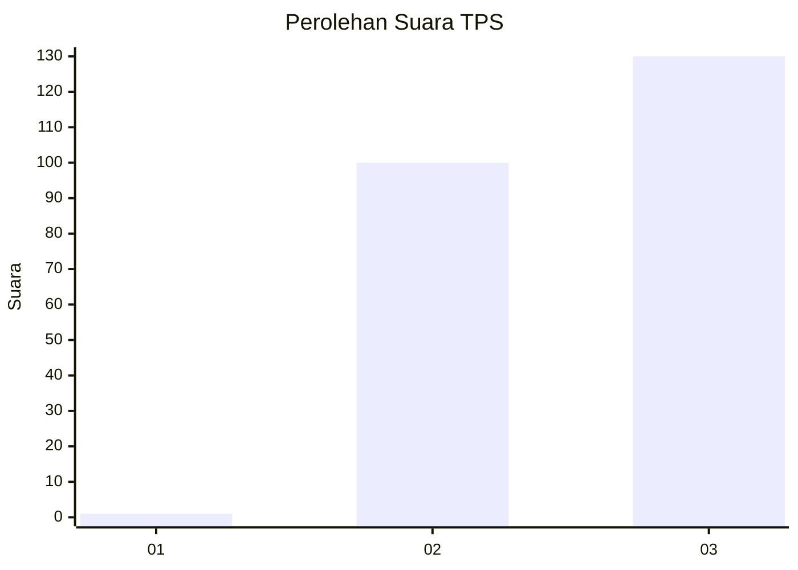

# Hasil

## Grafik

## Tabel

| No. | Nama Paslon    | Suara | Suara (raw) | Persentase |
|:--- |:-------------- | -----:| -----------:| ----------:|
| 1   | ANIES MUHAIMIN | 1     | [1][p-1]    | 0,43       |
| 2   | PRABOWO GIBRAN | 100   | [100][p-2]  | 43,29      |
| 3   | GANJAR MAHFUD  | 130   | [130][p-3]  | 56,28      |

[p-1]: https://github.com/gigit-pemilu/pemilu-2024-51-bali/blob/main/pilpres/hitung-suara/sub/51-bali/sub/06-bangli/sub/02-bangli/sub/1005-cempaga/sub/015-tps/sub/paslon-1.txt
[p-2]: https://github.com/gigit-pemilu/pemilu-2024-51-bali/blob/main/pilpres/hitung-suara/sub/51-bali/sub/06-bangli/sub/02-bangli/sub/1005-cempaga/sub/015-tps/sub/paslon-2.txt
[p-3]: https://github.com/gigit-pemilu/pemilu-2024-51-bali/blob/main/pilpres/hitung-suara/sub/51-bali/sub/06-bangli/sub/02-bangli/sub/1005-cempaga/sub/015-tps/sub/paslon-3.txt

## Foto C Plano

https://sirekap-obj-formc.kpu.go.id/c4f8/pemilu/ppwp/51/06/02/10/05/5106021005015-20240214-201631--403387d1-7d7d-412e-9bf3-917f578da10e.jpg

https://sirekap-obj-formc.kpu.go.id/c4f8/pemilu/ppwp/51/06/02/10/05/5106021005015-20240214-201922--5e36f6c5-1860-4956-8e41-3d2c44f97c95.jpg

https://sirekap-obj-formc.kpu.go.id/c4f8/pemilu/ppwp/51/06/02/10/05/5106021005015-20240316-203210--4e3a8fa0-3df0-4f45-8019-c0630512a401.jpg

## Metadata

| Key        | Value               |
| ---------- | ------------------- |
| Time Stamp | 2024-03-16 21:00:00 |

