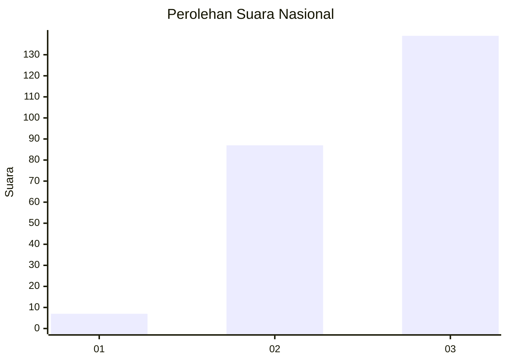
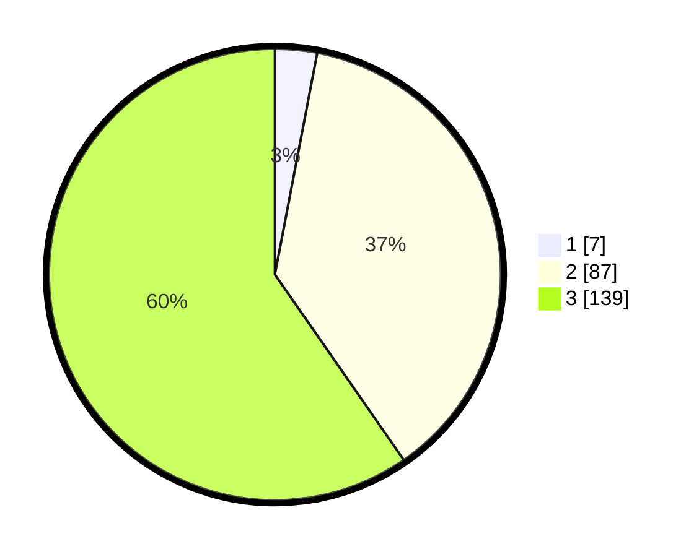

# Hasil

## Grafik

## Tabel

| No. | Nama Paslon    | Suara | Suara (raw) | Persentase |
|:--- |:-------------- | -----:| -----------:| ----------:|
| 1   | ANIES MUHAIMIN | 7     | [7][p-1]    | 3,00       |
| 2   | PRABOWO GIBRAN | 87    | [87][p-2]   | 37,34      |
| 3   | GANJAR MAHFUD  | 139   | [139][p-3]  | 59,66      |

[p-1]: https://github.com/gigit-pemilu/pemilu-2024/blob/main/pilpres/hitung-suara/sub/51-bali/sub/06-bangli/sub/02-bangli/sub/1006-kubu/sub/001-tps/sub/paslon-1.txt
[p-2]: https://github.com/gigit-pemilu/pemilu-2024/blob/main/pilpres/hitung-suara/sub/51-bali/sub/06-bangli/sub/02-bangli/sub/1006-kubu/sub/001-tps/sub/paslon-2.txt
[p-3]: https://github.com/gigit-pemilu/pemilu-2024/blob/main/pilpres/hitung-suara/sub/51-bali/sub/06-bangli/sub/02-bangli/sub/1006-kubu/sub/001-tps/sub/paslon-3.txt

## Foto C Plano

https://sirekap-obj-formc.kpu.go.id/4cbb/pemilu/ppwp/51/06/02/10/06/5106021006001-20240216-030617--0ee19584-3d02-4ca6-bace-f88efddb8554.jpg

https://sirekap-obj-formc.kpu.go.id/4cbb/pemilu/ppwp/51/06/02/10/06/5106021006001-20240216-030619--4d96bbd7-24b2-413e-abd7-686726c5833f.jpg

https://sirekap-obj-formc.kpu.go.id/4cbb/pemilu/ppwp/51/06/02/10/06/5106021006001-20240216-030618--04928c1d-8c46-40d9-8da0-ec44940be2a0.jpg

## Metadata

| Key        | Value               |
| ---------- | ------------------- |
| Time Stamp | 2024-02-17 19:00:04 |

## DATA PEMILIH TETAP

Jumlah pemilih dalam DPT: **277**.
 * L: **129**.
 * P: **148**.

## DATA PENGGUNA HAK PILIH

Jumlah pengguna hak pilih dalam DPT: **234**.
 * L: **105**.
 * P: **129**.

Jumlah pengguna hak pilih dalam DPTb: **0**.
 * L: **0**.
 * P: **0**.

Jumlah pengguna hak pilih dalam DPK: **1**.
 * L: **0**.
 * P: **1**.

Jumlah pengguna hak pilih: **235**.
 * L: **105**.
 * P: **130**.

## JUMLAH SUARA SAH DAN TIDAK SAH

JUMLAH SELURUH SUARA SAH: **233**.

JUMLAH SUARA TIDAK SAH: **2**.

JUMLAH SELURUH SUARA SAH DAN SUARA TIDAK SAH: **235**.

