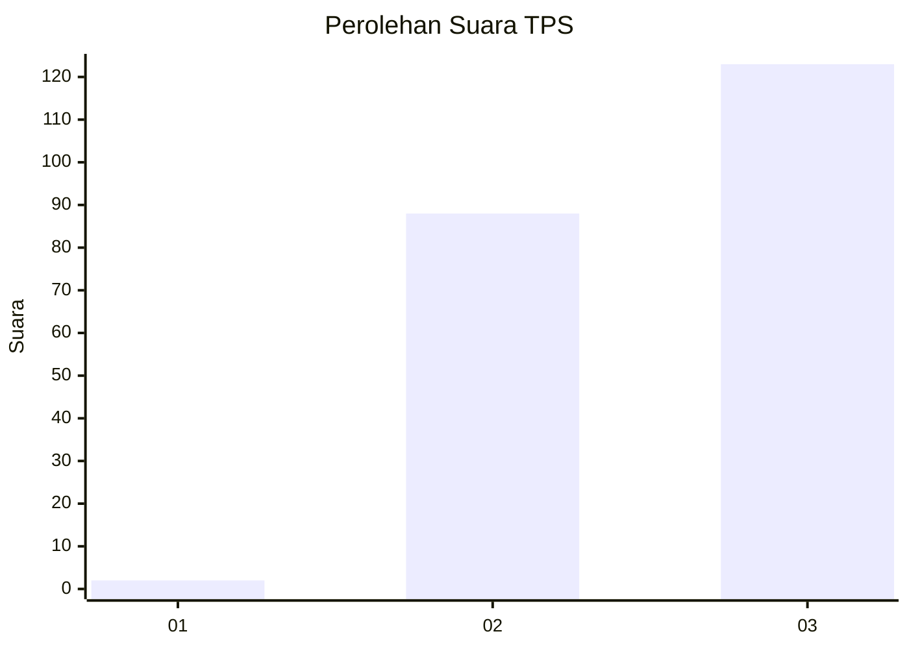
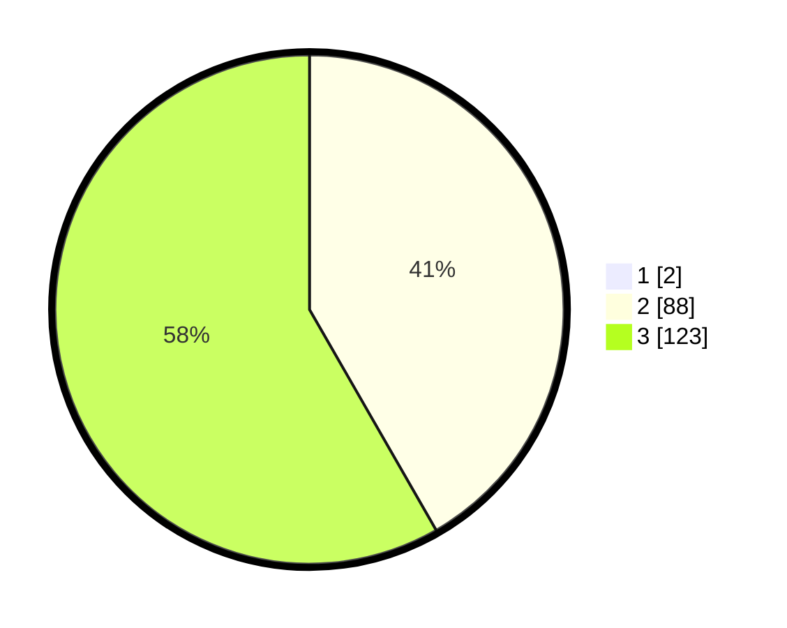

# Hasil

## Grafik

## Tabel

| No. | Nama Paslon    | Suara | Suara (raw) | Persentase |
|:--- |:-------------- | -----:| -----------:| ----------:|
| 1   | ANIES MUHAIMIN | 2     | [2][p-1]    | 0,94       |
| 2   | PRABOWO GIBRAN | 88    | [88][p-2]   | 41,31      |
| 3   | GANJAR MAHFUD  | 123   | [123][p-3]  | 57,75      |

[p-1]: https://github.com/gigit-pemilu/pemilu-2024-51-bali/blob/main/pilpres/hitung-suara/sub/51-bali/sub/06-bangli/sub/02-bangli/sub/1006-kubu/sub/002-tps/sub/paslon-1.txt
[p-2]: https://github.com/gigit-pemilu/pemilu-2024-51-bali/blob/main/pilpres/hitung-suara/sub/51-bali/sub/06-bangli/sub/02-bangli/sub/1006-kubu/sub/002-tps/sub/paslon-2.txt
[p-3]: https://github.com/gigit-pemilu/pemilu-2024-51-bali/blob/main/pilpres/hitung-suara/sub/51-bali/sub/06-bangli/sub/02-bangli/sub/1006-kubu/sub/002-tps/sub/paslon-3.txt

## Foto C Plano

https://sirekap-obj-formc.kpu.go.id/6d08/pemilu/ppwp/51/06/02/10/06/5106021006002-20240214-212938--127e2351-dbe1-44af-9139-38a756af4504.jpg

https://sirekap-obj-formc.kpu.go.id/6d08/pemilu/ppwp/51/06/02/10/06/5106021006002-20240214-213028--da25c20b-740c-4ae4-9ced-b0e3330e0692.jpg

https://sirekap-obj-formc.kpu.go.id/6d08/pemilu/ppwp/51/06/02/10/06/5106021006002-20240214-213150--2afd23f0-504f-48d5-aff2-b1710525a399.jpg

## Metadata

| Key        | Value               |
| ---------- | ------------------- |
| Time Stamp | 2024-02-24 22:31:28 |

