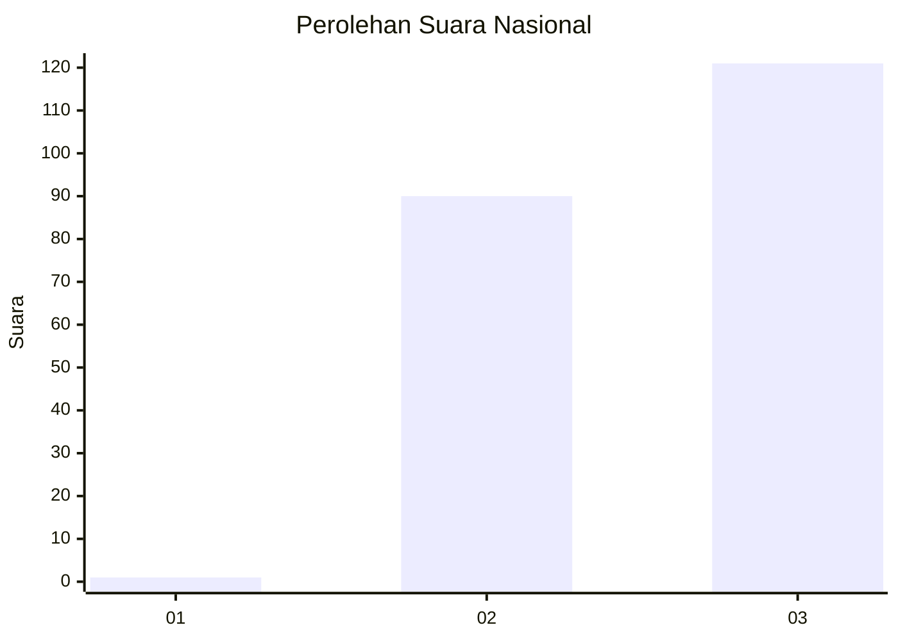
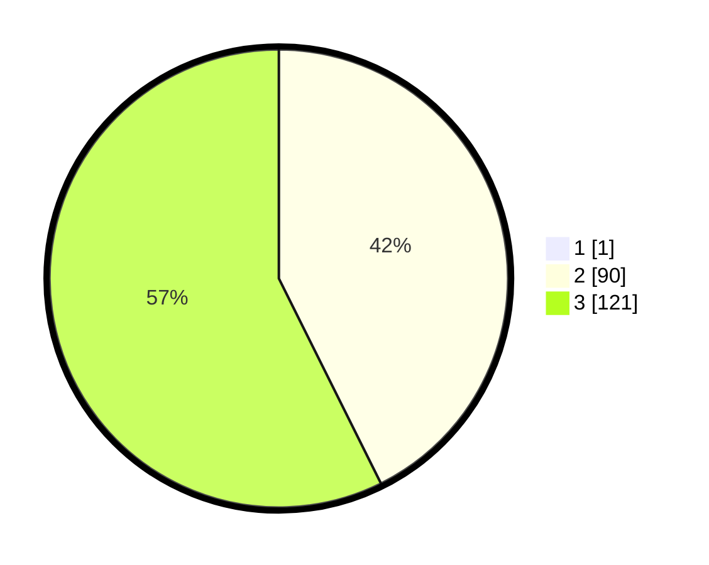

# Hasil

## Grafik

## Tabel

| No. | Nama Paslon    | Suara | Suara (raw) | Persentase |
|:--- |:-------------- | -----:| -----------:| ----------:|
| 1   | ANIES MUHAIMIN | 1     | [1][p-1]    | 0,47       |
| 2   | PRABOWO GIBRAN | 90    | [90][p-2]   | 42,45      |
| 3   | GANJAR MAHFUD  | 121   | [121][p-3]  | 57,08      |

[p-1]: https://github.com/gigit-pemilu/pemilu-2024/blob/main/pilpres/hitung-suara/sub/51-bali/sub/06-bangli/sub/02-bangli/sub/1006-kubu/sub/003-tps/sub/paslon-1.txt
[p-2]: https://github.com/gigit-pemilu/pemilu-2024/blob/main/pilpres/hitung-suara/sub/51-bali/sub/06-bangli/sub/02-bangli/sub/1006-kubu/sub/003-tps/sub/paslon-2.txt
[p-3]: https://github.com/gigit-pemilu/pemilu-2024/blob/main/pilpres/hitung-suara/sub/51-bali/sub/06-bangli/sub/02-bangli/sub/1006-kubu/sub/003-tps/sub/paslon-3.txt

## Foto C Plano

https://sirekap-obj-formc.kpu.go.id/95ab/pemilu/ppwp/51/06/02/10/06/5106021006003-20240215-000758--503efc99-5358-4321-8e82-eccaadbfc5e1.jpg

https://sirekap-obj-formc.kpu.go.id/95ab/pemilu/ppwp/51/06/02/10/06/5106021006003-20240214-211918--10f09c84-3e99-4210-ad24-4d0dc94628b7.jpg

https://sirekap-obj-formc.kpu.go.id/95ab/pemilu/ppwp/51/06/02/10/06/5106021006003-20240214-212008--3b8aa480-6784-4b4e-9fd7-7279d827718f.jpg

## Metadata

| Key        | Value               |
| ---------- | ------------------- |
| Time Stamp | 2024-02-15 21:01:18 |

