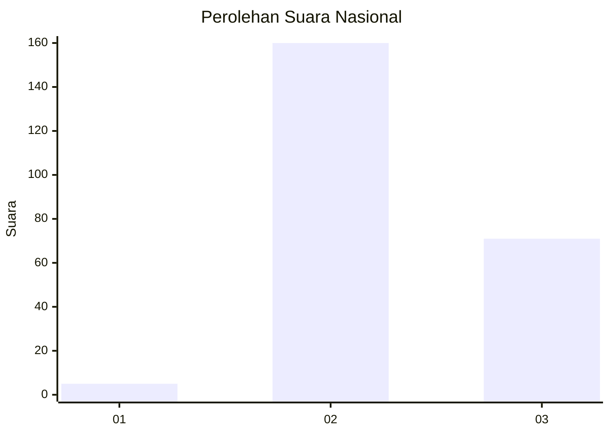

# Hasil

## Grafik

## Tabel

| No. | Nama Paslon    | Suara | Suara (raw) | Persentase |
|:--- |:-------------- | -----:| -----------:| ----------:|
| 1   | ANIES MUHAIMIN | 5     | [5][p-1]    | 2,12       |
| 2   | PRABOWO GIBRAN | 160   | [160][p-2]  | 67,80      |
| 3   | GANJAR MAHFUD  | 71    | [71][p-3]   | 30,08      |

[p-1]: https://github.com/gigit-pemilu/pemilu-2024/blob/main/pilpres/hitung-suara/sub/51-bali/sub/06-bangli/sub/02-bangli/sub/1006-kubu/sub/011-tps/sub/paslon-1.txt
[p-2]: https://github.com/gigit-pemilu/pemilu-2024/blob/main/pilpres/hitung-suara/sub/51-bali/sub/06-bangli/sub/02-bangli/sub/1006-kubu/sub/011-tps/sub/paslon-2.txt
[p-3]: https://github.com/gigit-pemilu/pemilu-2024/blob/main/pilpres/hitung-suara/sub/51-bali/sub/06-bangli/sub/02-bangli/sub/1006-kubu/sub/011-tps/sub/paslon-3.txt

## Foto C Plano

https://sirekap-obj-formc.kpu.go.id/477d/pemilu/ppwp/51/06/02/10/06/5106021006011-20240215-083119--5af6b044-cb27-4745-84de-27a1dbe6316f.jpg

https://sirekap-obj-formc.kpu.go.id/477d/pemilu/ppwp/51/06/02/10/06/5106021006011-20240215-083536--007c0df9-4abe-450e-9db6-7daee883329b.jpg

https://sirekap-obj-formc.kpu.go.id/477d/pemilu/ppwp/51/06/02/10/06/5106021006011-20240214-141031--071f68b8-fd76-4fd2-a95b-916b3ba53673.jpg

## Metadata

| Key        | Value               |
| ---------- | ------------------- |
| Time Stamp | 2024-02-24 22:31:28 |

