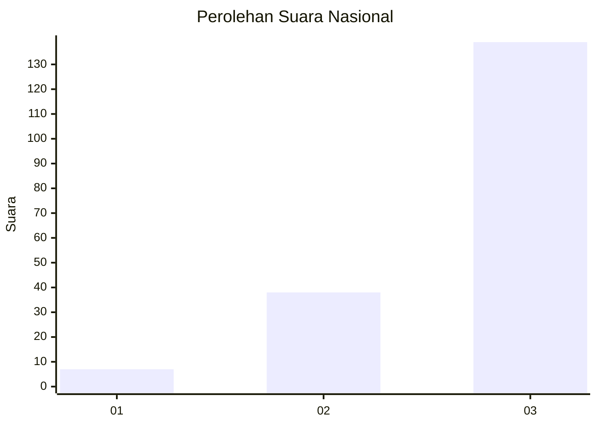
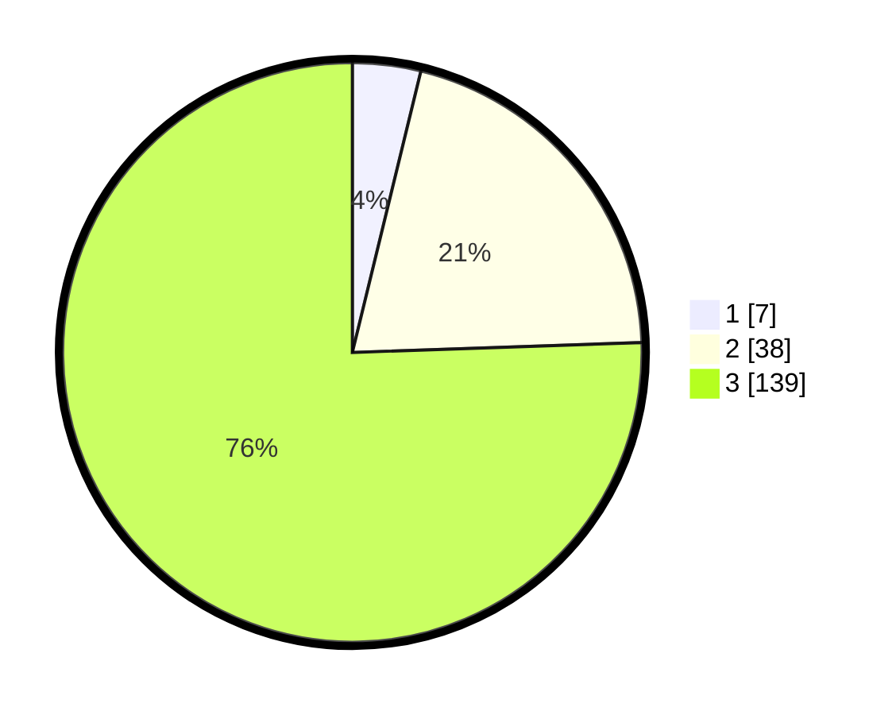

# Hasil

## Grafik

## Tabel

| No. | Nama Paslon    | Suara | Suara (raw) | Persentase |
|:--- |:-------------- | -----:| -----------:| ----------:|
| 1   | ANIES MUHAIMIN | 7     | [7][p-1]    | 3,80       |
| 2   | PRABOWO GIBRAN | 38    | [38][p-2]   | 20,65      |
| 3   | GANJAR MAHFUD  | 139   | [139][p-3]  | 75,54      |

[p-1]: https://github.com/gigit-pemilu/pemilu-2024/blob/main/pilpres/hitung-suara/sub/51-bali/sub/06-bangli/sub/02-bangli/sub/1006-kubu/sub/012-tps/sub/paslon-1.txt
[p-2]: https://github.com/gigit-pemilu/pemilu-2024/blob/main/pilpres/hitung-suara/sub/51-bali/sub/06-bangli/sub/02-bangli/sub/1006-kubu/sub/012-tps/sub/paslon-2.txt
[p-3]: https://github.com/gigit-pemilu/pemilu-2024/blob/main/pilpres/hitung-suara/sub/51-bali/sub/06-bangli/sub/02-bangli/sub/1006-kubu/sub/012-tps/sub/paslon-3.txt

## Foto C Plano

https://sirekap-obj-formc.kpu.go.id/09ac/pemilu/ppwp/51/06/02/10/06/5106021006012-20240214-232836--40e8af3b-5b50-496e-8a7d-01c6b341fbf7.jpg

https://sirekap-obj-formc.kpu.go.id/09ac/pemilu/ppwp/51/06/02/10/06/5106021006012-20240214-233015--74cc1ac1-5e02-4af6-af71-a92fee1fdf42.jpg

https://sirekap-obj-formc.kpu.go.id/09ac/pemilu/ppwp/51/06/02/10/06/5106021006012-20240214-233203--6a021117-e4d4-4c65-8f7f-e72ac3e0d77a.jpg

## Metadata

| Key        | Value               |
| ---------- | ------------------- |
| Time Stamp | 2024-02-24 23:00:00 |

