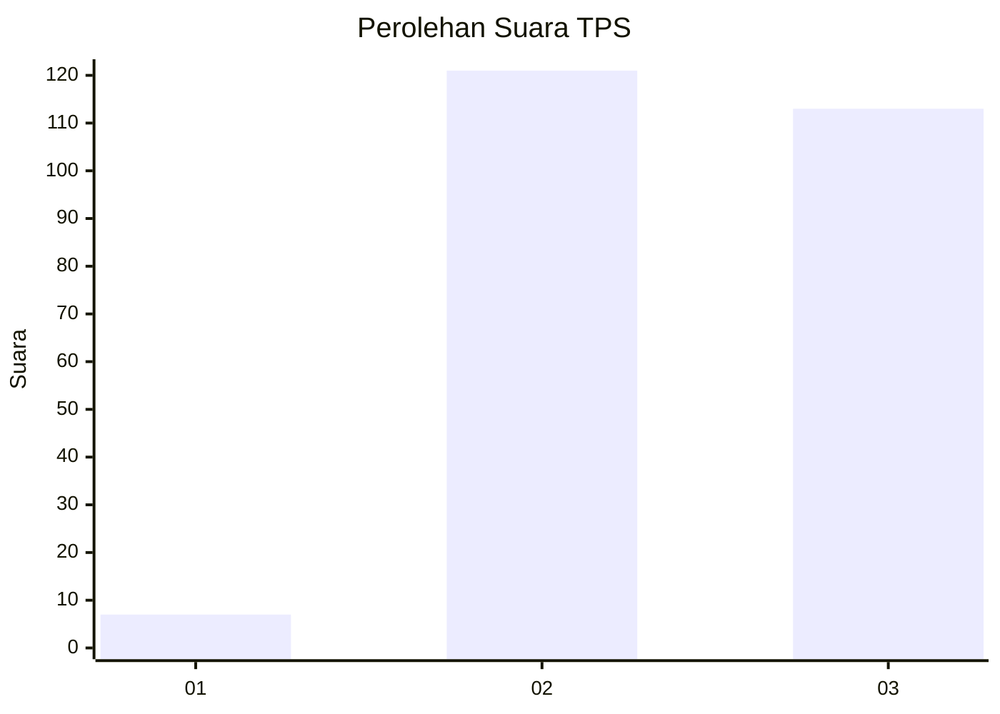
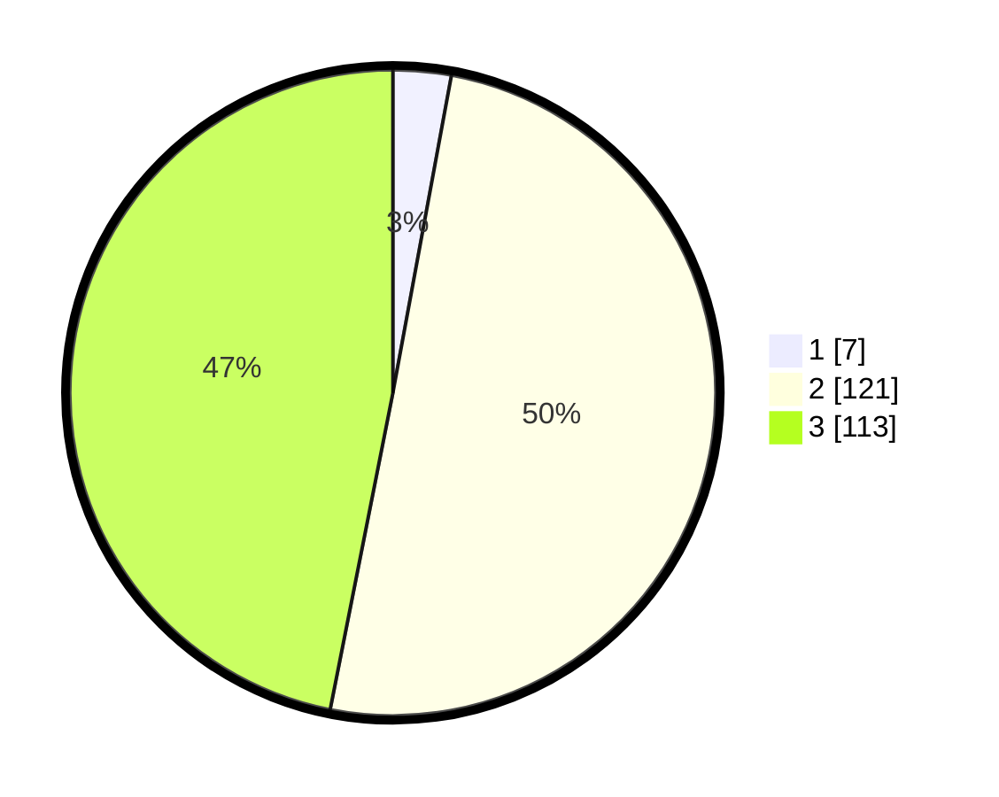

# Hasil

## Grafik

## Tabel

| No. | Nama Paslon    | Suara | Suara (raw) | Persentase |
|:--- |:-------------- | -----:| -----------:| ----------:|
| 1   | ANIES MUHAIMIN | 7     | [7][p-1]    | 2,90       |
| 2   | PRABOWO GIBRAN | 121   | [121][p-2]  | 50,21      |
| 3   | GANJAR MAHFUD  | 113   | [113][p-3]  | 46,89      |

[p-1]: https://github.com/gigit-pemilu/pemilu-2024-51-bali/blob/main/pilpres/hitung-suara/sub/51-bali/sub/06-bangli/sub/02-bangli/sub/2001-bunutin/sub/001-tps/sub/paslon-1.txt
[p-2]: https://github.com/gigit-pemilu/pemilu-2024-51-bali/blob/main/pilpres/hitung-suara/sub/51-bali/sub/06-bangli/sub/02-bangli/sub/2001-bunutin/sub/001-tps/sub/paslon-2.txt
[p-3]: https://github.com/gigit-pemilu/pemilu-2024-51-bali/blob/main/pilpres/hitung-suara/sub/51-bali/sub/06-bangli/sub/02-bangli/sub/2001-bunutin/sub/001-tps/sub/paslon-3.txt

## Foto C Plano

https://sirekap-obj-formc.kpu.go.id/60dd/pemilu/ppwp/51/06/02/20/01/5106022001001-20240214-234610--b706ebbf-7d79-47b3-9287-380905b4702e.jpg

https://sirekap-obj-formc.kpu.go.id/60dd/pemilu/ppwp/51/06/02/20/01/5106022001001-20240214-234712--37e48f05-606d-4e51-96aa-55b7b3403cd0.jpg

https://sirekap-obj-formc.kpu.go.id/60dd/pemilu/ppwp/51/06/02/20/01/5106022001001-20240214-234738--3df3ac34-94eb-4531-b413-74c5548fe2ce.jpg

## Metadata

| Key        | Value               |
| ---------- | ------------------- |
| Time Stamp | 2024-02-24 22:31:28 |

