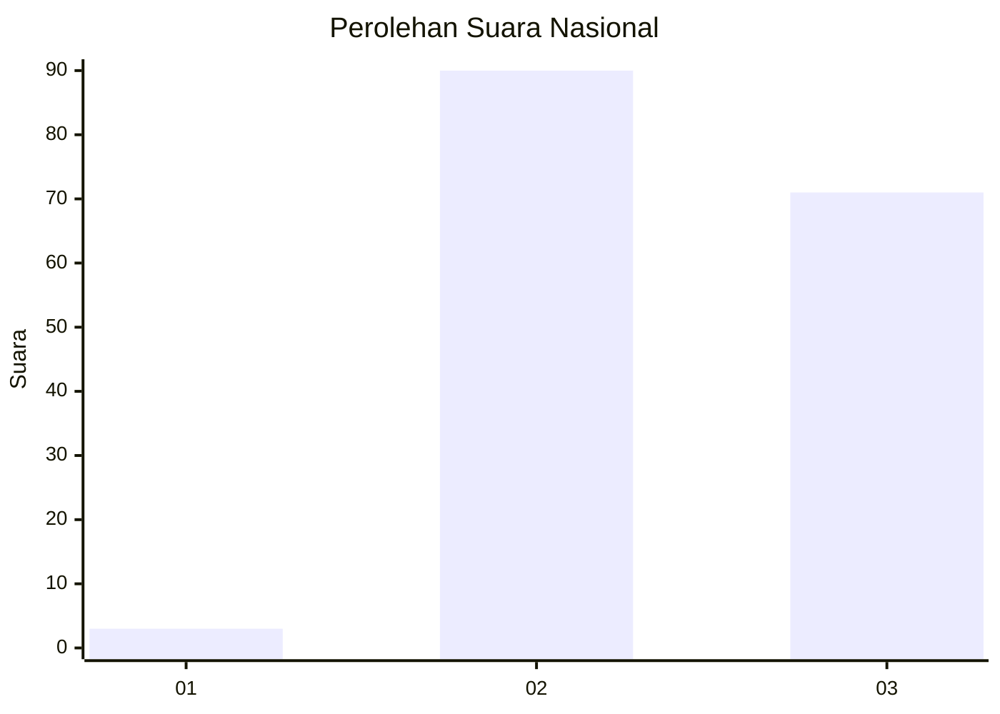
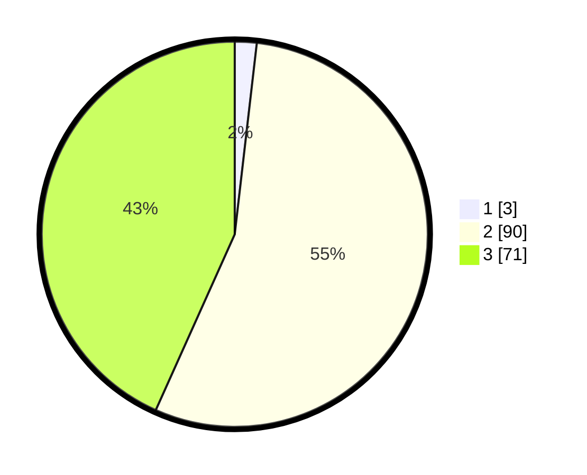

# Hasil

## Grafik

## Tabel

| No. | Nama Paslon    | Suara | Suara (raw) | Persentase |
|:--- |:-------------- | -----:| -----------:| ----------:|
| 1   | ANIES MUHAIMIN | 3     | [3][p-1]    | 1,83       |
| 2   | PRABOWO GIBRAN | 90    | [90][p-2]   | 54,88      |
| 3   | GANJAR MAHFUD  | 71    | [71][p-3]   | 43,29      |

[p-1]: https://github.com/gigit-pemilu/pemilu-2024/blob/main/pilpres/hitung-suara/sub/51-bali/sub/06-bangli/sub/02-bangli/sub/2002-tamanbali/sub/004-tps/sub/paslon-1.txt
[p-2]: https://github.com/gigit-pemilu/pemilu-2024/blob/main/pilpres/hitung-suara/sub/51-bali/sub/06-bangli/sub/02-bangli/sub/2002-tamanbali/sub/004-tps/sub/paslon-2.txt
[p-3]: https://github.com/gigit-pemilu/pemilu-2024/blob/main/pilpres/hitung-suara/sub/51-bali/sub/06-bangli/sub/02-bangli/sub/2002-tamanbali/sub/004-tps/sub/paslon-3.txt

## Foto C Plano

https://sirekap-obj-formc.kpu.go.id/117f/pemilu/ppwp/51/06/02/20/02/5106022002004-20240216-075349--46ed72b5-e528-4576-a5c0-07af0ffd2851.jpg

https://sirekap-obj-formc.kpu.go.id/117f/pemilu/ppwp/51/06/02/20/02/5106022002004-20240216-075351--7c109c01-bb16-4378-8697-bdafa5332782.jpg

https://sirekap-obj-formc.kpu.go.id/117f/pemilu/ppwp/51/06/02/20/02/5106022002004-20240216-075350--b6406e89-37c4-4fda-b3d0-60aafd510928.jpg

## Metadata

| Key        | Value               |
| ---------- | ------------------- |
| Time Stamp | 2024-02-21 22:00:00 |

## DATA PEMILIH TETAP

Jumlah pemilih dalam DPT: **203**.
 * L: **95**.
 * P: **108**.

## DATA PENGGUNA HAK PILIH

Jumlah pengguna hak pilih dalam DPT: **169**.
 * L: **81**.
 * P: **88**.

Jumlah pengguna hak pilih dalam DPTb: **0**.
 * L: **0**.
 * P: **0**.

Jumlah pengguna hak pilih dalam DPK: **0**.
 * L: **0**.
 * P: **0**.

Jumlah pengguna hak pilih: **169**.
 * L: **81**.
 * P: **88**.

## JUMLAH SUARA SAH DAN TIDAK SAH

JUMLAH SELURUH SUARA SAH: **164**.

JUMLAH SUARA TIDAK SAH: **5**.

JUMLAH SELURUH SUARA SAH DAN SUARA TIDAK SAH: **169**.

