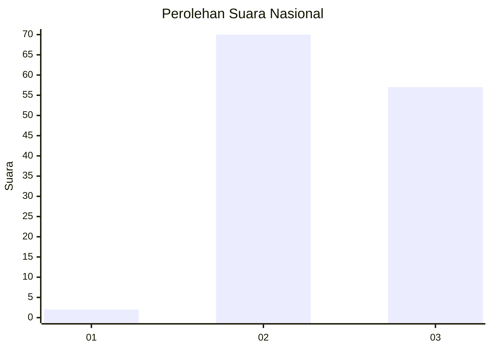
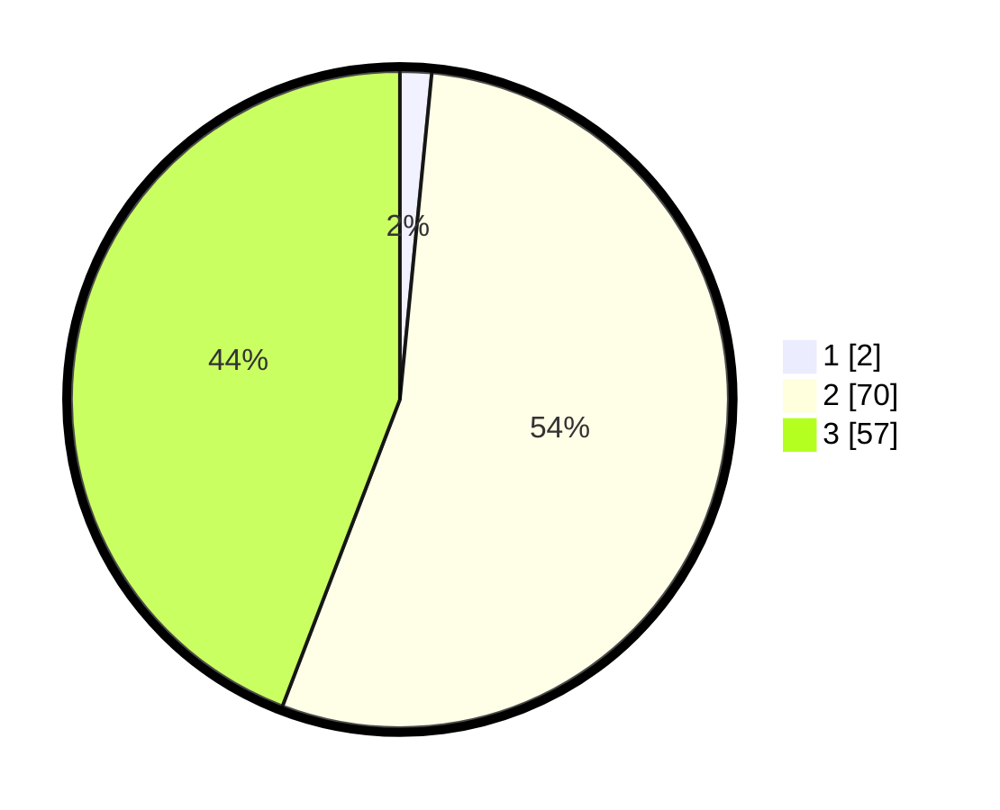

# Hasil

## Grafik

## Tabel

| No. | Nama Paslon    | Suara | Suara (raw) | Persentase |
|:--- |:-------------- | -----:| -----------:| ----------:|
| 1   | ANIES MUHAIMIN | 2     | [2][p-1]    | 1,55       |
| 2   | PRABOWO GIBRAN | 70    | [70][p-2]   | 54,26      |
| 3   | GANJAR MAHFUD  | 57    | [57][p-3]   | 44,19      |

[p-1]: https://github.com/gigit-pemilu/pemilu-2024/blob/main/pilpres/hitung-suara/sub/51-bali/sub/06-bangli/sub/02-bangli/sub/2002-tamanbali/sub/009-tps/sub/paslon-1.txt
[p-2]: https://github.com/gigit-pemilu/pemilu-2024/blob/main/pilpres/hitung-suara/sub/51-bali/sub/06-bangli/sub/02-bangli/sub/2002-tamanbali/sub/009-tps/sub/paslon-2.txt
[p-3]: https://github.com/gigit-pemilu/pemilu-2024/blob/main/pilpres/hitung-suara/sub/51-bali/sub/06-bangli/sub/02-bangli/sub/2002-tamanbali/sub/009-tps/sub/paslon-3.txt

## Foto C Plano

https://sirekap-obj-formc.kpu.go.id/6ebf/pemilu/ppwp/51/06/02/20/02/5106022002009-20240216-184631--f92c18a0-4380-4e03-85fd-431ee7b44454.jpg

https://sirekap-obj-formc.kpu.go.id/6ebf/pemilu/ppwp/51/06/02/20/02/5106022002009-20240216-184632--80487939-1039-4339-ab0e-3a79dae6a70e.jpg

https://sirekap-obj-formc.kpu.go.id/6ebf/pemilu/ppwp/51/06/02/20/02/5106022002009-20240216-184631--784c3ed1-bd0c-4a67-8240-8b29fb8a8864.jpg

## Metadata

| Key        | Value               |
| ---------- | ------------------- |
| Time Stamp | 2024-02-24 22:31:28 |

## DATA PEMILIH TETAP

Jumlah pemilih dalam DPT: **165**.
 * L: **86**.
 * P: **79**.

## DATA PENGGUNA HAK PILIH

Jumlah pengguna hak pilih dalam DPT: **134**.
 * L: **70**.
 * P: **64**.

Jumlah pengguna hak pilih dalam DPTb: **0**.
 * L: **0**.
 * P: **0**.

Jumlah pengguna hak pilih dalam DPK: **0**.
 * L: **0**.
 * P: **0**.

Jumlah pengguna hak pilih: **134**.
 * L: **70**.
 * P: **64**.

## JUMLAH SUARA SAH DAN TIDAK SAH

JUMLAH SELURUH SUARA SAH: **129**.

JUMLAH SUARA TIDAK SAH: **5**.

JUMLAH SELURUH SUARA SAH DAN SUARA TIDAK SAH: **134**.

