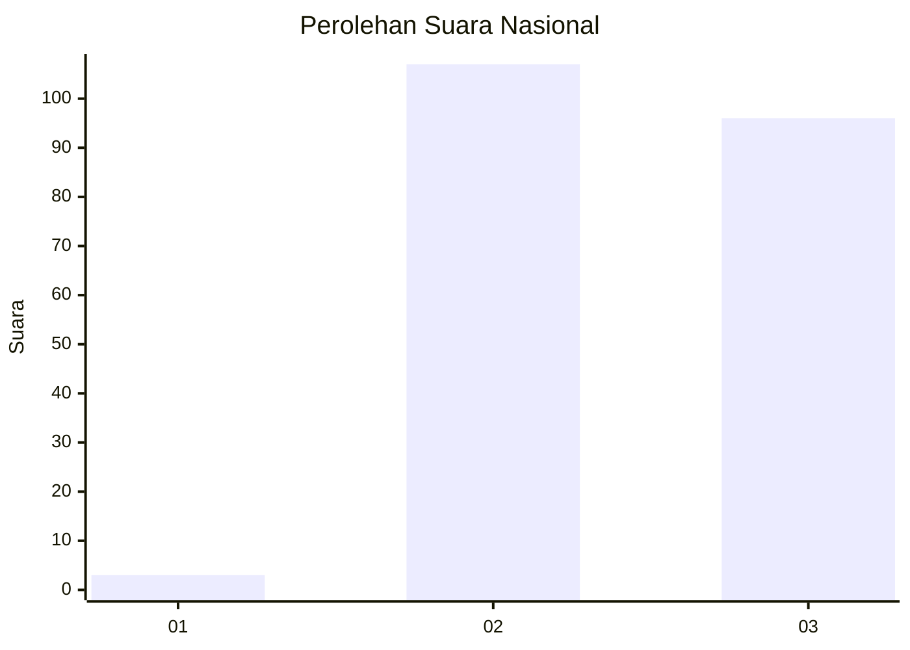
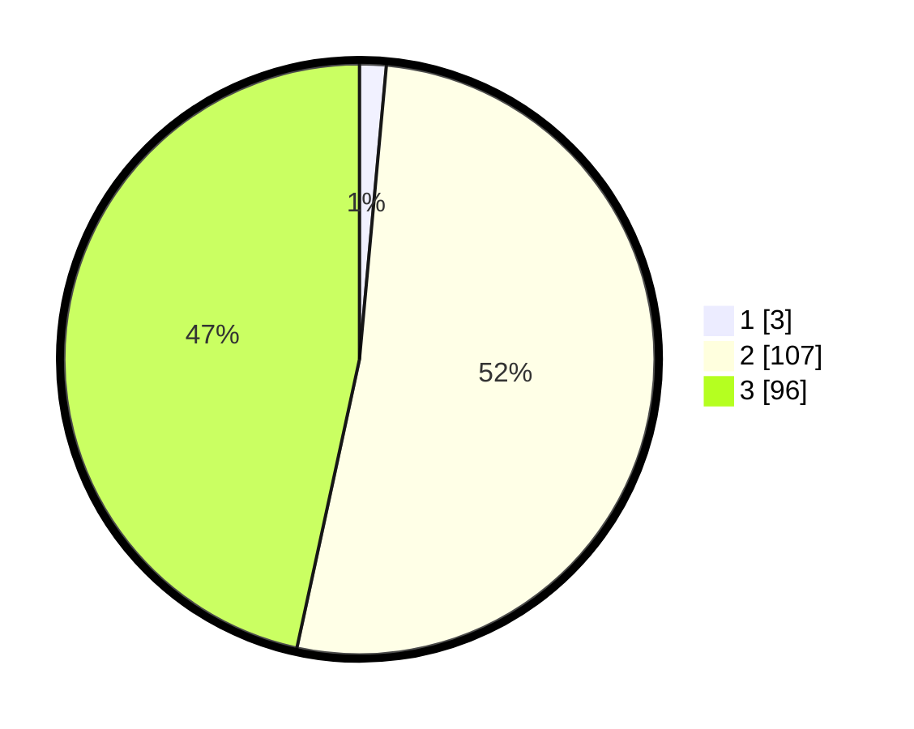

# Hasil

## Grafik

## Tabel

| No. | Nama Paslon    | Suara | Suara (raw) | Persentase |
|:--- |:-------------- | -----:| -----------:| ----------:|
| 1   | ANIES MUHAIMIN | 3     | [3][p-1]    | 1,46       |
| 2   | PRABOWO GIBRAN | 107   | [107][p-2]  | 51,94      |
| 3   | GANJAR MAHFUD  | 96    | [96][p-3]   | 46,60      |

[p-1]: https://github.com/gigit-pemilu/pemilu-2024/blob/main/pilpres/hitung-suara/sub/51-bali/sub/06-bangli/sub/02-bangli/sub/2002-tamanbali/sub/021-tps/sub/paslon-1.txt
[p-2]: https://github.com/gigit-pemilu/pemilu-2024/blob/main/pilpres/hitung-suara/sub/51-bali/sub/06-bangli/sub/02-bangli/sub/2002-tamanbali/sub/021-tps/sub/paslon-2.txt
[p-3]: https://github.com/gigit-pemilu/pemilu-2024/blob/main/pilpres/hitung-suara/sub/51-bali/sub/06-bangli/sub/02-bangli/sub/2002-tamanbali/sub/021-tps/sub/paslon-3.txt

## Foto C Plano

https://sirekap-obj-formc.kpu.go.id/2a80/pemilu/ppwp/51/06/02/20/02/5106022002021-20240215-005344--5e8c7944-f6ac-4b46-9af3-2c18f82d92e4.jpg

https://sirekap-obj-formc.kpu.go.id/2a80/pemilu/ppwp/51/06/02/20/02/5106022002021-20240215-005527--d7919572-0242-4b6e-bf6d-d8c7f3f486fb.jpg

https://sirekap-obj-formc.kpu.go.id/2a80/pemilu/ppwp/51/06/02/20/02/5106022002021-20240215-005559--1ae82a02-e892-4081-b51a-8d468c6b0507.jpg

## Metadata

| Key        | Value               |
| ---------- | ------------------- |
| Time Stamp | 2024-02-24 22:31:28 |

