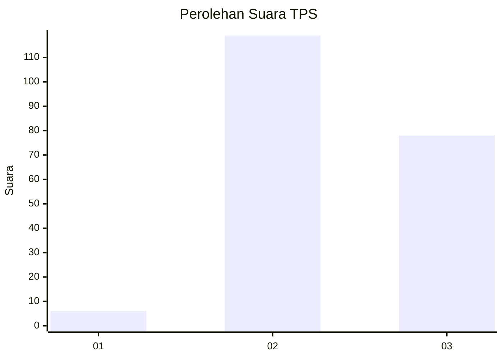
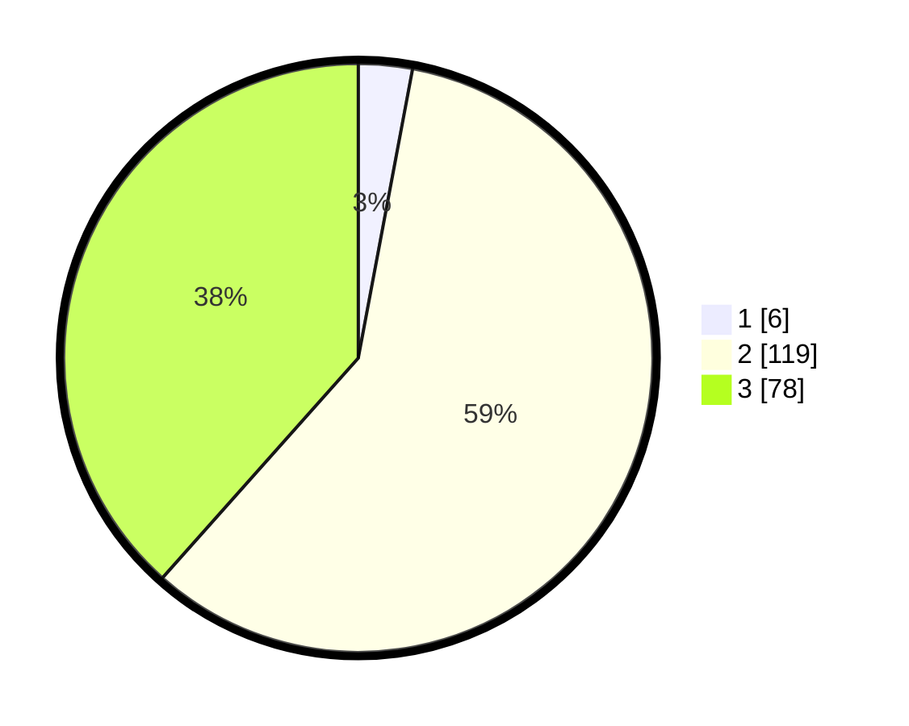

# Hasil

## Grafik

## Tabel

| No. | Nama Paslon    | Suara | Suara (raw) | Persentase |
|:--- |:-------------- | -----:| -----------:| ----------:|
| 1   | ANIES MUHAIMIN | 6     | [6][p-1]    | 2,96       |
| 2   | PRABOWO GIBRAN | 119   | [119][p-2]  | 58,62      |
| 3   | GANJAR MAHFUD  | 78    | [78][p-3]   | 38,42      |

[p-1]: https://github.com/gigit-pemilu/pemilu-2024-51-bali/blob/main/pilpres/hitung-suara/sub/51-bali/sub/06-bangli/sub/02-bangli/sub/2008-pengotan/sub/001-tps/sub/paslon-1.txt
[p-2]: https://github.com/gigit-pemilu/pemilu-2024-51-bali/blob/main/pilpres/hitung-suara/sub/51-bali/sub/06-bangli/sub/02-bangli/sub/2008-pengotan/sub/001-tps/sub/paslon-2.txt
[p-3]: https://github.com/gigit-pemilu/pemilu-2024-51-bali/blob/main/pilpres/hitung-suara/sub/51-bali/sub/06-bangli/sub/02-bangli/sub/2008-pengotan/sub/001-tps/sub/paslon-3.txt

## Foto C Plano

https://sirekap-obj-formc.kpu.go.id/b379/pemilu/ppwp/51/06/02/20/08/5106022008001-20240214-132337--4354f5b7-3ecf-48d8-bf22-6649ba911b3b.jpg

https://sirekap-obj-formc.kpu.go.id/b379/pemilu/ppwp/51/06/02/20/08/5106022008001-20240214-132415--2b02fe42-e875-41a9-9afc-89aebf1bdbd9.jpg

https://sirekap-obj-formc.kpu.go.id/b379/pemilu/ppwp/51/06/02/20/08/5106022008001-20240214-132500--09007878-9a46-497d-8535-c28b6a4f916e.jpg

## Metadata

| Key        | Value               |
| ---------- | ------------------- |
| Time Stamp | 2024-02-25 15:00:00 |

