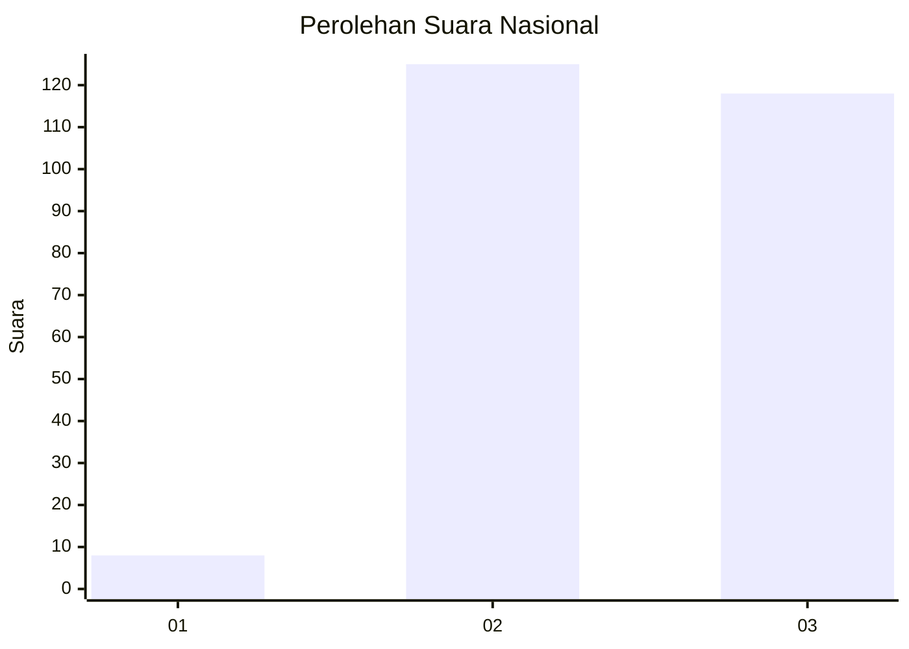
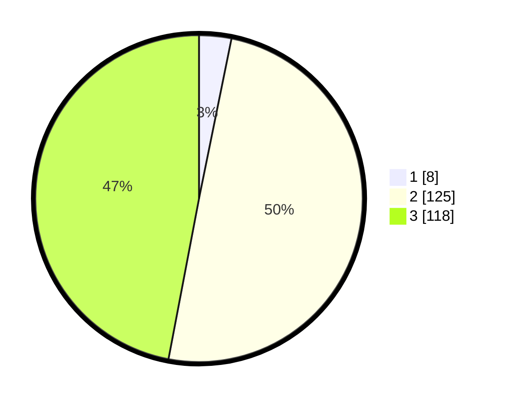

# Hasil

## Grafik

## Tabel

| No. | Nama Paslon    | Suara | Suara (raw) | Persentase |
|:--- |:-------------- | -----:| -----------:| ----------:|
| 1   | ANIES MUHAIMIN | 8     | [8][p-1]    | 3,19       |
| 2   | PRABOWO GIBRAN | 125   | [125][p-2]  | 49,80      |
| 3   | GANJAR MAHFUD  | 118   | [118][p-3]  | 47,01      |

[p-1]: https://github.com/gigit-pemilu/pemilu-2024/blob/main/pilpres/hitung-suara/sub/51-bali/sub/06-bangli/sub/02-bangli/sub/2008-pengotan/sub/003-tps/sub/paslon-1.txt
[p-2]: https://github.com/gigit-pemilu/pemilu-2024/blob/main/pilpres/hitung-suara/sub/51-bali/sub/06-bangli/sub/02-bangli/sub/2008-pengotan/sub/003-tps/sub/paslon-2.txt
[p-3]: https://github.com/gigit-pemilu/pemilu-2024/blob/main/pilpres/hitung-suara/sub/51-bali/sub/06-bangli/sub/02-bangli/sub/2008-pengotan/sub/003-tps/sub/paslon-3.txt

## Foto C Plano

https://sirekap-obj-formc.kpu.go.id/7ac8/pemilu/ppwp/51/06/02/20/08/5106022008003-20240214-214107--e31db60f-61e7-4db7-8a79-351a09a05fae.jpg

https://sirekap-obj-formc.kpu.go.id/7ac8/pemilu/ppwp/51/06/02/20/08/5106022008003-20240214-214122--c5bebd58-7d32-4ed2-8078-e5c338ffcc27.jpg

## Metadata

| Key        | Value               |
| ---------- | ------------------- |
| Time Stamp | 2024-02-24 22:31:28 |

