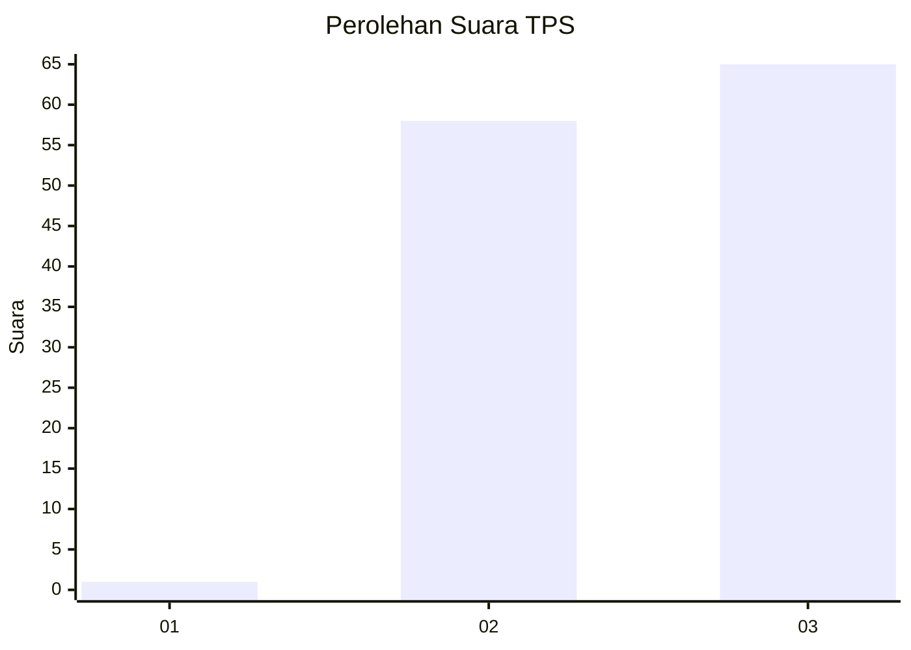
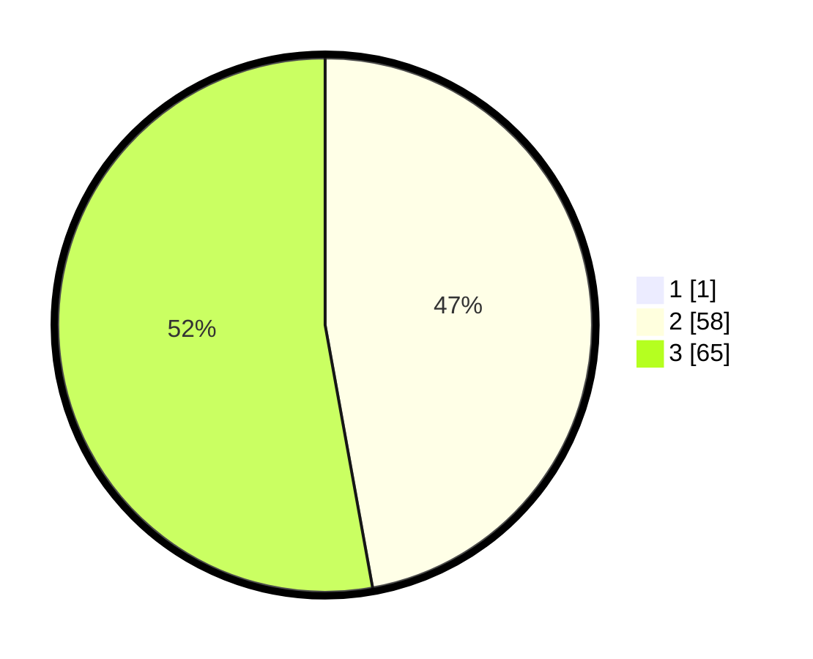

# Hasil

## Grafik

## Tabel

| No. | Nama Paslon    | Suara | Suara (raw) | Persentase |
|:--- |:-------------- | -----:| -----------:| ----------:|
| 1   | ANIES MUHAIMIN | 1     | [1][p-1]    | 0,81       |
| 2   | PRABOWO GIBRAN | 58    | [58][p-2]   | 46,77      |
| 3   | GANJAR MAHFUD  | 65    | [65][p-3]   | 52,42      |

[p-1]: https://github.com/gigit-pemilu/pemilu-2024-51-bali/blob/main/pilpres/hitung-suara/sub/51-bali/sub/06-bangli/sub/02-bangli/sub/2008-pengotan/sub/008-tps/sub/paslon-1.txt
[p-2]: https://github.com/gigit-pemilu/pemilu-2024-51-bali/blob/main/pilpres/hitung-suara/sub/51-bali/sub/06-bangli/sub/02-bangli/sub/2008-pengotan/sub/008-tps/sub/paslon-2.txt
[p-3]: https://github.com/gigit-pemilu/pemilu-2024-51-bali/blob/main/pilpres/hitung-suara/sub/51-bali/sub/06-bangli/sub/02-bangli/sub/2008-pengotan/sub/008-tps/sub/paslon-3.txt

## Foto C Plano

https://sirekap-obj-formc.kpu.go.id/03ba/pemilu/ppwp/51/06/02/20/08/5106022008008-20240214-194110--a8cb3d38-83ea-4471-9140-68e22f165705.jpg

https://sirekap-obj-formc.kpu.go.id/03ba/pemilu/ppwp/51/06/02/20/08/5106022008008-20240214-194436--4a83a626-fad6-4146-acd2-d999f208aaf3.jpg

https://sirekap-obj-formc.kpu.go.id/03ba/pemilu/ppwp/51/06/02/20/08/5106022008008-20240214-194514--9885473d-9c29-445d-b569-ba4f61dc8945.jpg

## Metadata

| Key        | Value               |
| ---------- | ------------------- |
| Time Stamp | 2024-02-24 22:31:28 |

