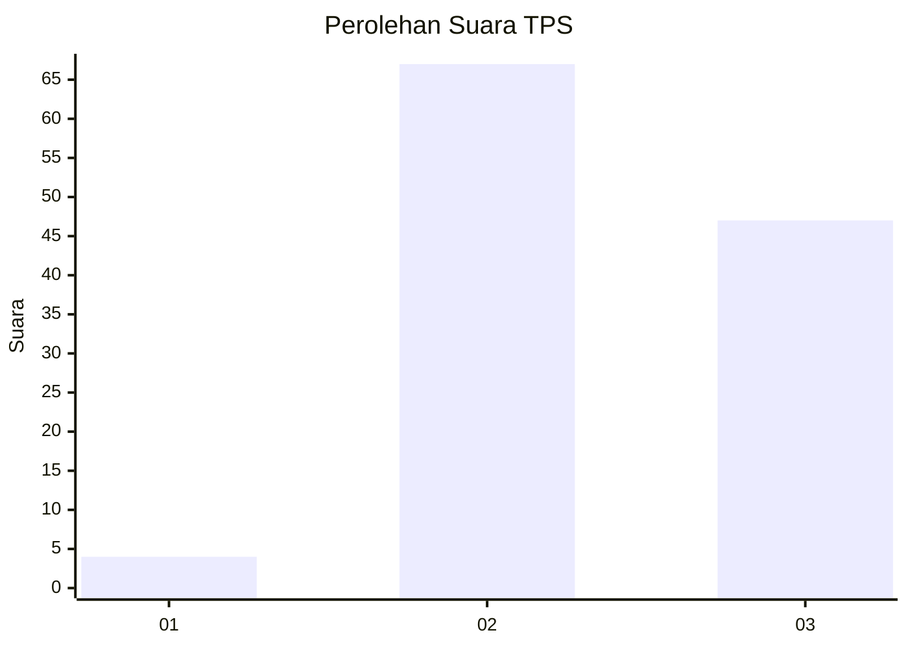
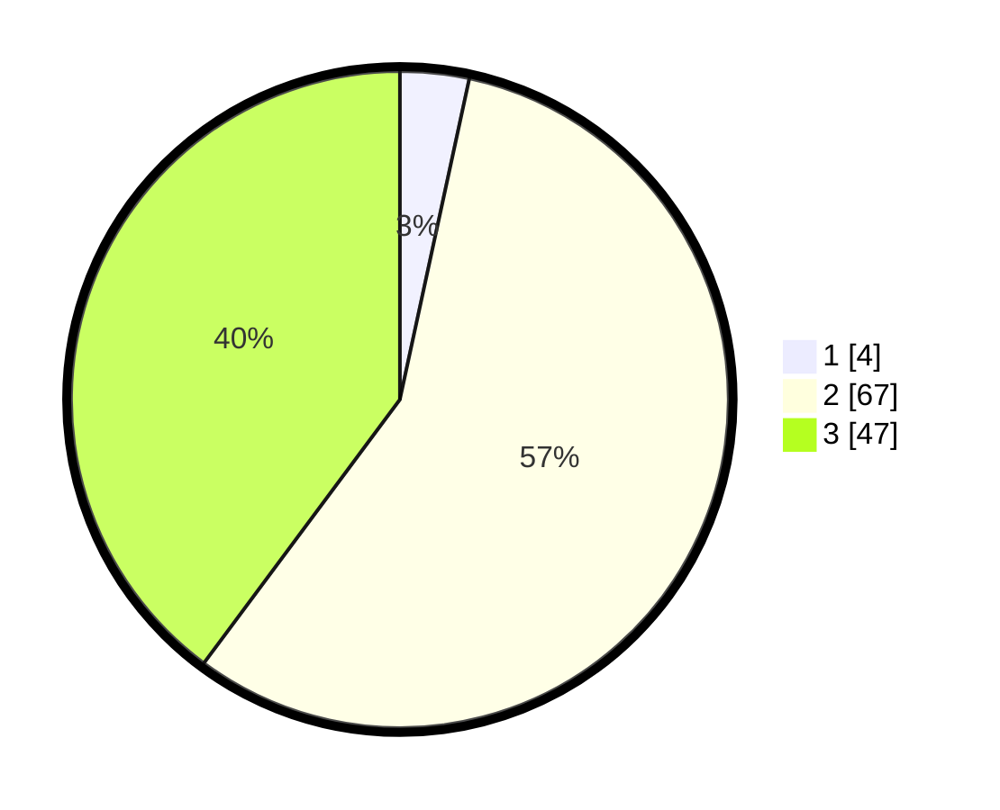

# Hasil

## Grafik

## Tabel

| No. | Nama Paslon    | Suara | Suara (raw) | Persentase |
|:--- |:-------------- | -----:| -----------:| ----------:|
| 1   | ANIES MUHAIMIN | 4     | [4][p-1]    | 3,39       |
| 2   | PRABOWO GIBRAN | 67    | [67][p-2]   | 56,78      |
| 3   | GANJAR MAHFUD  | 47    | [47][p-3]   | 39,83      |

[p-1]: https://github.com/gigit-pemilu/pemilu-2024-51-bali/blob/main/pilpres/hitung-suara/sub/51-bali/sub/06-bangli/sub/02-bangli/sub/2008-pengotan/sub/011-tps/sub/paslon-1.txt
[p-2]: https://github.com/gigit-pemilu/pemilu-2024-51-bali/blob/main/pilpres/hitung-suara/sub/51-bali/sub/06-bangli/sub/02-bangli/sub/2008-pengotan/sub/011-tps/sub/paslon-2.txt
[p-3]: https://github.com/gigit-pemilu/pemilu-2024-51-bali/blob/main/pilpres/hitung-suara/sub/51-bali/sub/06-bangli/sub/02-bangli/sub/2008-pengotan/sub/011-tps/sub/paslon-3.txt

## Foto C Plano

https://sirekap-obj-formc.kpu.go.id/56fb/pemilu/ppwp/51/06/02/20/08/5106022008011-20240214-210800--94a09760-5afd-4049-a6f3-f22cc35313bc.jpg

https://sirekap-obj-formc.kpu.go.id/56fb/pemilu/ppwp/51/06/02/20/08/5106022008011-20240214-210833--66d1da5a-72e4-4c44-b60f-16fe2905e72c.jpg

https://sirekap-obj-formc.kpu.go.id/56fb/pemilu/ppwp/51/06/02/20/08/5106022008011-20240214-210925--3204f01a-bbbf-4303-9b0f-992250158a4c.jpg

## Metadata

| Key        | Value               |
| ---------- | ------------------- |
| Time Stamp | 2024-02-15 00:41:44 |

## DATA PEMILIH TETAP

Jumlah pemilih dalam DPT: **162**.
 * L: **77**.
 * P: **85**.

## DATA PENGGUNA HAK PILIH

Jumlah pengguna hak pilih dalam DPT: **139**.
 * L: **67**.
 * P: **72**.

Jumlah pengguna hak pilih dalam DPTb: **0**.
 * L: **0**.
 * P: **0**.

Jumlah pengguna hak pilih dalam DPK: **0**.
 * L: **0**.
 * P: **0**.

Jumlah pengguna hak pilih: **139**.
 * L: **67**.
 * P: **72**.

## JUMLAH SUARA SAH DAN TIDAK SAH

JUMLAH SELURUH SUARA SAH: **118**.

JUMLAH SUARA TIDAK SAH: **21**.

JUMLAH SELURUH SUARA SAH DAN SUARA TIDAK SAH: **139**.

