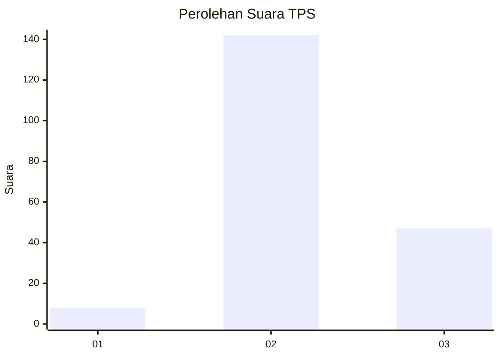
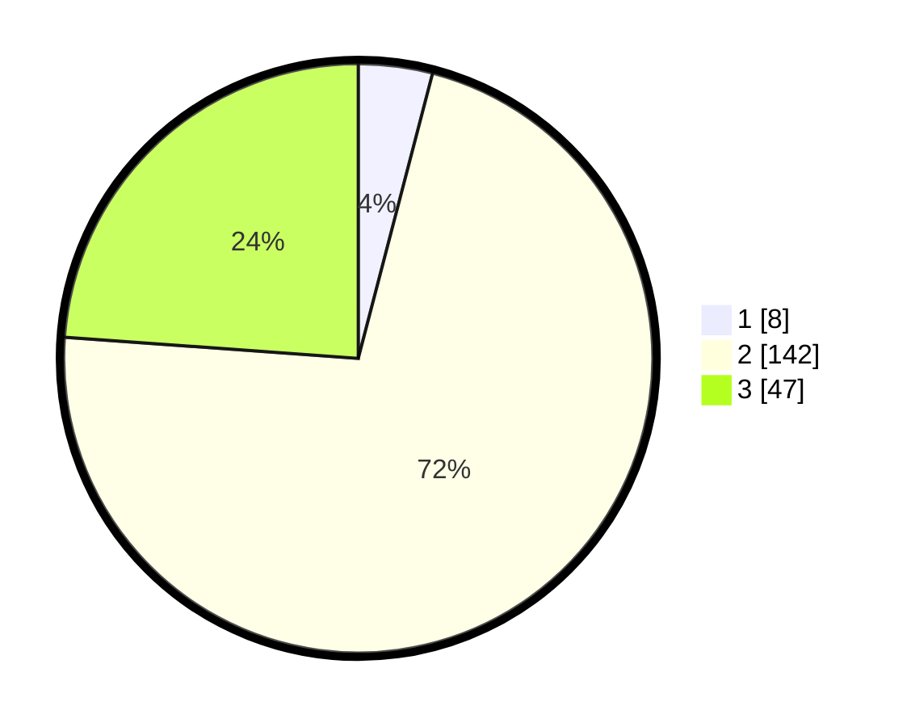

# Hasil

## Grafik

## Tabel

| No. | Nama Paslon    | Suara | Suara (raw) | Persentase |
|:--- |:-------------- | -----:| -----------:| ----------:|
| 1   | ANIES MUHAIMIN | 8     | [8][p-1]    | 4,06       |
| 2   | PRABOWO GIBRAN | 142   | [142][p-2]  | 72,08      |
| 3   | GANJAR MAHFUD  | 47    | [47][p-3]   | 23,86      |

[p-1]: https://github.com/gigit-pemilu/pemilu-2024-51-bali/blob/main/pilpres/hitung-suara/sub/51-bali/sub/06-bangli/sub/02-bangli/sub/2008-pengotan/sub/013-tps/sub/paslon-1.txt
[p-2]: https://github.com/gigit-pemilu/pemilu-2024-51-bali/blob/main/pilpres/hitung-suara/sub/51-bali/sub/06-bangli/sub/02-bangli/sub/2008-pengotan/sub/013-tps/sub/paslon-2.txt
[p-3]: https://github.com/gigit-pemilu/pemilu-2024-51-bali/blob/main/pilpres/hitung-suara/sub/51-bali/sub/06-bangli/sub/02-bangli/sub/2008-pengotan/sub/013-tps/sub/paslon-3.txt

## Foto C Plano

https://sirekap-obj-formc.kpu.go.id/7d55/pemilu/ppwp/51/06/02/20/08/5106022008013-20240214-233654--449776d7-c67a-4dc9-a557-e4b0dd3e13f6.jpg

https://sirekap-obj-formc.kpu.go.id/7d55/pemilu/ppwp/51/06/02/20/08/5106022008013-20240214-213759--60d3fe53-8183-47ec-803a-ed6967ebe82a.jpg

https://sirekap-obj-formc.kpu.go.id/7d55/pemilu/ppwp/51/06/02/20/08/5106022008013-20240214-233537--e3547800-5442-43ce-8d1a-d526627d65a5.jpg

## Metadata

| Key        | Value               |
| ---------- | ------------------- |
| Time Stamp | 2024-02-25 16:00:00 |

